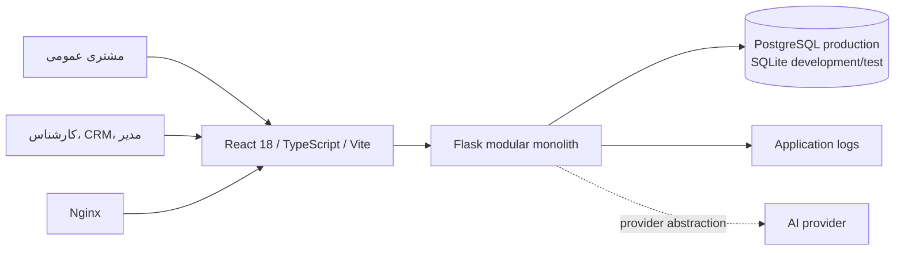
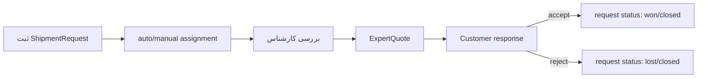

# موجودی معماری فعلی سامانه Forwarder

> مبنا: `deploy/cloud-integration-20260722_081958` در commit `0731b8b4c9e5b57a30a77cfbb2ed19eff1ffb80e`
> نوع بررسی: static architecture audit؛ رفتار و داده production **نیازمند تأیید** است.

## 1. دامنه و روش ممیزی

این سند وضعیت موجود (As-Is) را از روی کد، migration، قرارداد API، frontend، تست، CI و deployment inventory می‌کند. منابع مرجع عبارت‌اند از `backend/`، `src/`، `docs/openapi/openapi.yaml`، `.github/workflows/quality-gates.yml` و `docker-compose.production.yml`. مصاحبه عملیاتی، تست نفوذ، benchmark، داده زنده و cloud topology خارج از دامنه و **نیازمند تأیید** هستند.

## 2. ساختار Repository

| مسیر | مسئولیت فعلی | شاهد نمونه |
|---|---|---|
| `backend/routes/` | transport HTTP و blueprintها | `backend/routes/__init__.py:20-37`، تابع `register_routes` |
| `backend/services/` | application/service logic | `shipment_service.py`، `quote_service.py`، `multi_unit_tracking_service.py` |
| `backend/models.py` | مدل‌های چند دامنه در یک فایل | کلاس‌ها از `Province` تا `SiteSetting` |
| `backend/migrations/` | مسیر canonical Alembic | `backend/migrations/versions/` |
| `src/pages/` | workspaceهای مشتری، کارشناس، CRM و مدیر | routeها در `src/App.tsx:80-148` |
| `src/lib/api.ts` | client مشترک API | `src/lib/api.ts` |
| `docs/openapi/` | قرارداد API | `docs/openapi/openapi.yaml` |
| `scripts/` | setup، smoke، backfill و verification | catalog اسکریپت‌ها |
| `.github/workflows/` | quality gate | `.github/workflows/quality-gates.yml` |

Repository دارای artifactها و databaseهای محلی/legacy در root نیز هست. کاربرد و سیاست نگهداری بعضی از آن‌ها **نیازمند تأیید** است.

## 3. نمای معماری



`docker-compose.production.yml` چهار container برای frontend، API، PostgreSQL و Adminer تعریف می‌کند. queue، worker، broker، object storage، search engine یا adapter runtime مستقل وجود ندارد. topology واقعی production و محدودسازی Adminer **نیازمند تأیید** است.

## 4. Backend

تابع `create_app` در `backend/__init__.py:23` factory برنامه است و database/config/security/logging/CORS را مقداردهی می‌کند. CORS header و OPTIONS handling در `backend/__init__.py:112-119` قرار دارد. تابع `register_routes` شانزده blueprint را ثبت می‌کند (`backend/routes/__init__.py:20-37`).

جریان غالب:

```text
HTTP route → application service → SQLAlchemy model/session → PostgreSQL
```

سبک، modular monolith است: deployable و database واحد، routeهای تفکیک‌شده و serviceهای استخراج‌شده. با این حال، مدل‌ها در فایل مشترک‌اند؛ transaction/repository/domain boundary عمومی و event backbone وجود ندارد.

## 5. Frontend

SPA واحد نقش‌های مختلف را پوشش می‌دهد. routeهای قابل مشاهده در `src/App.tsx:80-148` شامل landing، expert console/detail، CRM، admin، user management، customer dashboard/detail، public tracking و email verification است. `ProtectedRoute` و `AdminRoute` guard رابط کاربری‌اند؛ مجوز قطعی باید در backend enforce شود.

React Query، React Router، React Hook Form/Zod، Radix UI و Tailwind در `package.json` وجود دارند. میزان واقعی استفاده از cache invalidation، code splitting و schema validation سراسری **نیازمند تأیید** است.

## 6. مدل‌های فعلی و روابط اصلی

| حوزه | مدل | شاهد | رابطه/کارکرد |
|---|---|---|---|
| جغرافیای داخلی | Province, County, City | `backend/models.py:14-107` | سلسله‌مراتب مکانی |
| بین‌الملل | Country, InternationalCity | `backend/models.py:108-157` | کشور و شهر خارجی |
| هویت | ExpertUser | `backend/models.py:158` | کاربر داخلی/نقش |
| session | RevokedToken, AuthSession | `backend/models.py:201-252` | revoke و خانواده token |
| درخواست | ShipmentRequest | `backend/models.py:319-431` | aggregate مرکزی intake/quote/tracking linkage |
| رهگیری | ShipmentTracking | `backend/models.py:432-470` | فعال‌سازی tracking برای request |
| واحد حمل | ShipmentTransportUnit | `backend/models.py:471-509` | چند واحد زیر tracking |
| مرجع checkpoint | TrackingLocationReference | `backend/models.py:510-551` | location helper داخلی |
| رخداد دستی | ShipmentTransportUnitUpdate | `backend/models.py:552-600` | update append-only واحد |
| audit دامنه‌ای | ShipmentRequestLog, ExpertConsoleLog | `backend/models.py:601-645` | log درخواست/کنسول |
| quote | ExpertQuote | `backend/models.py:734-766` | پیشنهاد کارشناس و پاسخ مشتری |
| CRM | Customer, Contact, Opportunity, Activity, Task | `backend/models.py:767-919` | CRM پایه |
| تخصیص | AssignmentRule/Log و ReferralRule/State/Log | `backend/models.py:980-1089` | ارجاع و round-robin |
| بندر/گمرک | IranPort, CustomsOffice و mappingها | `backend/models.py:1090-1315` | reference/coverage |

`ShipmentRequest` شامل داده مسیر، بار، تماس، status، assignment، tracking code و رابطه با quote/log/tracking است؛ بنابراین مرکز ثقل و نقطه coupling سامانه است.

## 7. Routeها و APIها

blueprintهای ثبت‌شده عبارت‌اند از health، locations/provinces، location admin، shipment request، expert console، tracking locations، CRM، gamification، user management، monitoring، admin، public tracking، site settings و customs (`backend/routes/__init__.py:22-37`). قرارداد machine-readable در `docs/openapi/openapi.yaml` است.

گروه‌های اصلی:

| گروه | عملیات فعلی | فایل |
|---|---|---|
| intake | ایجاد درخواست حمل | `backend/routes/shipment_request.py` |
| expert | login/list/detail/status/assignment/quote | `backend/routes/expert_console.py` |
| customer/public | request detail و tracking | `backend/routes/public_tracking.py` |
| CRM | customer/contact/opportunity/activity/task | `backend/routes/crm.py` |
| admin | dashboard/report/request/user/reference | `backend/routes/admin_panel.py` و فایل‌های مرتبط |
| tracking | location reference و multi-unit mutation/read | `backend/routes/tracking_locations.py`, `expert_console.py` |

پوشش کامل OpenAPI نسبت به همه routeهای runtime **نیازمند تأیید** و باید با contract test سنجیده شود.

## 8. Serviceها

service layer حوزه‌های shipment، quote، assignment/referral، CRM read/write، customer workflows، tracking/timeline، multi-unit tracking، location/reference، report/XLSX، auth session/revocation، notification/message، monitoring/settings و AI provider را پوشش می‌دهد.

شواهد مهم:

- ایجاد درخواست: `create_shipment_request` در `backend/services/shipment_service.py:81`؛
- tracking code: `generate_tracking_code` در همان فایل، خط 313؛
- context allowlist: `build_shipment_request_context` در `shipment_context_service.py:115`؛
- tracking enable/unit/update: `multi_unit_tracking_service.py:94,123,171`؛
- projection عمومی: `build_public_unit_tracking` در خط 343؛
- response عمومی: `tracking_service.py:108,158`؛
- statusهای گزارش: `admin_report_overview_service.py:47-49`.

## 9. Workflow فعلی Request، Quote و Customer Response



statusهای مصرف‌شده در کد شامل `new`, `pending`, `assigned`, `in_progress`, `quoted`, `waiting_for_customer`, `won`, `lost`, `closed` هستند. مجموعه‌ها در سرویس‌ها کاملاً همسان نیستند؛ برای نمونه active/completed در `backend/services/admin_report_overview_service.py:47-49` تعریف شده‌اند. `status_request_status` legacy است و `build_shipment_request_context` آن را کنار می‌گذارد؛ `ShipmentRequest.status` وضعیت canonical تجاری است.

هیچ command صریحی برای تبدیل quote پذیرفته‌شده به پرونده اجرایی مستقل وجود ندارد.

## 10. Tracking فعلی

دو لایه قابل تفکیک است:

1. timeline عمومی مشتق‌شده از status درخواست: mapping در `backend/services/timeline_service.py:19` و assembly در `tracking_service.py:108`؛
2. رهگیری چندواحدی دستی: `ShipmentTracking → ShipmentTransportUnit → ShipmentTransportUnitUpdate`.

updateها status، location/reference، پیام مشتری، note داخلی، visibility، زمان رخداد و actor دارند. projection عمومی allowlist است (`build_public_unit_tracking`, خط 343). `UNIT_STATUSES` و `AGGREGATE_STATUSES` در `multi_unit_tracking_service.py:18-31` تعریف شده‌اند.

فقدان‌ها: leg، planned milestone، source provenance استاندارد، external event id، confidence، ingestion adapter، ETA و out-of-order reconciliation.

## 11. Location architecture فعلی

سامانه داده مرجع داخلی/بین‌المللی، بندر، گمرک، mapping/coverage و `TrackingLocationReference` دارد. snapshot نام/کشور در update رهگیری تصمیم مثبتی برای تاریخچه است. در مدل هدف، location master باید از snapshot عملیاتی جدا بماند؛ geocode، timezone، UN/LOCODE و governance کامل **نیازمند تأیید** است.

## 12. نقش‌ها و Permissionها

هویت اصلی `ExpertUser` است و UI مسیرهای protected/admin/CRM دارد. session و token revocation پیاده شده‌اند. نقش‌های عملیاتی dispatcher، operator، project manager، control tower، finance، compliance، partner و customer organization به‌صورت مدل permission دامنه‌ای قابل مشاهده نیستند. scope سازمانی و policy `(action, resource, organization)` **نیازمند طراحی و تأیید** است.

## 13. وضعیت حوزه‌های کنترلی

| حوزه | وضعیت فعلی | نتیجه |
|---|---|---|
| Audit | چند log دامنه‌ای و actor روی tracking | پراکنده؛ فاقد correlation/causation یکپارچه |
| Document | مدل/ذخیره‌سازی عملیاتی مشاهده نشد | غایب |
| Cost | estimated/commercial value و quote | actual cost/accrual/invoice/margin غایب |
| Exception | delayed/cancelled status | exception case/owner/SLA/resolution غایب |
| Dashboard | admin/CRM/expert report و XLSX | request-centric؛ control tower نیست |
| Internal control | auth، allowlist، migration/test | transition guard و segregation of duties ناکافی |

## 14. ارزیابی بلوغ

| حوزه | امتیاز /5 | توضیح |
|---|---:|---|
| Intake و quotation | 4 | هسته فعلی سامانه |
| CRM | 3 | پایه قابل استفاده، فاقد party model جامع |
| Shipment execution | 1 | tracking محدود، بدون job/leg/milestone plan |
| Tracking/visibility | 2 | دستی و چندواحدی، بدون integration/provenance |
| Project logistics | 0 | مدل مستقل ندارد |
| Control tower | 0 | exception/work queue/KPI عملیاتی ندارد |
| Operational finance | 0 | فاقد actual/accrual/invoice/margin |
| Documents/compliance | 0 | فاقد lifecycle سند |
| Security/audit | 3 | authentication خوب؛ authorization/audit نیازمند توسعه |
| Technical operations | 2 | CI/health/log/Docker؛ HA/DR/SLO نیازمند تأیید |

## 15. قابلیت‌های قابل استفاده مجدد

- application factory، blueprint و service extraction؛
- PostgreSQL/Alembic و quality gates؛
- request/quote/customer response lineage؛
- reference data جغرافیایی، بندر و گمرک؛
- tracking code، واحدهای چندگانه و update append-only؛
- public allowlist و تفکیک note داخلی/مشتری؛
- JWT session/revocation و audit actorهای موجود؛
- React workspaceها و API client؛
- AI context read-only و human-review boundary.

## 16. محدودیت اطمینان

ادعاهای این سند درباره وجود/عدم وجود قابلیت بر اساس commit مبناست. topology cloud، حجم، data quality، backup restore، permission واقعی کاربران، فرایندهای دستی خارج از سیستم و الزامات قانونی همگی **نیازمند تأیید** هستند.
