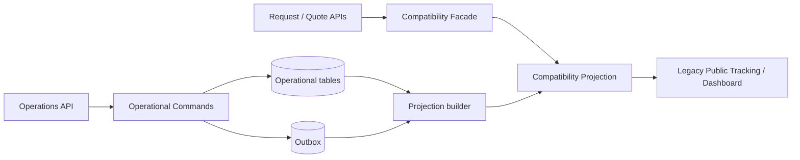
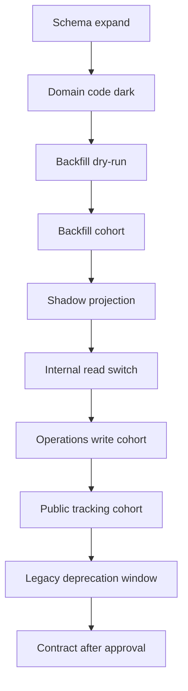

# راهبرد مهاجرت به مدل عملیاتی Forwarder

## 1. هدف و اصول

مهاجرت از مدل request-centric به `OperationalShipment` باید additive، قابل مشاهده، idempotent و برگشت‌پذیر باشد. هیچ migration نباید `ShipmentRequest` یا workflow quote را در اولین انتشار جایگزین کند.

اصول:

1. expand → migrate → verify → switch reads → contract؛
2. backward compatibility تا پایان دوره گذار؛
3. source identity و lineage غیرقابل حذف؛
4. عدم استفاده از `ShipmentRequest.status` برای عملیات؛
5. no hidden dual-write؛
6. migration و seed صریح، نه side effect startup؛
7. dry-run، checkpoint، quarantine و reconciliation؛
8. feature flag و rollback مستقل application/data.

## 2. اتصال مدل جدید به موجود

`OperationalShipment` دارای `source_request_id` و در مسیر quote-based دارای `accepted_quote_id` است. constraint پیشنهادی source identity:

```text
unique(conversion_type, source_request_id, accepted_quote_id, conversion_revision)
```

cardinality request/quote→shipment **نیازمند تأیید** است؛ constraint نهایی نباید بی‌دلیل one-to-one را تحمیل کند. `source_system`, `source_entity_type`, `source_entity_id` برای import آینده نگهداری می‌شود.

## 3. Status separation

- `ShipmentRequest.status`: فقط lifecycle تجاری؛
- `OperationalShipment.lifecycle_status`: plan/booking/execution/completion؛
- `RouteLeg.status`: پیشرفت leg؛
- `Milestone.status`: planned/due/realized/missed/cancelled؛
- `ExceptionCase.status`: workflow حل مسئله؛
- `TrackingEvent`: status mutable ندارد؛ fact append-only است.

mapping legacy صرفاً compatibility projection است. `won` می‌تواند eligibility conversion بدهد، اما هرگز معادل `in_execution` نیست.

## 4. Adapter و Compatibility Layer



legacy endpointها ابتدا unchanged باقی می‌مانند. facade برای requestهایی که shipment دارند summary را از projection جدید و در غیر این صورت از path قدیمی می‌دهد. پاسخ public همچنان allowlist است.

## 5. Dual Read و Dual Write

### Dual Read

در دوره shadow/read comparison مجاز است:

- محاسبه legacy و new projection؛
- پاسخ از legacy؛
- ثبت mismatch metric بدون افشای داده؛
- switch cohort-based پس از threshold کیفیت.

### Dual Write

write مستقل به legacy و new ممنوع است. اگر compatibility به تغییر هر دو نیاز داشت:

- یک command و transaction owner؛
- write aggregate + outbox اتمیک؛
- consumer idempotent برای projection؛
- reconciliation و repair command؛
- ممنوعیت rollback با پاک‌کردن کور داده.

## 6. Backfill

مراحل backfill:

1. profile count/null/status/duplicate و گزارش بدون write؛
2. تعیین eligibility (مثلاً quote پذیرفته‌شده منتخب)؛
3. snapshot مبنا و approval؛
4. dry-run با mapping و reason برای skip/quarantine؛
5. batch کوچک با checkpoint/keyset pagination؛
6. insert idempotent با source identity؛
7. verification count/hash/invariant؛
8. exception report و remediation؛
9. rerun اثبات idempotency؛
10. cohort enablement.

timestamp یا location ناموجود جعل نمی‌شود. update رهگیری قدیمی با source=`legacy_manual` نگاشت می‌شود. milestone planned از actual قدیمی استنتاج نمی‌شود مگر rule تصویب‌شده؛ در غیر این صورت unknown ثبت می‌شود.

## 7. Idempotency و Concurrency

- API header `Idempotency-Key` برای convert/create/event؛
- idempotency record شامل principal، command type، request hash، result reference و expiry؛
- unique source/external event identity در DB؛
- aggregate `version` و If-Match/expectedVersion؛
- retry فقط برای عملیات safe/idempotent؛
- event ordering بر aggregate version و event time؛
- duplicate returns همان نتیجه یا conflict در صورت payload متفاوت.

## 8. Feature Flag

flagهای مستقل:

| Flag | دامنه |
|---|---|
| `operations_write_enabled` | commandهای مدل جدید |
| `operations_ui_enabled` | workspace operator |
| `tracking_projection_v2_read` | read جدید داخلی |
| `public_tracking_v2_read` | projection عمومی cohort |
| `control_tower_rules_enabled` | exception generation |

flag باید server-side enforce و قابل cohort/role باشد. خاموش‌کردن flag داده را حذف نمی‌کند.

## 9. Data Quality Gate

| Gate | معیار |
|---|---|
| Identity | duplicate source صفر |
| Referential | orphan FK صفر |
| Required | origin/destination/owner/plan minimum |
| Temporal | planned/actual ordering معتبر یا exception مستند |
| Allocation | quantity و unit سازگار؛ over-allocation صفر |
| Event | dedupe و occurred/received time موجود |
| Projection | mismatch زیر threshold مصوب |
| Public safety | allowlist/security tests صددرصد |
| Audit | actor/source/correlation/version کامل |

threshold عددی و مالک approval **نیازمند تأیید** است.

## 10. Audit

هر migration run دارای run id، code/schema version، started/completed time، actor، input scope، count success/skip/fail، checkpoint و artifact hash است. domain conversion از migration audit جدا ولی correlation دارد. اصلاح داده با repair command ثبت می‌شود؛ SQL دستی production فقط break-glass و مستند.

## 11. Rollback

سه سطح:

1. **Traffic rollback:** flag/read routing به legacy؛
2. **Application rollback:** نسخه قبلی که ستون‌های additive را نادیده می‌گیرد؛
3. **Data remediation:** compensating command/quarantine؛ نه drop فوری.

contract/drop ستون یا API legacy فقط پس از یک release window، telemetry صفرمصرف، backup و restore rehearsal انجام می‌شود. rollback runbook باید owner، trigger، زمان و verification داشته باشد.

## 12. Migration sequencing



ترتیب tableها: party/scope foundation → OperationalShipment/source identity → RoutePlan/Leg/Milestone → Unit/Allocation → Event/Outbox/Inbox → Projection → Exception/Task → document/finance در فازهای بعد.

## 13. Seed strategy و Startup side effect

داده reference مانند milestone type، exception category و permission باید versioned migration یا command idempotent صریح داشته باشد. اجرای migration/seed در `create_app` خطر چند worker، race، lock و startup failure دارد؛ factory فعلی پارامتر `skip_startup` دارد (`backend/__init__.py:23`) که نشان می‌دهد startup concern قبلاً مطرح بوده است. طراحی نهایی باید migration را در release job جدا اجرا کند. رفتار محیط production فعلی **نیازمند تأیید** است.

## 14. Foreign Keyهای تکراری

خطرها: وجود هم‌زمان `shipment_request_id`, `operational_shipment_id`, `tracking_id` یا دو مسیر به customer/location. کنترل‌ها:

- naming convention سراسری `fk_<child>_<parent>_<column>`؛
- یک owner برای relationship؛
- جلوگیری از دو FK هم‌معنی؛
- schema inspection test روی SQLite و PostgreSQL؛
- migration rehearsal از همه headهای پشتیبانی‌شده؛
- explicit `ondelete` و cascade policy؛
- unique/index audit؛
- عدم استفاده از polymorphic id بدون constraint مگر در audit/event envelope.

## 15. تست Migration

- empty DB upgrade تا head؛
- production-like snapshot anonymized؛
- upgrade از base commit schema؛
- downgrade فقط جایی که واقعاً safe است؛
- rerun/idempotency؛
- partial failure/resume؛
- concurrent app compatibility N/N-1؛
- PostgreSQL-specific constraint/index؛
- FK/orphan/duplicate checks؛
- performance/lock duration؛
- backup/restore و rollback؛
- public tracking/dashboard comparison؛
- request/quote full regression.

## 16. انتقال Public Tracking

1. حفظ identifier و response contract فعلی (`tracking_service.py:108,158`)؛
2. ساخت projection v2 با allowlist؛
3. shadow compare برای requestهای دارای shipment؛
4. opt-in داخلی؛
5. cohort customer؛
6. metric freshness/mismatch/error؛
7. fallback legacy؛
8. نسخه جدید API فقط در صورت تغییر contract شکسته.

internal note، cost، actor id، exception investigation و raw partner payload هرگز وارد projection عمومی نمی‌شوند.

## 17. انتقال Dashboard

dashboard موجود request-centric باقی می‌ماند. dashboard عملیات endpoint/projection جدا دارد. ابتدا لینک cross-navigation، سپس summary read-only و در نهایت workspace control tower فعال می‌شود. KPI تجاری و عملیاتی در یک label مخلوط نمی‌شوند.

## 18. Exit Criteria مهاجرت

- شش gate داده PASS؛
- duplicate/orphan صفر؛
- backfill rerun بدون اثر اضافی؛
- shadow mismatch در threshold مصوب؛
- regression و UAT PASS؛
- rollback rehearsal موفق؛
- audit/reconciliation report امضاشده؛
- هیچ write عملیاتی به `ShipmentRequest.status`؛
- owner/on-call/runbook مشخص.
