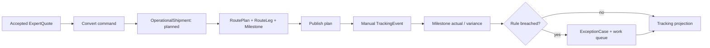

# دامنه MVP مدیریت اجرای حمل Forwarder

## 1. هدف MVP

اثبات یک vertical slice ممیزی‌پذیر از «quote پذیرفته‌شده تا برنامه و اجرای پایه حمل» بدون شکستن Request/Quote فعلی. اصطلاح رسمی پرونده اجرا `OperationalShipment` است؛ `ShipmentJob` entity جدا نیست.

## 2. کاربران و نقش‌ها

| نقش | نیاز MVP |
|---|---|
| Sales/Pricing | مشاهده lineage و conversion؛ حفظ workflow فعلی |
| Operator/Dispatcher | ساخت/مالکیت shipment، route، milestone، update |
| Control Tower | صف exception و موارد نیازمند توجه |
| Manager/Admin | policy/reference و KPI خلاصه |
| Customer | tracking allowlisted بدون داده داخلی |

Finance، compliance پیشرفته، partner self-service و project manager کامل خارج MVP هستند؛ permission skeleton آن‌ها نباید مسدود شود.

## 3. In Scope

- conversion idempotent accepted quote به OperationalShipment؛
- source identity و lineage به ShipmentRequest/ExpertQuote؛
- shipment owner، lifecycle، version و audit؛
- یک RoutePlan فعال با یک یا چند RouteLeg؛
- milestone catalog محدود و planned/actual؛
- TransportUnit چندگانه و LoadAllocation حداقلی؛
- TrackingEvent دستی normalized با source=`manual_operator`؛
- exception ساده delay/data-stale/manual؛
- work queue/dashboard MVP؛
- public tracking compatibility projection؛
- feature flag، migration/backfill محدود و rollback؛
- RBAC پایه و organization scope حداقلی.

## 4. Out of Scope

- microservice، broker خارجی و event sourcing کامل؛
- billing/GL/invoice و margin کامل؛
- document/compliance lifecycle کامل؛
- carrier/EDI/API integration production؛
- predictive ETA/AI automation/optimization؛
- map live، geofencing، IoT؛
- mobile/offline/POD؛
- TransportProject کامل؛
- workflow engine عمومی؛
- حذف ستون/status/API legacy.

## 5. User Storyها

1. به‌عنوان operator، از quote پذیرفته‌شده دقیقاً یک shipment می‌سازم تا duplicate رخ ندهد.
2. به‌عنوان operator، owner و route legهای ترتیبی تعیین می‌کنم.
3. به‌عنوان dispatcher، milestoneهای برنامه‌ای هر leg را ثبت/منتشر می‌کنم.
4. به‌عنوان operator، event واقعی با زمان/مکان/source ثبت می‌کنم.
5. به‌عنوان سیستم، event مناسب milestone را realize و variance را محاسبه می‌کنم.
6. به‌عنوان control tower، shipment دیرکرده/بدون update را در صف می‌بینم.
7. به‌عنوان control tower، exception را acknowledge، assign و resolve می‌کنم.
8. به‌عنوان مشتری، projection امن وضعیت و timeline را می‌بینم.
9. به‌عنوان sales، نتیجه conversion را می‌بینم بدون تغییر workflow درخواست.
10. به‌عنوان auditor، actor/reason/version/correlation هر transition را ردیابی می‌کنم.

## 6. Workflowهای MVP

## 7. Stage-based validation

| Stage | Validation blocking |
|---|---|
| Conversion | accepted quote، source identity unique، permission |
| Shipment draft | origin/destination/mode/owner/service level |
| Plan publish | ≥1 leg، sequence معتبر، location snapshot، planned time |
| Booking/in execution | milestoneهای اجباری و owner |
| Event entry | event type/source/occurred_at، dedupe، visibility |
| Complete leg | departure/arrival milestone یا override مجاز و reason |
| Complete shipment | همه legها complete، exception blocker صفر |

## 8. سناریوهای چند سفارش و چند واحد

MVP باید حداقل این حالات را مدل کند:

- یک CustomerOrder/Request → یک shipment → چند unit؛
- چند order → یک shipment consolidated با LoadAllocation؛ این حالت **نیازمند تأیید کسب‌وکار** ولی schema باید پشتیبانی کند؛
- یک order → چند shipment؛ **نیازمند تأیید** و بدون فرض ضمنی one-to-one؛
- unit در چند leg متوالی؛ allocation overlap نامعتبر رد شود؛
- unit بدون update در summary `not_started/data_stale`، نه حذف از محاسبه.

## 9. Route و Milestone

catalog محدود پیشنهادی: `pickup_ready`, `picked_up`, `leg_departed`, `leg_arrived`, `customs_started`, `customs_cleared`, `delivered`. کاربرد customs بر حسب route قابل تنظیم است. RouteLeg برنامه را تعریف می‌کند؛ TrackingEvent واقعیت را ثبت می‌کند؛ Milestone پیوند plan/actual است. این سه هرگز هم‌معنا نیستند.

## 10. Exception ساده

MVP categoryهای `milestone_overdue`, `data_stale`, `manual_issue` را با severity، owner، due time، status، note و resolution ارائه می‌کند. automatic rule deterministic است. escalation چندسطحی، root-cause taxonomy جامع و predictive alert خارج MVP است.

## 11. Dashboard MVP

- شمار shipmentهای planned/in execution/completed؛
- work queue با severity، age، owner و due؛
- overdue milestone و shipment بدون update؛
- last event/freshness؛
- drill-down shipment→leg→milestone→event؛
- filter owner/status/lane/date؛
- acknowledge/assign/resolve command؛
- بدون map زنده، ETA هوشمند یا margin.

## 12. Permissions MVP

| Action | Sales | Operator | Tower | Admin | Customer |
|---|---:|---:|---:|---:|---:|
| view commercial lineage | ✓ | ✓ | ✓ | ✓ | محدود |
| convert accepted quote | محدود | ✓ | - | ✓ | - |
| edit/publish plan | - | ✓ | view | ✓ | - |
| record event | - | ✓ | ✓ | ✓ | - |
| manage exception | view | ✓ | ✓ | ✓ | - |
| view public projection | view | view | view | view | own scope |
| change request/quote | طبق legacy | - | - | policy | پاسخ quote فقط |

Backend enforcement و audit الزامی است؛ UI guard کافی نیست.

## 13. Acceptance Criteria

- conversion تکراری همان source، shipment جدید نسازد؛
- request/quote بدون تغییر معنای status ادامه کار دهد؛
- invalid transition با conflict و error code پایدار رد شود؛
- concurrent update با version conflict از lost update جلوگیری کند؛
- plan منتشرشده overwrite نشود و revision بسازد؛
- event تکراری اثر دوم نداشته باشد؛
- out-of-order event projection را deterministic بازسازی کند؛
- public response هیچ internal note/cost/actor id ندهد؛
- exception overdue ساخته، ownerپذیر و resolveپذیر باشد؛
- audit دارای actor/source/reason/correlation/version باشد؛
- feature flag خاموش، UI/API legacy را سالم نگه دارد؛
- rollback application بدون حذف داده جدید ممکن باشد.

## 14. Regression criteria برای Request و Quote

- ایجاد domestic/international request؛
- auto/manual assignment و referral؛
- expert list/detail/status؛
- quote create/read/customer accept/reject؛
- customer/public tracking legacy؛
- CRM linking/create-from-request؛
- admin reports/XLSX؛
- auth/session/revocation؛
- location/reference endpoints؛
- OpenAPI/client build و frontend lint.

## 15. UAT Matrix

| UAT | سناریو | نتیجه مورد انتظار |
|---|---|---|
| U01 | convert quote پذیرفته‌شده | یک shipment با lineage کامل |
| U02 | convert دوباره با همان key | همان نتیجه؛ بدون duplicate |
| U03 | quote ردشده/منقضی | منع conversion |
| U04 | plan دو leg | ترتیب و milestone معتبر |
| U05 | plan زمان نامعتبر | validation error |
| U06 | دو unit و allocation | summary و ظرفیت صحیح |
| U07 | event departure/arrival | actual و variance صحیح |
| U08 | event تکراری/out-of-order | idempotent/recomputed |
| U09 | milestone overdue | exception/work queue |
| U10 | resolve بدون permission | forbidden |
| U11 | customer tracking | allowlist و own scope |
| U12 | legacy request/quote regression | رفتار مبنا حفظ شود |
| U13 | optimistic conflict | 409/version error |
| U14 | feature flag off | قابلیت جدید پنهان، legacy سالم |
| U15 | rollback rehearsal | داده حفظ، مسیر legacy فعال |

## 16. Non-functional requirements

- API transactional p95 و حجم هدف **نیازمند تأیید**؛ baseline پیش از تعهد؛
- availability/RPO/RTO **نیازمند تأیید**؛
- UTC storage و timezone-aware display؛
- structured logging/correlation و metric event lag؛
- WCAG/RTL و responsive desktop-first؛
- export امن و جلوگیری از formula injection؛
- encryption in transit/at rest طبق محیط؛
- migration بدون downtime معنادار با expand/migrate/contract؛
- backup/restore rehearsal؛
- تست authorization، contract، migration و concurrency.

## 17. Exit Definition

MVP زمانی تمام است که UAT 01-15، regression suite، migration rehearsal، rollback، audit completeness، permission tests و telemetry همگی PASS باشند. dashboard نمایشی بدون command/action و داده milestone سالم، MVP محسوب نمی‌شود.
