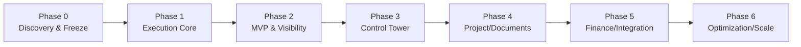

# برنامه فازبندی تحول عملیاتی Forwarder

## 1. قواعد برنامه

- اصطلاح رسمی `OperationalShipment`؛ `ShipmentJob` deprecated و فاقد مدل جدا؛
- modular monolith تا پایان Phase 6؛
- هر فاز vertical slice، feature flag، migration rehearsal، rollback و UAT دارد؛
- backend semantic foundation پیش از frontend mutation؛
- `ShipmentRequest.status` همیشه تجاری باقی می‌ماند؛
- commit boundaryها پیشنهادی‌اند و هر commit باید build/test سبز داشته باشد.

## 2. نمای نقشه راه

## 3. Phase 0 — Discovery، Baseline و Architecture Freeze

**هدف:** رفع ابهام معنایی و قفل تصمیم‌های پایه.

| بعد | خروجی |
|---|---|
| مدل | glossary، cardinality، state/transition matrix |
| API | command/error/idempotency/version convention |
| UI | research نقش/operator journey و information architecture |
| Migration | data profile، schema baseline، rollback template |
| تست | regression baseline، OpenAPI coverage، performance baseline |
| ریسک | R01/R02/R11/R13 |

وابستگی: مصاحبه sales/operation/finance/compliance و پاسخ موارد «نیازمند تأیید».

Exit Criteria: ADR-001 تا 006/009/012/013 تصویب؛ glossary و `OperationalShipment` freeze؛ mapping status تصویب؛ baseline tests سبز.

UAT: walkthrough کاغذی سه shipment واقعی و sign-off ذی‌نفعان.

Commit boundaries پیشنهادی: docs/ADR؛ architecture tests؛ API conventions؛ بدون feature.

خارج فاز: table عملیاتی، UI جدید، integration.

## 4. Phase 1 — Execution Core و Platform Seam

**هدف:** schema و commandهای تاریک برای هسته اجرا.

| بعد | خروجی |
|---|---|
| مدل | Party scope حداقلی، OperationalShipment، RoutePlan/Leg/Milestone |
| API | convert، shipment read، plan draft/publish، transition commands |
| UI | feature-flagged read-only internal detail |
| Migration | additive tables/FK/index، source identity، backfill dry-run |
| تست | invariant/state/concurrency/migration/PostgreSQL |
| platform | audit envelope، outbox/inbox، idempotency record |

ترتیب: migration expand → domain model/service → commands → outbox/projector → read API → UI read-only.

وابستگی: Phase 0 freeze. ریسک‌ها: R01-R04، R07، R11-R13.

Exit Criteria: duplicate conversion صفر؛ state guard و version conflict؛ migration/retry/rollback PASS؛ هیچ تغییر معنایی request/quote.

UAT: convert سه quote منتخب در staging، route یک/دو leg و audit lineage.

Commit boundaries: schema expand؛ domain model؛ transition service؛ outbox/inbox؛ API/OpenAPI؛ read-only UI؛ tests/docs.

خارج فاز: public rollout، exception automation، project/document/finance.

**Architecture Freeze A:** aggregate boundaries، source identity و event envelope پس از این فاز بدون ADR سازگار تغییر نکنند.

## 5. Phase 2 — MVP Execution و Visibility

**هدف:** تکمیل دامنه تعریف‌شده در [MVP](forwarder_mvp_scope.md).

| بعد | خروجی |
|---|---|
| مدل | TransportUnit، LoadAllocation، TrackingEvent، projection |
| API | unit/allocation، record event، milestone realization، tracking v2 |
| UI | operator workspace و shipment/leg/milestone timeline |
| Migration | legacy update adapter و cohort backfill |
| تست | dedupe/out-of-order/projection/public allowlist/regression |
| ریسک | R03/R04/R10/R13 |

ترتیب backend→frontend: event schema/dedupe → projector → query API → operator mutations → UI → shadow public tracking.

Exit Criteria: UAT 01-15 MVP؛ data quality gates؛ shadow mismatch در threshold؛ rollback rehearsal.

UAT: چند سفارش/چند unit، route دو leg، event تکراری و out-of-order، public tracking امن.

Commit boundaries: unit/allocation؛ event ingestion؛ projection؛ compatibility adapter؛ UI؛ public cohort flags.

خارج فاز: predictive ETA، carrier integration، document/finance.

## 6. Phase 3 — Control Tower MVP

**هدف:** تبدیل visibility به اقدام سازمان‌یافته.

| بعد | خروجی |
|---|---|
| مدل | ExceptionCase، OperationalTask، SLA rule، Alert |
| API | queue/query، acknowledge/assign/escalate/resolve |
| UI | work queue، filter، drill-down، freshness و overdue |
| Migration | rule seed versioned؛ projection rebuild |
| تست | deterministic rule، permission، aging/timezone، load |
| ریسک | R05/R10 |

وابستگی: event/milestone quality Phase 2. ترتیب: exception taxonomy → deterministic evaluator → queue projection → commands → UI.

Exit Criteria: هر exception owner/due/audit؛ MTTA/MTTR قابل محاسبه؛ dashboard command-actionable؛ alert فنی و عملیاتی جدا.

UAT: milestone overdue، data stale، assign/escalate/resolve/reopen، unauthorized action.

Commit boundaries: exception model؛ rule evaluator؛ queue projection/API؛ commands؛ UI؛ KPI contracts.

خارج فاز: ML risk score، map live، margin at risk.

**Architecture Freeze B:** تعریف Milestone/TrackingEvent/Exception و KPI contract قفل می‌شود.

## 7. Phase 4 — TransportProject، Document و Compliance

**هدف:** پشتیبانی پروژه‌های لجستیکی و gateهای اسنادی.

| بعد | خروجی |
|---|---|
| مدل | TransportProject، membership/dependency، Document/Version/Requirement/Check |
| API | project grouping، document metadata/upload URL، review/approval |
| UI | project portfolio، checklist و blocker |
| Migration | object storage metadata، policy/retention، legacy attachment discovery |
| تست | access/classification/checksum/version/expiry |
| ریسک | R06/R07 |

وابستگی: party/scope و exception. storage vendor و compliance catalog **نیازمند تأیید**.

Exit Criteria: blob خارج DB، signed access، audit کامل، required document gate و project drill-down.

UAT: چند shipment در project، dependency، upload/version/reject/approve/expire، forbidden cross-org access.

Commit boundaries: project model/API/UI؛ storage adapter؛ document model؛ compliance rules؛ permissions/UAT.

خارج فاز: OCR/AI extraction، legal archive جامع، customer bulk portal.

## 8. Phase 5 — Operational Finance و Partner Integration

**هدف:** visibility هزینه/درآمد واقعی و یک integration production کنترل‌شده.

| بعد | خروجی |
|---|---|
| مدل | ChargeLine، accrual، invoice link، FX snapshot، PartnerConnection |
| API | cost/revenue commands، margin query، webhook/integration ops |
| UI | finance workspace، margin/variance، replay console |
| Migration | currency/charge seed، credential vault، mapping version |
| تست | decimal/FX/allocation، signature/replay/retry/circuit breaker |
| ریسک | R06/R14 |

وابستگی: finance policy، accounting boundary و partner منتخب **نیازمند تأیید**.

Exit Criteria: traceable buy/sell/actual/accrual؛ margin reproducible؛ webhook replay-safe؛ manual fallback و runbook.

UAT: multi-currency charge، cost variance، invoice link، duplicate webhook، outage/retry/DLQ/replay.

Commit boundaries: money primitives؛ charge domain؛ finance API/UI؛ adapter framework؛ first partner؛ operations runbook.

خارج فاز: GL کامل، چندین partner هم‌زمان، auto-payment.

## 9. Phase 6 — Optimization، AI و Scale Decision

**هدف:** استفاده از داده معتبر برای prediction و تصمیم درباره استخراج سرویس.

| بعد | خروجی |
|---|---|
| مدل | prediction record، confidence، model/version/provenance |
| API | ETA/risk proposal و feedback؛ بدون mutation خودکار حساس |
| UI | explainable recommendation و human approve/reject |
| Migration | feature/model metadata و retention |
| تست | accuracy/drift/bias/fallback/human boundary |
| ریسک | R08/R09 |

ارزیابی استخراج visibility/integration فقط با evidence: throughput، failure isolation، deploy cadence و team ownership. default، حفظ monolith است.

Exit Criteria: baseline بهتر از rule، confidence/explanation، fallback، monitoring drift و approval audit.

UAT: ETA proposal، low-confidence fallback، provider outage و human rejection.

Commit boundaries: offline evaluation؛ proposal service؛ UI review؛ monitoring؛ در صورت تصویب ADR استخراج مستقل.

خارج فاز: autonomous dispatch/pricing، mutation بدون human policy.

**Architecture Freeze C:** معیار scale و مرز احتمالی extraction، نه الزام microservice.

## 10. ماتریس وابستگی قابلیت‌ها

| قابلیت | P0 | P1 | P2 | P3 | P4 | P5 | P6 |
|---|---:|---:|---:|---:|---:|---:|---:|
| glossary/ADR | ● |  |  |  |  |  |  |
| OperationalShipment/Leg/Milestone |  | ● | تکمیل |  |  |  |  |
| Event/projection | طراحی | seam | ● | مصرف | مصرف | مصرف | داده آموزشی |
| MVP operator |  | read | ● | توسعه |  |  |  |
| Control Tower | طراحی KPI |  | freshness | ● | blocker | margin risk | prediction |
| Project/Document | discovery |  |  |  | ● |  |  |
| Finance/Partner | discovery | seam |  |  |  | ● | توسعه |

## 11. Quality و Release Gate مشترک

هر فاز باید این موارد را PASS کند:

- OpenAPI compatibility و client build؛
- unit/integration/contract/authorization tests؛
- migration dry-run/rehearsal و rollback؛
- data quality/reconciliation؛
- observability، alert و runbook؛
- security/privacy review متناسب؛
- request/quote/public tracking regression؛
- UAT sign-off و feature flag rollout؛
- docs/ADR به‌روز و conflict terminology صفر.

## 12. ترتیب نهایی و معیار موفقیت

semantic و data foundation (P0-P2) پیش از dashboard گسترده، document/finance و AI است. موفقیت با تعداد screen سنجیده نمی‌شود؛ با lineage کامل، transition ممیزی‌پذیر، event idempotent، milestone قابل اعتماد، exception ownerدار، public allowlist، rollback موفق و SLO اثبات‌شده سنجیده می‌شود.
