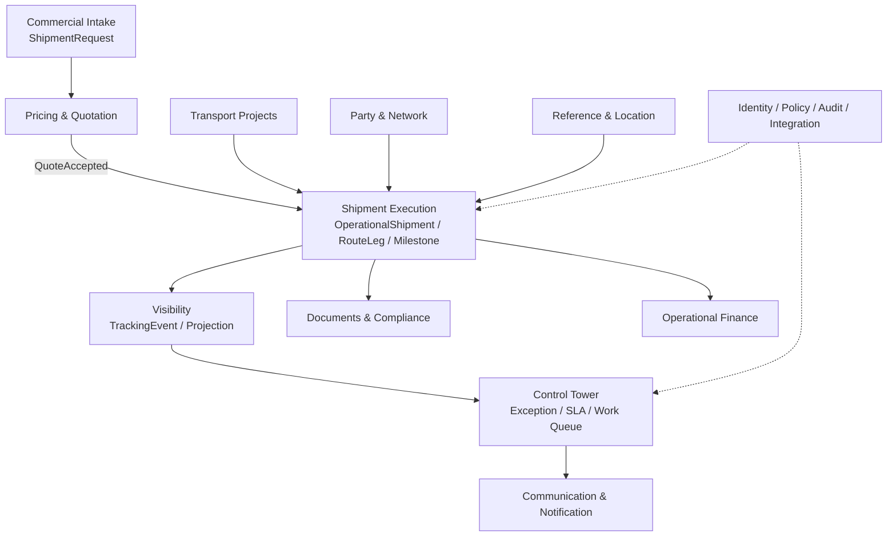
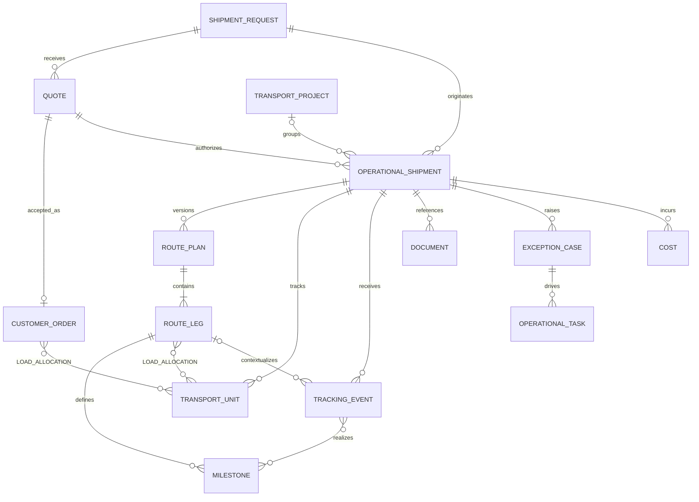
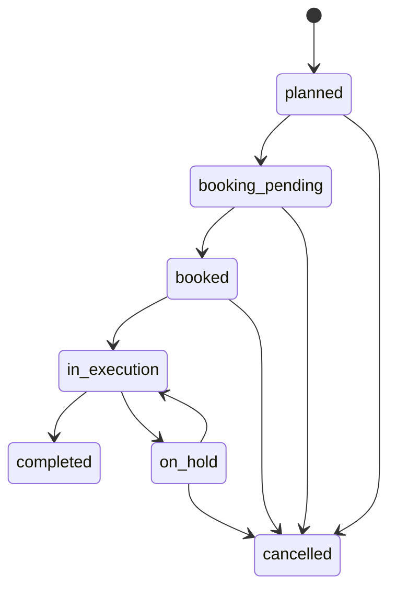

# مدل دامنه و معماری هدف Forwarder

## 1. واژگان رسمی

| اصطلاح | تعریف رسمی | قاعده نام‌گذاری |
|---|---|---|
| ShipmentRequest | تقاضای تجاری اولیه برای دریافت خدمت/قیمت | فقط Commercial Intake |
| CustomerOrder | تعهد/سفارش مشتری قابل fulfillment؛ ممکن است از request پذیرفته‌شده ساخته شود | در MVP اختیاری و **نیازمند تأیید** |
| OperationalShipment | پرونده اجرایی end-to-end حمل | اصطلاح رسمی مدل هدف |
| ShipmentJob | نام جایگزین قدیمی برای OperationalShipment | Deprecated؛ entity جدا ساخته نشود |
| TransportProject | ظرف برنامه‌ای برای چند OperationalShipment و dependency/budget مشترک | جایگزین shipment نیست |
| RoutePlan | baseline مسیر یک OperationalShipment | دارای نسخه و RouteLeg |
| RouteLeg | بخش ترتیبی مسیر با mode/provider/from/to | منبع plan، نه event |
| Milestone | تعهد/نقطه کنترل planned و actual روی shipment/leg | وضعیت تحقق plan |
| TrackingEvent | واقعیت append-only دریافتی/ثبت‌شده | می‌تواند milestone را محقق کند |
| TransportUnit | container/truck/package group یا واحد قابل رهگیری | مستقل از leg |
| LoadAllocation | تخصیص cargo/order به unit و در صورت نیاز leg | رابطه چندبه‌چند با مقدار |
| ExceptionCase | مورد قابل مالکیت و حل ناشی از انحراف/رخداد | صرفاً status delayed نیست |
| OperationalTask | اقدام قابل واگذاری برای shipment/project/exception | با CRM Task اشتباه نشود |

**تصمیم صریح:** `OperationalShipment` و `ShipmentJob` یک مفهوم‌اند؛ فقط `OperationalShipment` در schema، API و UI جدید استفاده می‌شود. `ShipmentJob` terminology منسوخ و فاقد table/class مستقل است.

## 2. اصول معماری هدف

1. Request=intent، Quote=offer، OperationalShipment=execution.
2. `ShipmentRequest.status` فقط تجاری باقی می‌ماند.
3. status عملیاتی در aggregate مستقل و از milestone/event مشتق یا guardشده است.
4. plan و fact جدا: RouteLeg/Milestone برنامه، TrackingEvent واقعیت است.
5. write با command و transition؛ read با projection.
6. mutation دارای actor، source، reason، correlation و aggregate version است.
7. integration با transactional outbox/inbox و idempotency انجام می‌شود.
8. modular monolith تا اثبات نیاز scale/team/failure isolation حفظ می‌شود.
9. AI پیشنهاددهنده است؛ تصمیم و mutation حساس تحت policy/انسان است.

## 3. تصمیم حفظ Modular Monolith

Backend فعلی factory/blueprint/service و database مشترک دارد (`backend/__init__.py:23` و `backend/routes/__init__.py:20-37`). هدف، bounded moduleهای درون همین deployable است:

- مالکیت صریح table و service؛
- import rule و architecture test؛
- API/application contract بین moduleها؛
- outbox به‌عنوان seam استخراج آینده؛
- ممنوعیت join/write مستقیم across boundary بدون owner service.

microservice در MVP خارج از دامنه است.

## 4. Bounded Contextها



| Context | مالک حقیقت | مرز ممنوع |
|---|---|---|
| Commercial Intake | ShipmentRequest و qualification | status اجرایی |
| Pricing | Quote/version/estimated charges | actual cost |
| Execution | OperationalShipment/RoutePlan/Leg/Milestone | CRM pipeline |
| Projects | TransportProject/dependency/baseline | event ingestion |
| Party & Network | Party/role/capability/location affiliation | shipment lifecycle |
| Visibility | TrackingEvent و current projection | تغییر plan بدون command |
| Documents | metadata/version/requirement/check | blob در DB transactional |
| Finance | charge/accrual/invoice allocation/margin | GL کامل در MVP |
| Control Tower | exception/SLA/alert/work queue | حقیقت milestone/event |
| Platform | identity/policy/audit/outbox/inbox/reference | منطق اختصاصی shipment |

## 5. مدل مفهومی و Cardinality



قواعد cardinality:

- یک request می‌تواند چند quote و، پس از تصمیم کسب‌وکار، صفر تا چند shipment داشته باشد؛ cardinality دقیق **نیازمند تأیید** است.
- هر OperationalShipment حداقل یک RoutePlan فعال و هر plan حداقل یک RouteLeg دارد.
- تنها یک RoutePlan در هر لحظه baseline فعال است.
- Milestone می‌تواند shipment-level یا leg-level باشد؛ در MVP leg-level ترجیح دارد.
- TrackingEvent ممکن است به leg/unit/location مرتبط باشد و صفر یا چند milestone را realize کند.
- LoadAllocation مقدار cargo/order روی unit و leg را نگه می‌دارد و از duplicate allocation جلوگیری می‌کند.
- TransportProject اختیاری است و lifecycle shipment را مالک نیست.

## 6. Aggregateها و Invariantها

### OperationalShipment

- `source_request_id` الزامی برای conversion از legacy؛
- `accepted_quote_id` در مسیر quote-based الزامی و با source identity unique؛
- public id غیرقابل حدس؛
- owner team/user و organization scope؛
- lifecycle transition فقط از domain service؛
- version افزایشی برای optimistic concurrency؛
- completion تنها با milestoneهای اجباری محقق و exception blocker حل‌شده.

### RoutePlan و RouteLeg

- sequence در plan یکتا و پیوسته؛
- from/to location snapshot الزامی؛
- زمان برنامه‌ای departure ≤ arrival؛
- plan منتشرشده immutable؛ revision جدید ساخته می‌شود؛
- leg actual time از TrackingEvent/Milestone می‌آید، نه overwrite plan.

### Milestone

- `type + leg + plan_version` یکتا طبق catalog؛
- planned_at با timezone/UTC semantics مشخص؛
- actual_at بدون source event یا actor/source معتبر ممنوع؛
- delayed یک derived condition است، نه lifecycle shipment؛
- تغییر actual نیازمند correction event و audit، نه حذف تاریخچه.

### TrackingEvent

- append-only؛
- `(source, external_event_id)` یا dedupe key یکتا؛
- occurred_at و received_at جدا؛
- payload خام reference و normalized fields؛
- out-of-order event مجاز، projection قابل rebuild؛
- visibility/classification صریح.

### TransportUnit و LoadAllocation

- unit code در scope shipment یکتا؛
- allocation دارای quantity/unit و source order/cargo؛
- مجموع allocation از مقدار مجاز بیشتر نشود؛ واحد اندازه‌گیری بدون تبدیل ضمنی؛
- unit می‌تواند در legهای متوالی حرکت کند، ولی overlap نامعتبر ممنوع.

### Document، Exception، Task و Cost

- Document شامل metadata/storage key/checksum/version/classification؛ blob بیرون DB؛
- Exception دارای severity/owner/due/status/root cause/resolution؛
- OperationalTask با CRM `Task` فعلی (`backend/models.py:891`) نام فنی متمایز دارد؛
- Cost شامل buy/sell، estimate/actual/accrual، currency و FX snapshot؛ money float نیست.

## 7. Lifecycle و Status architecture



چرخه‌های رسمی:

- ShipmentRequest: `new/qualified/quoted/accepted|rejected|expired|cancelled`؛ mapping legacy جداگانه؛
- OperationalShipment: نمودار بالا؛
- RouteLeg: `planned → ready → departed → arrived → completed` با hold/cancel guard؛
- ExceptionCase: `open → acknowledged → investigating → action_pending → resolved → closed` و reopen؛
- Document: `required → uploaded → under_review → approved|rejected|expired`.

`delayed`، `at_risk` و `data_stale` condition/projection هستند، نه status اصلی shipment.

## 8. Event architecture

هر command موفق در transaction واحد aggregate و `OutboxEvent` را می‌نویسد. worker آن را claim/publish می‌کند. inbound adapter ابتدا `InboxMessage` و dedupe را ثبت، سپس `TrackingEvent` normalized ایجاد می‌کند. event envelope:

```text
event_id, event_type, schema_version, aggregate_type/id/version,
occurred_at, recorded_at, actor/source, correlation_id, causation_id,
idempotency_key, classification, payload
```

رخدادهای پایه: `QuoteAccepted`, `OperationalShipmentCreated`, `RoutePlanPublished`, `LegDeparted`, `MilestoneRealized`, `TrackingEventReceived`, `ExceptionOpened/Resolved`, `DocumentApproved`, `ShipmentCompleted`.

## 9. Location architecture

سه سطح تفکیک می‌شود:

1. **Location master:** کشور/شهر/بندر/گمرک/reference فعلی؛
2. **Operational snapshot:** نام، code، مختصات/timezone و address لازم در زمان plan/event؛
3. **Observed location:** location یک TrackingEvent با source/confidence.

`TrackingLocationReference` فعلی (`backend/models.py:510`) قابل استفاده مجدد است، اما source-of-truth بیرونی، geocode، UN/LOCODE و timezone **نیازمند تأیید** است.

## 10. Permission boundaries

| نقش | مرز اصلی |
|---|---|
| sales | request/customer؛ مشاهده خلاصه عملیات |
| pricing | quote و estimated charge؛ بدون actual approval |
| operator/dispatcher | plan/leg/milestone/event؛ بدون تغییر quote |
| project_manager | project و cross-shipment coordination |
| control_tower | exception/alert/assignment/escalation |
| finance | actual/accrual/invoice/margin |
| compliance | document/check/gate |
| partner | فقط shipment/leg تخصیص‌یافته و API scope محدود |
| customer | projection allowlisted سازمان خود |
| admin | policy/config؛ عملیات حساس همچنان audit/approval |

Authorization بر `(action, resource, organization_scope)` و در صورت نیاز attribute/document classification است.

## 11. ADRهای پیشنهادی

| ADR | تصمیم | وضعیت |
|---|---|---|
| 001 | modular monolith با bounded module | پیشنهاد برای تصویب |
| 002 | OperationalShipment مستقل؛ ShipmentJob deprecated | ضروری |
| 003 | conversion idempotent و lineage از accepted quote | ضروری |
| 004 | command/state machine؛ عدم PATCH آزاد status | ضروری |
| 005 | PostgreSQL outbox/inbox | ضروری |
| 006 | append-only event و rebuildable projection | ضروری |
| 007 | object storage برای document blob | پیش از Phase 3 |
| 008 | Party/Role و organization scope | پیش از rollout MVP |
| 009 | RBAC/ABAC و segregation of duties | ضروری |
| 010 | decimal money/currency/FX snapshot | پیش از finance |
| 011 | build/buy workflow/map/ETA | **نیازمند تأیید** |
| 012 | retention/privacy/audit policy | ضروری |
| 013 | location master/snapshot/observation separation | ضروری |

## 12. تصمیم نهایی درباره ShipmentRequest.status

`ShipmentRequest.status` منبع حقیقت چرخه تجاری موجود است. هیچ مقدار `booked`, `departed`, `arrived`, `delayed` یا `delivered` به آن افزوده نمی‌شود. UI قدیمی می‌تواند summary عملیات را از projection بخواند، اما حق write روی status عملیاتی ندارد. mapping `won` به ساخت shipment یک command مستقل و idempotent است؛ `won` به‌تنهایی اثبات شروع اجرا نیست.
