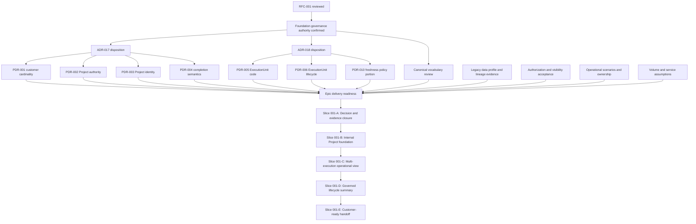

# EPIC-001: Project Aggregate Foundation

- Epic ID: EPIC-001
- Source RFC: [RFC-001 — Multi-Execution Operational Project](RFC-001-multi-execution-operational-project.md)
- Status: Draft
- Date: 2026-07-31
- Capability owner: Product
- Delivery participants: Product, Architecture, Operations, Security, Data, QA
- Primary capability: CAP-001 Project Management
- Supporting capabilities: CAP-002 Shipment Management, CAP-003 Execution Management
- Release target: Platform Delivery — Project Aggregate Foundation release train; exact SemVer and calendar date require approval
- Decision authority: None. This Epic organizes executable outcomes but does not accept an ADR or PDR, authorize implementation, or prescribe implementation design.

## 1. Business Objective

Establish the first governed Project capability that lets Forwarder coordinate a customer outcome spanning multiple ShipmentRequests, OperationalShipments, and independently progressing ExecutionUnits without merging their distinct commercial and operational meanings.

The Epic should enable authorized operational users to understand the whole body of work, its ownership, contributing executions, progress, remaining obligations, and exceptions from one Project context. It should create a safe foundation for later customer visibility, timelines, documents, reporting, integrations, and AI assistance while preserving the existing business workflows throughout adoption.

The business outcome is successful only when Project-level coordination improves operational clarity without creating false completion, losing lineage, broadening access, or redefining ShipmentRequest and OperationalShipment.

## 2. Technical Objective

Deliver an approved, bounded Project aggregate foundation as a platform capability while preserving the established architecture boundaries and backward-compatibility laws.

At outcome level, the foundation must support:

- stable Project identity and explicit ownership under approved policy;
- explicit, traceable membership of relevant ShipmentRequests and OperationalShipments;
- Project-level understanding of multiple independently progressing ExecutionUnits;
- deterministic, qualified Project progress derived from authoritative child state;
- organization- and resource-scoped access with deny-by-default behavior;
- evidence-based coexistence with legacy records and workflows;
- independently releasable increments with safe fallback; and
- clear seams for later capabilities without including those capabilities in this Epic.

This objective does not select entities, storage, schemas, endpoints, services, UI structures, migration mechanics, or deployment mechanics. Those require separately approved implementation design after all governing decisions are accepted.

## 3. Capability Alignment

| Capability | Alignment to EPIC-001 | Accountability |
|---|---|---|
| CAP-001 — Project Management | Primary outcome: establish the governed Project coordination foundation | Product |
| CAP-002 — Shipment Management | Preserve ShipmentRequest commercial truth and OperationalShipment execution truth; provide traceable Project relationships | Product |
| CAP-003 — Execution Management | Make independently progressing ExecutionUnits understandable within Project context | Operations |
| CAP-006 — Reporting & Analytics | Consume qualified Project outcomes in later work; no new reporting platform scope here | Data |
| CAP-007 — Customer Portal | Potential consumer of a later customer-safe Project projection | Product |
| CAP-008 — Expert Workspace | Primary internal experience consumer for operational coordination | Operations |
| CAP-010 — Security & Identity | Enforce approved organization, resource, customer, stakeholder, and action boundaries | Security |
| CAP-013 — Master Data | Supply governed customer, organization, location, and reference data where applicable | Data |

CAP-004 Timeline Platform, CAP-005 Document Platform, CAP-011 Integration Platform, CAP-012 Notification Platform, and CAP-014 AI Platform are downstream dependencies or consumers, not Epic deliverables.

Capability references do not change Capability Registry status, priority, ownership, or roadmap phase.

## 4. Architecture Boundaries

EPIC-001 must operate within the following boundaries:

- **Project** is the business coordination and customer-context boundary. It must not become the detailed source of truth for child execution.
- **ShipmentRequest** remains the commercial intake, quotation, and decision record.
- **OperationalShipment** remains the executable shipment aggregate responsible for route and shipment execution.
- **ExecutionUnit** is the canonical term for independently progressing unit execution when ADR-018 and the applicable PDRs are accepted.
- Project-level progress is a qualified aggregate understanding; it must not overwrite child lifecycle, evidence, alert, exception, or verification truth.
- Commercial status, operational lifecycle, alerts, exceptions, tasks, document state, approval state, and customer presentation remain separately owned concepts.
- Cross-Project and cross-organization access fails closed. Project membership alone must not broaden event or document visibility.
- Legacy request, shipment, tracking, and case-document behavior remains authoritative until an approved adoption and deprecation gate says otherwise.
- Evolution remains additive, observable, cohort-controlled, N/N-1 aware, and rollback-ready.
- Ambiguous ownership, lineage, status, code, type, or time evidence is never guessed.
- The modular-monolith boundary remains in force unless a separately accepted ADR supersedes it.
- Proposed ADRs and PDRs remain non-authoritative until their named owners and approvers record acceptance.

## 5. Explicit Out-of-Scope Items

- Unified OperationalEvent or Timeline Platform delivery.
- Project-, shipment-, unit-, or event-scoped document delivery.
- Customer document upload, replacement, approval, download, or bulk ZIP.
- Public Project tracking or unauthenticated Project access.
- ExecutionUnit split, merge, custody reconciliation, or document inheritance.
- Executable bulk unit operations.
- Full SLA catalog, predictive risk, or advanced control-tower ranking.
- ERP, BPM, carrier, partner, warehouse-management, customs-filing, finance, settlement, invoicing, or payment systems.
- Mode-specific specialist aggregates or separate lifecycle systems.
- Autonomous AI action, Project mutation, approval, or visibility change.
- Physical purge, legal-hold automation, or digital-signature verification.
- Replacement of existing ShipmentRequest, OperationalShipment, milestone, tracking, audit, outbox, or document behavior.
- Destructive legacy contraction or inferred backfill.
- Any entity, schema, API, UI, migration, infrastructure, or deployment design in this Epic document.

## 6. Dependency Map

### Dependency rules

- ADR-017 and ADR-018 must be Accepted, revised, or superseded before an implementation slice relying on their boundaries is authorized.
- PDR-001 through PDR-006 are blockers for the canonical Project/ExecutionUnit foundation.
- The relevant PDR-010 freshness-policy portion is required only when a slice labels data stale or produces freshness alerts. Until then, update age may be shown only as non-interpretive evidence under approved presentation rules.
- PDR-007 through PDR-009 and PDR-011 remain deferred because their capabilities are outside this Epic.
- ADR-019 and ADR-020 are not entry dependencies unless a slice expands into timeline or document scope; such expansion requires Epic review and is not assumed.
- Data, Security, Operations, QA, and Product evidence gates cannot be replaced by Architecture approval alone.

## 7. Deliverables

EPIC-001 is expected to produce the following governed delivery artifacts and business outcomes after Product approval:

1. A Product-approved Epic scope and ordered slice backlog.
2. Recorded dispositions for the ADRs and PDR portions required by each selected slice.
3. Approved canonical vocabulary and business-rule traceability for Project, ShipmentRequest, OperationalShipment, and ExecutionUnit.
4. Representative business scenarios and expected outcomes for ownership, membership, partial progress, cancellation, completion, ambiguity, and unauthorized access.
5. A legacy data-readiness assessment covering lineage, customer ownership, unit codes, types, statuses, timestamps, duplicates, and ambiguity.
6. An approved authorization and visibility boundary for internal Project coordination.
7. A documented backward-compatibility, adoption, observability, fallback, and reconciliation contract.
8. Independently releasable delivery slices with entry gates, exit evidence, release decisions, and Product acceptance.
9. An internal Project coordination foundation that meets the accepted scope.
10. A qualified multi-execution operational view that preserves child sources of truth.
11. A customer-readiness decision package stating whether and how a later customer-facing slice may proceed.
12. Epic closure evidence showing metrics, unresolved items, deferrals, and ownership of follow-on work.

This deliverables list states required outcomes and governance evidence. It does not prescribe implementation artifacts or mechanisms.

## 8. Expected Implementation Sequence

The expected sequence is gate-driven:

1. **Product review of EPIC-001:** confirm business objective, scope, slice boundaries, ownership, and release intent.
2. **Decision closure:** record the required ADR and PDR dispositions; unresolved blockers retain their documented fail-safe behavior.
3. **Evidence readiness:** validate operational scenarios, authorization cases, scale assumptions, and legacy data profiles.
4. **Slice authorization:** approve only the smallest slice whose dependencies and acceptance criteria are complete.
5. **Bounded delivery:** realize that slice under a separate approved implementation design.
6. **Release and observation:** release the slice to its approved audience/cohort, collect agreed evidence, and preserve legacy fallback.
7. **Product acceptance:** compare actual outcomes to the slice acceptance criteria and success measures.
8. **Progression decision:** expand, revise, hold, or roll back before authorizing the next slice.
9. **Epic closure:** close only after every in-scope slice is accepted or explicitly removed/deferred with an owner and follow-up vehicle.

No downstream slice is automatically authorized by the success of an earlier slice.

## 9. Risks

| Risk | Impact | Epic control |
|---|---|---|
| Product policy remains unresolved | Delivery encodes unauthorized assumptions | Block the affected slice and preserve PDR fail-safe behavior |
| Project absorbs child responsibilities | God aggregate, concurrency pressure, lifecycle confusion | Enforce ADR and canonical-boundary review at every slice gate |
| Incorrect customer or stakeholder scope | Cross-customer disclosure | Require explicit ownership policy and negative authorization acceptance |
| False completion or progress | Customer harm and unreliable reporting | Require approved deterministic business examples and reconciliation |
| Legacy grouping is guessed | Incorrect lineage and ownership | Adopt only evidence-backed records; isolate ambiguity |
| Terminology drift | Duplicate concepts and incompatible contracts | Require vocabulary traceability in every slice |
| Project summary diverges from execution truth | Conflicting operational decisions | Measure reconciliation and prohibit Project-level truth overrides |
| Scale assumptions are too small | Unusable views or unsafe mass operations | Establish volume profile and bounded acceptance before rollout expansion |
| Existing workflows regress | Operational disruption | Maintain compatibility, cohorts, fallback, and explicit deprecation gates |
| Scope expands into timeline/documents/public tracking | Unapproved security and governance obligations | Stop and route expansion through the relevant ADR/PDR and Epic review |
| Success cannot be measured | Premature rollout or subjective acceptance | Freeze metric definitions and evidence owners before slice authorization |
| Rollback destroys new evidence | Loss of auditability and reconciliation | Use non-destructive fallback and preserve accepted records/evidence |

## 10. Success Metrics

Metric definitions, baselines, targets, measurement windows, and owners must be approved before the relevant slice is authorized. Candidate Epic metrics are:

| Measure | Intended signal | Minimum Epic expectation |
|---|---|---|
| Project coordination coverage | Eligible operational work represented in an approved Project context | Target set from the approved cohort; ambiguous records excluded and counted |
| Lineage reconciliation | Project membership agrees with authoritative evidence | No unexplained membership mismatch in the released cohort |
| Progress reconciliation | Project summary agrees with contributing child truth under the accepted policy | No unresolved false-completion or lifecycle contradiction |
| Authorization isolation | Unauthorized organization, customer, or stakeholder access | Zero confirmed cross-scope disclosure |
| Legacy workflow regression | Existing ShipmentRequest, OperationalShipment, and tracking outcomes remain available and correct | Zero unresolved critical regression attributable to the slice |
| Operational usability | Authorized users can identify overall progress and remaining work | Product/Operations acceptance against agreed scenarios |
| Ambiguity handling | Uncertain legacy ownership or lineage is surfaced safely | No guessed adoption; all ambiguity is counted and reviewable |
| Project lookup success | Authorized users can locate the intended Project using approved identifiers | Target established before the internal foundation release |
| Decision traceability | Delivered behavior maps to accepted ADR/PDR criteria | 100% of in-scope business rules traceable |
| Fallback readiness | Slice can be disabled without data loss or workflow outage | Demonstrated for every released slice before expansion |

Targets not yet approved must remain `TBD`; they must not be invented by delivery teams.

## 11. Rollback Strategy

Rollback is defined at the capability and slice level, not as destructive data reversal.

- Each slice must have a separately approved fallback that restores users to the previously supported ShipmentRequest, OperationalShipment, and tracking experience.
- A released Project capability may be disabled or restricted to an earlier approved audience/cohort when acceptance, security, reconciliation, performance, or operability gates fail.
- Project-originated information and lineage evidence must be preserved for audit and reconciliation during application fallback.
- Rollback must not delete or rewrite ShipmentRequest, OperationalShipment, ExecutionUnit, milestone, event, document, or audit history.
- Ambiguous or conflicting adoption outcomes must be isolated from normal Project summaries until reviewed.
- Customer-facing exposure, if later authorized outside this Epic, must be independently disableable from internal coordination.
- A failed slice does not require rollback of earlier accepted slices unless shared risk or evidence justifies it.
- Any database, migration, deployment, or technical rollback procedure belongs to the later approved implementation/release plan and is not designed here.

Rollback success means existing supported operations continue safely, new evidence remains reconcilable, and no unauthorized visibility persists.

## 12. Release Target

EPIC-001 targets the **Platform Delivery — Project Aggregate Foundation** release train.

- The Epic is expected to span multiple independently releasable increments.
- No fixed SemVer, date, or production commitment is approved by this draft.
- Slice 001-A is a documentation/governance release candidate and carries no runtime version impact.
- Runtime slices require their own SemVer assessment, immutable release identity, release manifest, compatibility statement, readiness evidence, and Product approval.
- The first runtime release may not be scheduled until ADR-017, ADR-018, PDR-001 through PDR-006, and any applicable PDR-010 portion have the required accepted status.
- Customer exposure, public tracking, documents, timeline, integrations, and AI actions are not part of the Epic release target.

## 13. Definition of Epic Completion

EPIC-001 is complete only when all of the following are true:

- [ ] Product has accepted the Epic business objective, final scope, and completion evidence.
- [ ] Architecture has confirmed compliance with the Platform Constitution, Architecture Baseline, Canonical Business Object Catalog, and applicable Accepted ADRs.
- [ ] Every Product behavior delivered by the Epic traces to an Accepted PDR or an explicitly unchanged existing policy.
- [ ] All in-scope slices are released and accepted, or explicitly removed/deferred with a named owner, reason, and follow-up vehicle.
- [ ] Authorized internal users can coordinate the approved Project scope across multiple operational executions.
- [ ] Project, ShipmentRequest, OperationalShipment, and ExecutionUnit remain distinct in behavior, language, and ownership.
- [ ] Project-level progress reconciles with authoritative child state under the accepted policy.
- [ ] No unresolved critical cross-organization, customer, or resource authorization defect remains.
- [ ] Existing ShipmentRequest, OperationalShipment, and legacy tracking workflows remain supported according to the approved compatibility contract.
- [ ] No legacy ownership, lineage, identifier, status, or timestamp was adopted through an unapproved guess.
- [ ] Slice success metrics meet their approved targets or have an explicit Product-approved exception.
- [ ] Fallback and reconciliation evidence exists for every released slice.
- [ ] Deferred timeline, document, public tracking, split/merge, integration, and AI scope remains disabled or outside the delivered capability.
- [ ] Operational ownership, support expectations, known limitations, and follow-on backlog are documented and accepted.
- [ ] The final release identity and Product acceptance record are available for every runtime slice.

Epic completion does not imply completion of CAP-001 or CAP-003 as a whole; it completes only the foundation scope defined here.

## 14. Independently Releasable Slices

### Slice 001-A — Decision and Evidence Closure

- **Slice ID:** EPIC-001-SLICE-A
- **Goal:** Produce an approved, decision-complete delivery baseline for the first Project foundation outcome, including business scenarios, decision traceability, legacy evidence, authorization boundaries, metrics, and release gates.
- **Estimated size:** Medium
- **Dependencies:** RFC-001 review; Platform Constitution/Baseline authority confirmation; Canonical Catalog review; ADR-017 and ADR-018 disposition; PDR-001 through PDR-006 disposition; applicable PDR-010 disposition; named Product, Operations, Security, Data, QA, and Architecture owners.
- **Business value:** Removes policy ambiguity before durable behavior is introduced and gives delivery teams an executable, reviewable scope.
- **Risk:** Medium — incomplete or nominal approvals could allow hidden assumptions into later delivery.
- **Backward compatibility impact:** None at runtime. Existing behavior and data remain unchanged.
- **Acceptance criteria:**
  - [ ] Every blocking ADR/PDR decision has an explicit recorded status and owner approval.
  - [ ] Project, ShipmentRequest, OperationalShipment, and ExecutionUnit vocabulary is approved for the slice.
  - [ ] Representative ownership, membership, partial-progress, cancellation, completion, ambiguity, and unauthorized-access scenarios have expected outcomes.
  - [ ] Legacy data profiling identifies eligibility, ambiguity, duplicates, and evidence gaps without inferring fixes.
  - [ ] Success measures, release audience, stop conditions, and fallback expectations are approved.
  - [ ] No implementation design is embedded in the slice approval package.
- **Suggested release:** Documentation/governance release; no runtime SemVer change.

### Slice 001-B — Internal Project Foundation

- **Slice ID:** EPIC-001-SLICE-B
- **Goal:** Make an approved Project identity, ownership, membership, and coordination context available to a bounded internal audience while preserving existing commercial and operational sources of truth.
- **Estimated size:** Large
- **Dependencies:** Slice 001-A accepted; accepted ADR-017 and applicable ADR-018 scope; accepted PDR-001, PDR-002, and PDR-003; approved internal authorization scope; approved legacy adoption eligibility; separate implementation and release plans.
- **Business value:** Gives authorized staff one stable context for coordinating related requests and shipments without relying on informal case interpretation.
- **Risk:** High — ownership, membership, and identifier errors could cause incorrect coordination or unauthorized access.
- **Backward compatibility impact:** Additive only. Existing ShipmentRequest, OperationalShipment, identifiers, routes, and tracking experiences remain supported; ambiguous legacy records remain outside canonical adoption.
- **Acceptance criteria:**
  - [ ] Authorized users can identify and access the correct Project for every approved cohort scenario.
  - [ ] Project ownership and membership match accepted Product rules and authoritative lineage evidence.
  - [ ] Unauthorized organization, customer, and resource scenarios fail without disclosing protected Project existence or content.
  - [ ] ShipmentRequest remains commercial truth and OperationalShipment remains execution truth.
  - [ ] Existing supported workflows continue under the approved compatibility contract.
  - [ ] The slice can fall back to existing views without deleting Project evidence.
- **Suggested release:** First minor runtime release after all entry gates; exact SemVer `TBD` by release governance.

### Slice 001-C — Multi-Execution Operational View

- **Slice ID:** EPIC-001-SLICE-C
- **Goal:** Let authorized internal users understand multiple independently progressing OperationalShipments and ExecutionUnits within one Project context, with lifecycle and alert meanings clearly separated.
- **Estimated size:** Large
- **Dependencies:** Slice 001-B accepted; accepted ADR-018; accepted PDR-005 and PDR-006; PDR-010 freshness portion accepted if stale/fresh labels are included; approved volume profile and operational scenarios; separate implementation and release plans.
- **Business value:** Reduces fragmented coordination and enables operators to locate remaining, completed, cancelled, and exceptional work without merging execution truth.
- **Risk:** High — incorrect unit identity, lifecycle mapping, or aggregation could misrepresent operational progress.
- **Backward compatibility impact:** Additive and observational for the Project context. Legacy ShipmentTransportUnit behavior remains supported until a separate deprecation gate; ambiguous mappings are excluded and visible to authorized reviewers.
- **Acceptance criteria:**
  - [ ] Approved cohort scenarios show the correct contributing OperationalShipments and ExecutionUnits.
  - [ ] Each ExecutionUnit remains independently understandable and attributable to its authoritative execution context.
  - [ ] Lifecycle, alert, exception, and freshness concepts are visibly and semantically distinct.
  - [ ] No Project-level view writes or fabricates child execution state.
  - [ ] Volume and usability acceptance criteria pass for the approved cohort.
  - [ ] Reconciliation reports no unexplained mismatch between the Project view and authoritative child evidence.
  - [ ] Existing unit tracking remains available through the approved compatibility period.
- **Suggested release:** Subsequent minor runtime release after Slice 001-B observation; exact SemVer `TBD`.

### Slice 001-D — Governed Project Lifecycle Summary

- **Slice ID:** EPIC-001-SLICE-D
- **Goal:** Present an approved, deterministic Project progress and completion summary based on contributing execution outcomes, without confusing operational completion, cancellation, alerts, or administrative closure.
- **Estimated size:** Medium
- **Dependencies:** Slice 001-C accepted; accepted PDR-004; approved treatment of cancelled/inactive/ambiguous units; Product and Reporting/Data acceptance scenarios; separate implementation and release plans.
- **Business value:** Provides trustworthy overall progress for operational management and prepares a stable basis for later customer and reporting experiences.
- **Risk:** High — false completion can hide obligations and misinform customers or management.
- **Backward compatibility impact:** Additive summary only. It does not rewrite ShipmentRequest commercial status, OperationalShipment lifecycle, ExecutionUnit lifecycle, or legacy statuses.
- **Acceptance criteria:**
  - [ ] Every approved combination of not-started, active, arrived, delivered, cancelled, and ambiguous execution outcomes yields the Product-approved Project summary.
  - [ ] Partial delivery, all-cancelled work, outstanding active work, and administrative closure remain distinguishable.
  - [ ] Alerts and exceptions do not become Project lifecycle statuses.
  - [ ] No false-completion result exists in the approved scenario set or released cohort.
  - [ ] The summary can be reconciled to authoritative child outcomes and its policy version is identifiable to authorized reviewers.
  - [ ] Disabling the summary returns users to child-level truth without data loss.
- **Suggested release:** Subsequent minor runtime release after Slice 001-C acceptance; exact SemVer `TBD`.

### Slice 001-E — Customer-Ready Foundation Handoff

- **Slice ID:** EPIC-001-SLICE-E
- **Goal:** Demonstrate and approve that the internal Project foundation is safe and sufficiently stable to become an input to a separate customer-visibility Epic or slice, without exposing it to customers in EPIC-001.
- **Estimated size:** Small
- **Dependencies:** Slices 001-B through 001-D accepted; stable success metrics; Security and Product review; customer-language and disclosure scenarios; known limitations and deferred scope recorded.
- **Business value:** Converts the internal foundation into a governed launch point for customer value while preventing premature exposure.
- **Risk:** Medium — readiness may be overstated if internal terminology, completeness, or authorization assumptions are carried into a customer context.
- **Backward compatibility impact:** None at runtime. This is a review and handoff outcome; existing customer experiences remain unchanged.
- **Acceptance criteria:**
  - [ ] Product confirms which Project summary concepts are meaningful to customers and which remain internal.
  - [ ] Security identifies the required customer ownership, allowlist, non-enumeration, and negative-disclosure gates.
  - [ ] Internal-only fields, alerts, events, documents, and operational notes are explicitly excluded from automatic customer exposure.
  - [ ] Public tracking, customer documents, and partner access remain separate decisions.
  - [ ] A follow-on delivery vehicle has named ownership, scope, dependencies, and acceptance authority, or Product explicitly defers it.
  - [ ] EPIC-001 can close without customer-facing release.
- **Suggested release:** Documentation/product-readiness release accompanying Epic closure; no independent runtime SemVer change.

## 15. Slice Release Rules

- Each slice is independently reviewable, releasable, observable, and reversible.
- A slice may be deferred without preventing earlier accepted slices from remaining in service, provided its absence does not invalidate their accepted behavior.
- A runtime slice requires a distinct release decision; suggested release ordering is not a commitment.
- Later slices cannot silently broaden the audience, permissions, business semantics, or canonical scope of an earlier slice.
- Failed acceptance returns the slice to revision or fallback; it does not authorize compensating policy changes.
- Out-of-scope capabilities require a new Epic, RFC, ADR, or PDR as triggered by governance.

---

Status:

Draft

Ready for Product Review
