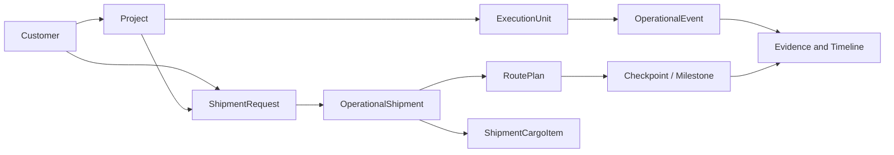
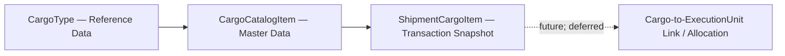
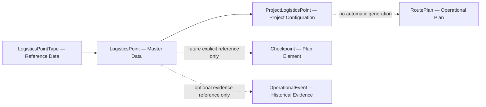
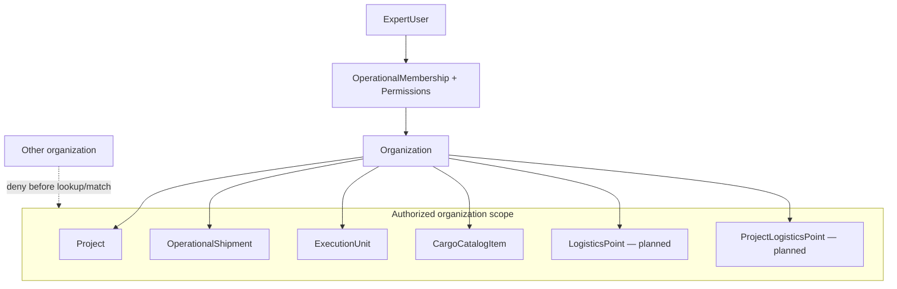
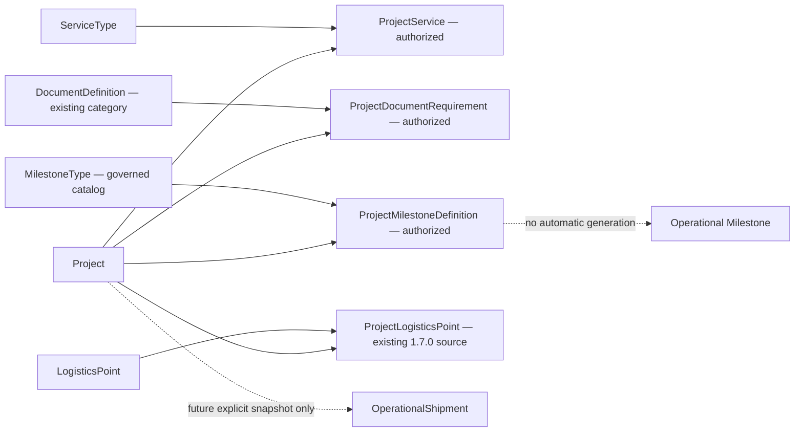

# FDM-001 — Forwarder Domain Map

- **Status:** Living Architecture View
- **Architecture version:** DA-1.0
- **Date:** 2026-08-02
- **Vocabulary:** [FDD-001](FDD-001-forwarder-data-dictionary.md) and [Canonical Business Object Catalog](canonical_business_object_catalog.md)

Solid relationships below represent governed/current conceptual ownership; dashed relationships are future or separately governed. Diagrams do not imply database foreign keys unless the FDD or implementation contract says so.

## 1. Maturity layers

Layers are maturity stages, not unconditional release order. Analytics and optimization remain deferred until facts and governance are mature.

Reference Data is administrator-managed and may be empty after installation. It includes LogisticsPointType, MilestoneType, ServiceType, DocumentDefinition, CargoType, UnitOfMeasure, Cargo Catalog, and equivalent governed lookups. System Data (roles, permissions, feature flags, internal/framework configuration) is a separate installer/bootstrap concern. Master Data (Project, Customer, LogisticsPoint, Carrier, Vehicle, Driver, Organization) is created through normal user administration. Operational Data (Shipment, RoutePlan, Quote, Operational Milestone, Operational Event, Invoice, Evidence) is created only by business execution. See ADR-028.

## 2. Core business flow

This is conceptual flow: ShipmentRequest commercial state, Project coordination, OperationalShipment execution, ExecutionUnit lifecycle, planning, and evidence remain distinct sources of truth.

## 3. Cargo model

Catalog changes never rewrite ShipmentCargoItem snapshots. Allocation remains deferred under PDR-013 and ADR-023 Proposed.

## 4. Logistics Network boundaries

Logistics Network governance is Accepted; Release 1.7.0 implementation remains Not Started until its Slice contract is accepted.

## 5. Organization and security boundary

Organization scope is resolved before resource matching or serialization. Opaque IDs do not grant access. Reference Data may be organization-independent, but mutation remains governed and dependent Master Data remains scoped.

## Architecture meaning of DA-1.0

DA-1.0 establishes explicit Reference/Master/Configuration/Transaction/Evidence layers, governed Cargo foundations, and accepted Logistics Network boundaries. It does not claim Logistics Network implementation, dashboards, allocation, customer search, GIS, or AI optimization.

## 6. Accepted Release 1.8.0 Project configuration boundary

The bounded 1.8.0 concepts are **Implemented — Not Deployed**. ADR-027 and the Slice Contract remain the accepted authority; Release 1.8.0 is implementation complete, not published, and not deployed. Production is unchanged, Seed was not executed, the MilestoneType catalog is prepared but not applied, and no automatic execution behavior is present.
