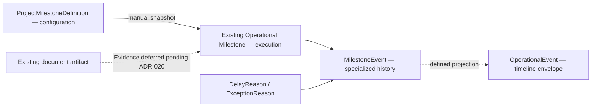
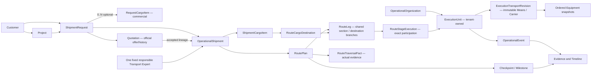
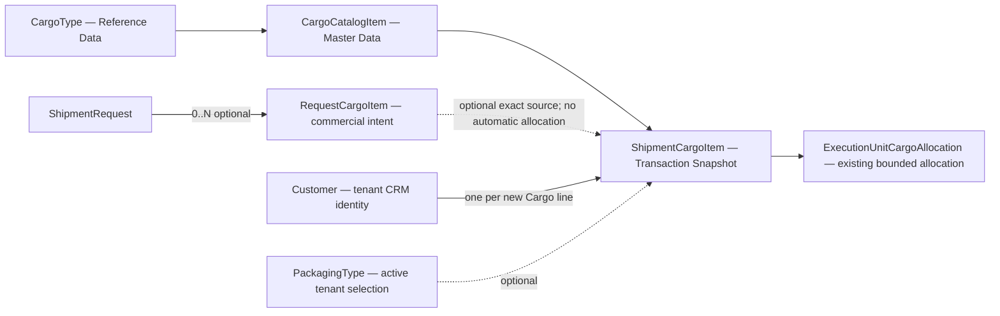
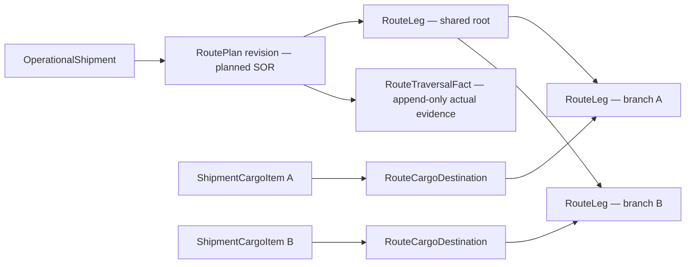
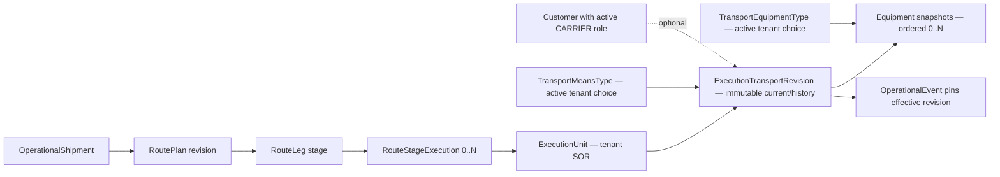
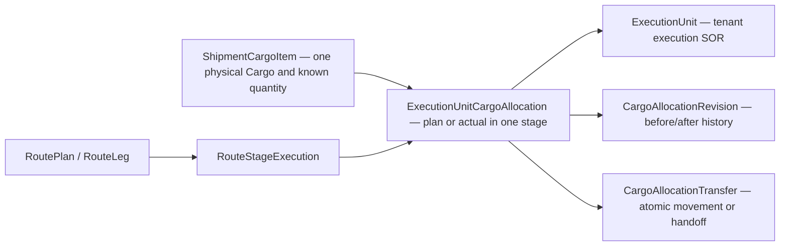
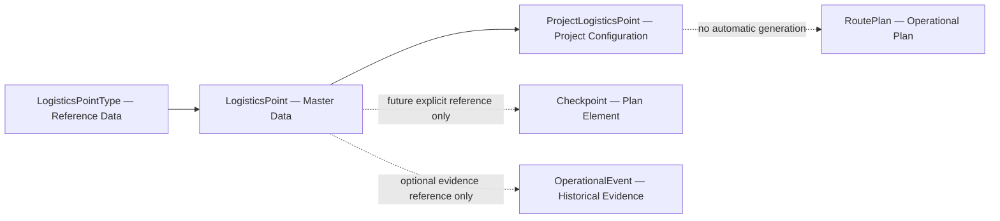
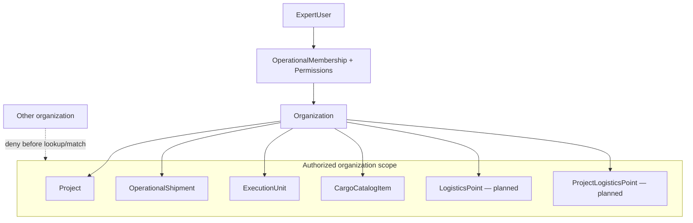
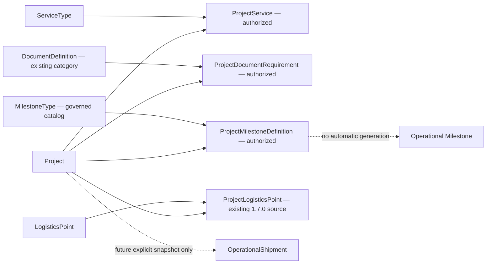
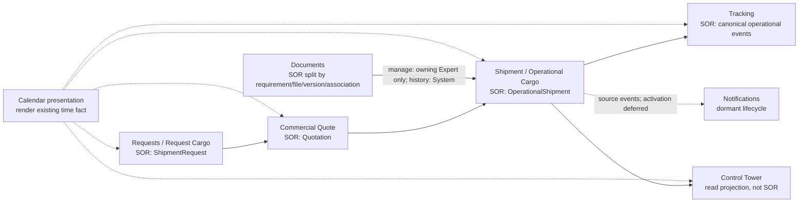

# FDM-001 — Forwarder Domain Map

## Release 1.9.0 authorized boundary reconciliation

Implementation reconciliation: **Implemented — Not Published — Not Deployed** under `20260812_operational_execution`; Evidence remains Deferred.

This boundary is **Governance Accepted — Implementation Authorized — Not Implemented — Not Deployed**. Initialization is explicit/manual; Delay does not replace status; Checkpoint is not Milestone. Evidence linkage is Deferred pending ADR-020; any later link cannot duplicate files. Security Track is complete; the future Release 1.9.0 migration parent is `security_credential_remediation`.

- **Status:** Living Architecture View
- **Architecture version:** DA-1.0
- **Date:** 2026-08-02
- **Vocabulary:** [FDD-001](FDD-001-forwarder-data-dictionary.md) and [Canonical Business Object Catalog](canonical_business_object_catalog.md)

Solid relationships below represent governed/current conceptual ownership; dashed relationships are future or separately governed. Diagrams do not imply database foreign keys unless the FDD or implementation contract says so.

## 1. Maturity layers

Layers are maturity stages, not unconditional release order. Analytics and optimization remain deferred until facts and governance are mature.

Reference Data is administrator-managed and may be empty after installation. It includes LogisticsPointType, MilestoneType, ServiceType, DocumentDefinition, CargoType, UnitOfMeasure, Cargo Catalog, and equivalent governed lookups. System Data (roles, permissions, feature flags, internal/framework configuration) is a separate installer/bootstrap concern. Master Data (Project, Customer, LogisticsPoint, Carrier, Vehicle, Driver, Organization) is created through normal user administration. Operational Data (Shipment, RoutePlan, Quote, Operational Milestone, Operational Event, Invoice, Evidence) is created only by business execution. See ADR-028.

## 2. Core business flow

This is conceptual flow: ShipmentRequest commercial state, optional Request Cargo, Quotation lifecycle, Project coordination, fixed Shipment Expert ownership, OperationalShipment execution, ExecutionUnit lifecycle, planning, and evidence remain distinct sources of truth. Request assignment does not mutate an existing Shipment owner.

## 3. Cargo model

`RequestCargoItem` and `ShipmentCargoItem` are distinct. Request submission permits zero Cargo Items and no Cargo field is mandatory. ADR-057 adds optional exact source lineage from an operational Cargo line to one authorized Request/RequestCargo, without copying Customer intake into execution or fabricating a Request for direct Cargo. Each new Cargo line has one same-tenant CRM Customer and independent requested/planned/actual meanings. Catalog changes never silently rewrite ShipmentCargoItem identity snapshots. Existing allocation remains separately governed by ADR-046 and is not redesigned by P3-02.

## 3A. Route plan and actual traversal

ADR-058 keeps `RoutePlan/RouteLeg` as the planned-route SOR. Draft legs can be honestly incomplete without synthetic times or milestones; activation requires complete and cycle-free topology. Cargo points to a terminal branch without duplication. Actual traversal is revision-bound evidence and never replaces plan history or automatically creates an Operational Exception. ADR-059 now consumes an exact stage through the existing tenant-owned ExecutionUnit, with distinct governed Means, ordered Equipment, per-execution Carrier and immutable history. ETA, reported-location taxonomy and Customer projection remain later concerns.

## 3B. Route-stage transport execution

Means performs movement; Equipment/load units remain distinct ordered execution context. A Train with Wagon and Container is represented without a reusable fleet or containment registry. Missing optional Carrier, identifier, Equipment or driver detail is progressive incompleteness, not an Exception. Existing Cargo allocations are unchanged: P3-04 creates no quantity allocation, split, transfer or remaining-quantity semantics.

## 3C. Stage-scoped Cargo distribution and trace

ADR-060 extends the same allocation SOR. Stage planned and actual distributions remain separate. One Cargo may split across several executions; downstream actual stage totals show continuity and are not added to Cargo's known physical quantity. Underage, overage and stage differences are warnings only, with no automatic Exception, Attention, SLA or status effect. The owning Transport Expert records correction or transfer with immutable history. Legacy allocation rows have unknown stage/dimension and are never assigned guessed history. Tracking reads current actual or legacy unknown allocation, not plans or released rows. P3-06 documents and P3-07 location meaning remain later slices.

## 4. Logistics Network boundaries

Logistics Network governance is Accepted; Release 1.7.0 implementation remains Not Started until its Slice contract is accepted.

## 5. Organization and security boundary

Organization scope is resolved before resource matching or serialization. Opaque IDs do not grant access. Reference Data may be organization-independent, but mutation remains governed and dependent Master Data remains scoped.

## Architecture meaning of DA-1.0

DA-1.0 establishes explicit Reference/Master/Configuration/Transaction/Evidence layers, governed Cargo foundations, and accepted Logistics Network boundaries. It does not claim Logistics Network implementation, dashboards, allocation, customer search, GIS, or AI optimization.

## 6. Accepted Release 1.8.0 Project configuration boundary

The bounded 1.8.0 concepts are **Implemented — Not Deployed**. ADR-027 and the Slice Contract remain the accepted authority; Release 1.8.0 is implementation complete, not published, and not deployed. Production is unchanged, Seed was not executed, the MilestoneType catalog is prepared but not applied, and no automatic execution behavior is present.

## 7. Post-D2 owner/SOR boundary

PDR-019, PDR-020, ADR-047, and ADR-050 established the following ownership boundary. The bounded Cargo, Dual Calendar, Combined Transport, Quote Communication, Documents, Control Tower scalability, public-tracking, and fixed-Shipment-owner implementations are now qualified in the Golden-controlled source. This living view still authorizes no physical modular refactor, Production access, or deployment.

Request transport intent and actual Route Leg transport are separate implemented facts. Documents management is `IMPLEMENTED — QUALIFIED`: only the owning Transport Expert manages files, parent Shipment/Case authority is server-derived, and the System preserves version history. Customer/Admin/Manager/other-Expert management is denied; generalized read visibility remains separately governed and no new Customer visibility is granted. Control Tower's former 100-Shipment safety ceiling is removed by the qualified server-side authorized read model. Notifications remain dormant.

Documents keep four boundaries distinct: `DocumentRequirement` is the logical need, `DocumentArtifact`/compatibility `CaseDocumentFile` is an immutable physical version, `DocumentAttachment`/compatibility `ArtifactAssociation` is contextual exact-version use, and DocumentReadiness is a derived requirement result. Append adds a current sibling; targeted replacement supersedes one selected current file while preserving history; historical versions do not inflate readiness.
