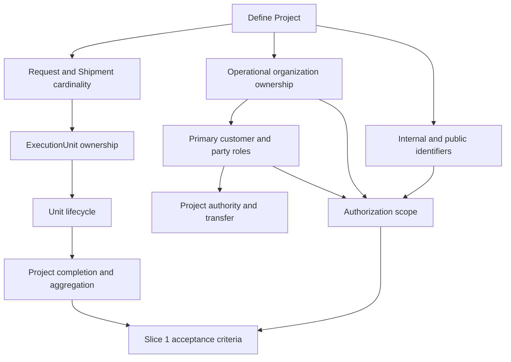

# Operational Architecture Decision Workshop

- Status: Workshop Draft
- Date: 2026-07-31
- Duration: 110 minutes
- Decision baseline: ADR-017 through ADR-020 and PDR-001 through PDR-011
- Intended participants: Product Owner, Architecture, Operations, Security, Data
- Constraint: This document recommends decisions but does not approve them.

## 1. Executive Summary

### Why this workshop exists

Architecture Phase 0.5 has produced four consistent proposed ADRs and an eleven-item Product Decision Register. The architecture now distinguishes Project, ShipmentRequest, OperationalShipment, and ExecutionUnit, but several business policies still determine ownership, lifecycle, identifiers, permissions, aggregation, and operational limits. This workshop converts those proposals into explicit, reviewable decisions before Slice 1.

### Why implementation is intentionally paused

The unresolved items are not cosmetic configuration. They determine database cardinality, aggregate boundaries, uniqueness constraints, authorization scope, status calculation, migration eligibility, API identifiers, and acceptance tests. Starting implementation would force engineers to encode assumptions that Product, Operations, Security, and Data have not approved.

### Why architecture must be frozen before Slice 1

Slice 1 establishes canonical Project and ExecutionUnit foundations. These foundations will be expensive to reverse after data is created. Freezing the architecture first allows additive migration, backward compatibility, deterministic projections, secure defaults, and traceable acceptance criteria.

### Risks of implementing early

- Incorrect customer cardinality could create cross-customer data exposure.
- Incorrect Project/Shipment boundaries could recreate a God aggregate or duplicate execution models.
- Premature code formats or uniqueness constraints could make legacy backfill impossible.
- Ambiguous lifecycle and completion rules could produce false delivery/completion reports.
- Undefined authority could permit unauthorized cancellation, transfer, or forced closure.
- Hard-coded stale/SLA thresholds could create false alerts and unreliable AI recommendations.
- Undefined document visibility could leak internal files.
- Unbounded batch/ZIP operations could create security and scalability failures.

The required workshop outcome is a recorded decision for every Slice 1 blocker, plus an explicit defer/fail-safe statement for later-slice decisions. “No objection” is not acceptance.

## 2. Business Model Workshop

### 2.1 What is a Project?

- **Definition:** The customer-facing, organization-owned business coordination boundary grouping related commercial requests, executable shipments, units, alerts, reports, and scoped documents.
- **Current state:** No Project entity exists. ShipmentRequest is often used as the de facto case boundary, while OperationalShipment owns execution.
- **Recommended architecture:** Adopt Project as its own aggregate root for identity, ownership, membership, aggregate projection, and coordination—not detailed child execution.
- **Alternative options:** Treat ShipmentRequest as Project; treat OperationalShipment as Project; use an unstructured tag/grouping value.
- **Pros:** Supports several shipments and requests, clear ownership, scalable summaries, stable customer navigation.
- **Cons:** Adds lineage, projection, permission, and migration work.
- **Operational consequences:** Teams receive one coordination workspace without merging child transactions or status histories.
- **Questions requiring Product Owner approval:** Is every operational engagement a Project? May a Project exist before a request or before execution? What is the minimum viable Project lifecycle?

### 2.2 What is a Shipment Request?

- **Definition:** The commercial intake, quotation, assignment, and customer-decision record.
- **Current state:** ShipmentRequest currently carries intake, customer, cargo, route, commercial status, assignment, tracking linkage, and case documents.
- **Recommended architecture:** Preserve ShipmentRequest as the commercial aggregate and lineage source. Do not write operational states such as departed/delivered into its commercial status.
- **Alternative options:** Expand it into the Project; rename it to Shipment; retire it after quote acceptance.
- **Pros:** Preserves existing commercial workflows and ADR-002; avoids semantic migration of current statuses.
- **Cons:** Requires compatibility views and explicit conversion/link actions.
- **Operational consequences:** Sales and operations maintain separate responsibilities while retaining traceability.
- **Questions requiring Product Owner approval:** Can several requests feed one Project? Can one request generate several OperationalShipments? Can a request move between Projects after acceptance?

### 2.3 What is an Operational Shipment?

- **Definition:** An executable shipment aggregate owning route plans, legs, checkpoints, milestones, operational lifecycle, and one or more ExecutionUnits.
- **Current state:** OperationalShipment exists and is linked to ShipmentRequest and accepted quote; it is not Project-owned and has no canonical ExecutionUnit relationship.
- **Recommended architecture:** Keep OperationalShipment as the execution aggregate under exactly one Project after adoption. Allow one ShipmentRequest to create multiple OperationalShipments through explicit idempotent conversion policy.
- **Alternative options:** One OperationalShipment per Project; one per Request forever; make each ExecutionUnit an OperationalShipment.
- **Pros:** Preserves route/milestone architecture and supports multimodal or separately executed shipments.
- **Cons:** Requires an approved conversion cardinality and lineage model.
- **Operational consequences:** Execution teams can plan shipments independently while Project reporting aggregates them.
- **Questions requiring Product Owner approval:** What business event creates a new OperationalShipment? When should one request split into several shipments? May shipments be transferred between Projects?

### 2.4 Who owns a Project?

- **Definition:** Ownership has two dimensions: owning operational organization and primary customer organization. Assignment to a staff member is responsibility, not legal/customer ownership.
- **Current state:** OperationalShipment has organization scope; ShipmentRequest has customer and assigned expert relationships; Project ownership does not exist.
- **Recommended architecture:** Require one operational organization and one primary customer organization. Represent Project Manager/assignee separately and maintain ownership history.
- **Alternative options:** Staff assignee owns Project; payer owns Project; several equal customer owners; ownership inferred from first request.
- **Pros:** Deterministic tenant security, portfolio reporting, escalation, and customer access.
- **Cons:** Requires deliberate treatment of multi-party arrangements and legacy ambiguity.
- **Operational consequences:** Transfers become governed actions rather than field edits.
- **Questions requiring Product Owner approval:** Who selects the primary customer? Who resolves disputes between payer, consignee, and cargo owner? May operational organization ownership change?

### 2.5 Customer cardinality

- **Definition:** The number and roles of legal/customer parties associated with a Project.
- **Current state:** Customer relationships are request-centric and do not model one Project with typed payer, consignee, or cargo-owner roles.
- **Recommended architecture:** One primary customer organization plus typed party relationships for payer, consignee, cargo owner, notify party, and selected stakeholders. Party role alone grants no access.
- **Alternative options:** Exactly one party with no roles; multiple equal co-owners; unrestricted many-to-many customers.
- **Pros:** Represents commercial reality while keeping authorization deterministic.
- **Cons:** Additional party governance and UI are needed.
- **Operational consequences:** Billing, custody, delivery, and visibility can reference different parties without confusing ownership.
- **Questions requiring Product Owner approval:** Are multiple legal co-owners ever required? Which roles may see status or documents by default? Can a party role change during execution?

### 2.6 Internal Project Code

- **Definition:** Stable human-readable reference used by authorized staff for search, communication, exports, and support.
- **Current state:** ShipmentRequest has numeric ID/tracking code; OperationalShipment has numeric/public IDs; no Project code exists.
- **Recommended architecture:** Organization-local generated immutable format such as `PRJ-YYYY-NNNNNN`, separate from API identity and public tracking credential.
- **Alternative options:** User-entered code; global sequence; expose database ID; reuse public code internally.
- **Pros:** Readable, stable, collision-controlled, and free of customer data.
- **Cons:** Requires allocation policy and duplicate handling across organizations.
- **Operational consequences:** Staff gain one searchable coordination reference.
- **Questions requiring Product Owner approval:** Exact format, yearly reset, visibility to authenticated customers, and whether imports may preserve an external code.

### 2.7 Public Tracking Code

- **Definition:** High-entropy customer-shareable credential/reference for a permission-filtered Project projection; it is not the Project primary key.
- **Current state:** ShipmentRequest tracking code exists, and numeric request identifiers are also accepted in the legacy public lookup path.
- **Recommended architecture:** Separate public tracking code from internal Project code and opaque API ID; support controlled rotation/revocation, rate limiting, and non-enumerating errors.
- **Alternative options:** Reuse internal code; expose public UUID; require authenticated customer session only; preserve numeric lookup.
- **Pros:** Reduces enumeration and allows compromise recovery without renaming Project.
- **Cons:** Requires support workflow, secure storage, and customer communication after rotation.
- **Operational consequences:** Support can revoke leaked public access while preserving internal continuity.
- **Questions requiring Product Owner approval:** Is anonymous tracking required? Which Project/unit fields appear anonymously? Who may rotate a code and how is the customer notified?

### 2.8 Project completion rules

- **Definition:** Deterministic aggregate outcome derived from child execution, distinct from administrative closure.
- **Current state:** Multi-unit tracking calculates an aggregate including `attention_required`; OperationalShipment has its own lifecycle; no Project rule exists.
- **Recommended architecture:** Completed when at least one unit is delivered and every active non-cancelled unit is delivered. Partially delivered when some are delivered and at least one active non-cancelled unit remains. All active units cancelled means Project cancelled. Forced closure records administrative closure and unresolved obligations; it never fabricates completed/delivered state.
- **Alternative options:** All units including cancelled must be delivered; any delivered unit completes Project; staff manually sets completion.
- **Pros:** Truthful reporting, deterministic projection, cancelled scope does not block valid completion.
- **Cons:** Needs careful handling of inactive, transferred, split, and administratively closed units.
- **Operational consequences:** Dashboards show delivered/cancelled/remaining counts and distinguish closure from successful delivery.
- **Questions requiring Product Owner approval:** Do cancelled units raise a persistent alert? Can a Project with zero delivered units ever be completed? Who may force close and can it be reopened?

### 2.9 Business decision dependency graph

Approval should follow the arrows. Identifier, permission, migration, and completion work must not start from downstream assumptions.

## 3. Operational Model Workshop

### 3.1 Execution Unit

- **Current model:** ShipmentTransportUnit belongs to ShipmentTracking under ShipmentRequest and stores code, type, display metadata, activation, and updates.
- **Target model:** ExecutionUnit is a mode-neutral aggregate owned by OperationalShipment, with Project-local canonical code, opaque public ID, version, lifecycle projection, alerts, events, documents, reports, and legacy compatibility.
- **Why:** Tracking is only one concern; each unit needs independent execution and concurrency.
- **Benefits:** Independent status/timeline, multimodal coverage, safe bulk actions, unit reporting.
- **Trade-offs:** More identity, lineage, authorization, projection, and migration complexity.
- **Operational examples:** Truck, trailer, container, wagon, sea booking/cargo unit, air cargo unit, warehouse lot, customs lot.
- **Future extensibility:** Typed references and linked specialist records avoid one table per mode.
- **Open questions:** Code policy, mandatory type attributes, ownership transfer, quantity semantics.

### 3.2 Lifecycle

- **Current model:** Unit updates accept statuses including loading, departed, in_transit, checkpoint, delayed, arrived, delivered, and cancelled; latest visible update drives the projection.
- **Target model:** Current lifecycle derives from authorized operational events and uses expected version/idempotency.
- **Why:** Mutable or visibility-filtered latest status is not a reliable operational source of truth.
- **Benefits:** Deterministic rebuild, concurrency safety, correction history, internal/customer consistency.
- **Trade-offs:** Transition rules and legacy mapping require approval and tests.
- **Operational examples:** A unit transitions ready→in_progress after verified start evidence; arrival does not automatically mean delivery.
- **Future extensibility:** Type-specific milestones can evolve without changing the shared lifecycle.
- **Open questions:** Reopen rules, deactivation versus cancellation, and which evidence gates delivery.

### 3.3 Shared statuses

- **Current model:** Mode and alert meanings are mixed in one status list.
- **Target model:** `not_started`, `ready`, `in_progress`, `arrived`, `delivered`, `cancelled`.
- **Why:** Project aggregation needs comparable semantics across modes.
- **Benefits:** Stable reporting, filtering, customer summaries, and AI reasoning.
- **Trade-offs:** Shared states are intentionally less detailed.
- **Operational examples:** Truck departed, vessel loaded, and flight uplifted all project to `in_progress` while retaining distinct events.
- **Future extensibility:** Add new modes without changing aggregate rules.
- **Open questions:** Whether every mode needs `ready` and `arrived`, and terminal reopen policy.

### 3.4 Mode-specific statuses

- **Current model:** Some details appear as unit statuses; operational route model separately has legs/checkpoints/milestones.
- **Target model:** Loading, gate-in/out, customs inspection/clearance, vessel loading/discharge, flight booking/uplift, warehouse receive/release, and similar facts are checkpoint/event projections, not shared lifecycle values.
- **Why:** A large universal enum becomes contradictory and cannot represent simultaneous mode facts.
- **Benefits:** Operational precision without fragmenting Project reporting.
- **Trade-offs:** UI must show core state and detailed checkpoint separately.
- **Operational examples:** A container can be `in_progress`, at `export_customs`, with `inspection_pending` detail.
- **Future extensibility:** Versioned event/checkpoint catalogs support new carriers, ports, and regulations.
- **Open questions:** Catalog ownership, localization, evidence/verification requirements.

### 3.5 Alerts

- **Current model:** Delayed/cancelled can force aggregate `attention_required`; overdue work items exist in the OperationalShipment module.
- **Target model:** Alerts are independent projections: delayed units, stale updates, open exceptions, incomplete documents, SLA breach, and attention required.
- **Why:** An alert is a condition requiring action, not lifecycle truth.
- **Benefits:** Multiple simultaneous alerts, clear prioritization, no status distortion.
- **Trade-offs:** Requires policy version, severity, dedupe, resolution, and freshness logic.
- **Operational examples:** Delivered unit with missing proof-of-delivery remains delivered but has an incomplete-document alert.
- **Future extensibility:** Control-tower work items and predictive risks can consume the same alert projection.
- **Open questions:** Severity/ranking, ownership, acknowledgement, and auto-resolution policies.

### 3.6 Timeline

- **Current model:** Separate request logs, unit updates, milestone events, document audit, operational audit, and customer timelines.
- **Target model:** Paginated permission-filtered timeline projection across Project, Shipment, ExecutionUnit, and Document scopes.
- **Why:** Users need one coherent history while underlying domain records retain ownership.
- **Benefits:** Traceability, customer/internal views, correction chain, scalable lazy loading.
- **Trade-offs:** Projection ordering, lag, retention, and visibility must be governed.
- **Operational examples:** Unit delay, document replacement, exception resolution, and customer publication appear in sequence with scope badges.
- **Future extensibility:** Partner, ERP, BPM, and AI events join through versioned event schemas.
- **Open questions:** Acceptable projection lag, source precedence, customer actor redaction.

### 3.7 Operational Events

- **Current model:** MilestoneEvent is append-only and verified; ShipmentTransportUnitUpdate is append-style but lacks the same correction/idempotency contract.
- **Target model:** Lightweight event sourcing with immutable event envelope, occurred/recorded time, actor/source, visibility/classification, idempotency, correlation/batch IDs, correction/supersession, and deterministic projection.
- **Why:** Important facts need provenance and safe retry without forcing all persistence to be event-sourced.
- **Benefits:** Auditability, explainability, out-of-order reconciliation, rebuildable projections.
- **Trade-offs:** Event schema governance and storage growth.
- **Operational examples:** Correct a wrong checkpoint through a superseding event; original evidence remains.
- **Future extensibility:** Explicit adapters can emit events from carriers, ERP, sensors, and approved AI actions.
- **Open questions:** Event retention, generic metadata restrictions, sync versus async projection.

### 3.8 Batch Update

- **Current model:** Only one-unit-at-a-time update is available.
- **Target model:** One batch/correlation command fans out to per-unit authorized, idempotent, version-checked outcomes; synchronous limit proposed at 50 units, larger operations deferred to jobs.
- **Why:** Fifty-unit Projects need efficient operations without losing per-unit safety.
- **Benefits:** Faster expert workflow, traceable partial success, bounded resource use.
- **Trade-offs:** Selection snapshots, conflicts, retries, and partial failure UI are more complex.
- **Operational examples:** Mark 30 selected trucks as departed; 27 succeed, two conflict, one is unauthorized/invalid without leaking hidden resources.
- **Future extensibility:** Asynchronous jobs, CSV import, ERP commands, and agent-prepared batches.
- **Open questions:** Final limit, all-or-nothing versus partial success, approval thresholds.

### 3.9 Stale Update

- **Current model:** “without update” can be counted, but no approved time threshold or policy version exists.
- **Target model:** Derived alert evaluated after execution starts using a versioned service/mode policy; PDR proposes a 24-hour default and `unknown` when no policy applies.
- **Why:** A stale road movement and stale ocean movement have different operational meaning.
- **Benefits:** Explainable alerts, fewer false positives, policy-aware AI recommendations.
- **Trade-offs:** Requires policy ownership, timezone-safe evaluation, and overrides.
- **Operational examples:** Truck alert after 24 hours; ocean shipment uses a longer approved cadence.
- **Future extensibility:** Dynamic thresholds by route risk, customer SLA, integration health, and event source.
- **Open questions:** Default approval, business calendar, grace periods, and who may override.

### 3.10 Project aggregation

- **Current model:** Request and unit tracking have separate statuses; attention is mixed into aggregate status.
- **Target model:** Five Project states—`not_started`, `in_progress`, `partially_delivered`, `completed`, `cancelled`—plus independent alert counts.
- **Why:** Project truth must be deterministic and mode-neutral.
- **Benefits:** Reliable customer summary, reporting, completion guards, and AI context.
- **Trade-offs:** Split/merge, inactive units, transfers, and forced closure need explicit policies.
- **Operational examples:** 40 delivered + 5 in progress + 5 cancelled = partially delivered with cancellation count; 45 delivered + 5 cancelled = completed with cancellation alert/count if approved.
- **Future extensibility:** Shipment-level weighting or commercial KPIs can be separate projections without changing lifecycle.
- **Open questions:** Cancelled-unit warning persistence and completion with zero delivered units.

### 3.11 Scalability

- **Current model:** Unit lists and public timelines can load all units/events; UI renders cards without server pagination.
- **Target model:** Server-side/keyset pagination, filtered summaries, lazy timelines/documents, bounded batch commands, background exports, indexed projection queries, and rebuild checkpoints.
- **Why:** 500 units × 20 events plus file versions cannot be sent or rendered as one response.
- **Benefits:** Predictable latency, bounded memory, safer ZIP/report workloads.
- **Trade-offs:** More endpoints/read models, background-job operations, and eventual projection consistency.
- **Operational examples:** Project summary loads counts first; 25–50 units per page; timeline loads only for an opened unit.
- **Future extensibility:** Worker queues, object storage, search indexes, and partitioning can be added behind stable contracts.
- **Open questions:** SLOs, maximum Project size, export quotas, projection lag, archival tiers.

## 4. Governance Workshop

All recommendations below remain Proposed. UI visibility is not authorization; backend permission, resource scope, version control, idempotency, reason, and audit apply where relevant.

| Action | Recommended role | Alternative role | Approval chain | Audit requirement | Fail-safe behavior |
|---|---|---|---|---|---|
| Create Project | Project Manager or Administrator with `project.create` | Administrator only | Single authorized actor; optional customer validation | Actor, organization, customer owner, source request(s), idempotency, timestamp | Creation disabled; read-only prototype only |
| Transfer Project | Administrator or Customer Governance Manager with `project.transfer` | Operations Manager | Two-person approval when legal customer or operational organization changes | Previous/new owner, reason, approvers, versions, affected access grants | Transfer disabled; ownership unchanged |
| Close Project | Project Manager with `project.close` after completion guards | Operations Manager | Single approval when clean; elevated approval with warnings | Child summary, guard result, reason if warnings, actor/version | Closure rejected while guards unresolved |
| Force Close | Operations Manager plus Administrator/Compliance approver | Administrator plus Product Owner | Mandatory two-person approval | Reason, unresolved obligations, evidence, both approvers, immutable event | Feature disabled; never map to completed |
| Cancel Project | Operations Manager or Administrator with `project.cancel` | Project Manager with secondary approval | Elevated approval; two-person approval after execution starts | Reason, affected shipments/units, actor, approver, version, customer notification outcome | Cancellation rejected; existing states preserved |
| Reopen Project | Operations Manager plus policy approver | Administrator | Two-person approval; only from administratively closed state unless a later lifecycle policy allows more | Prior closure/cancellation, reason, new version, obligations restored | Reopen disabled; create exception/work item instead |
| Bulk Update | Operator/Project Manager with `execution_unit.bulk_update` | Administrator only | Single actor within approved count; elevated approval for sensitive transitions | Frozen selection, correlation ID, command, per-unit permission/version/result, failures | Disabled if limit/policy unresolved; no implicit partial writes |
| Approve operational/document evidence | Designated verifier/compliance role, separate from submitter when policy requires | Operations Manager | Segregation-of-duties chain by document/event type | Submitter, verifier, evidence/version, decision, reason, policy version | Remains pending/unverified |
| View sensitive documents | Explicit classified-document permission plus active Project/scope relationship | Security/Compliance break-glass | Normal policy evaluation; break-glass requires post-review | Viewer, artifact/attachment, purpose, policy decision, timestamp | Deny without exact permission and relationship |
| Download ZIP | Authorized Project/document exporter; only permitted attachments | Administrator | User confirmation; elevated approval above approved quota/classification | Selection snapshot, exclusions, manifest hash, size/count, requester, expiry, downloads | ZIP disabled until limits/worker/visibility are approved |

Governance questions for approval:

1. Which named business roles map to the recommended permissions?
2. Which actions require two-person approval in all cases versus only after execution starts?
3. Can customers request close/cancel/transfer, and who adjudicates the request?
4. What is the break-glass authority, duration, review deadline, and notification policy?
5. Does bulk delivery/cancellation require stronger approval than ordinary bulk progress updates?

## 5. AI Readiness

### Read

AI may read only permission-filtered, purpose-limited projections available to its service identity. Project access does not imply document or internal-note access. Sensitive values, public tracking credentials, storage keys, and unauthorized stakeholder data are excluded before model context construction.

### Recommend

AI may identify stale units, delays, missing documents, route risks, inconsistent events, or candidate batch actions. Every recommendation must state evidence, policy version, uncertainty, affected scope, and why no action may be needed.

### Prepare

AI may prepare a draft command containing explicit target IDs, expected versions, reason, idempotency/correlation identity, anticipated effects, and conflicts. Preparation creates no business-state change. The human must see the exact selection and customer-visible content before approval.

### Execute

Execution is allowed only through explicit business APIs/actions and only after the applicable PDR, permission, policy, and approval boundary are Accepted. The agent receives no direct database write authority. It cannot split requests to evade batch limits, broaden visibility, force close, purge, release legal hold, or transfer ownership outside explicit policy.

### Approve

Initial AI roles cannot be the final approver for Project transfer, force close, cancellation after execution, evidence/document verification, visibility expansion, split/merge, legal hold release, purge, or digital-signature validation. AI may assist an authorized human reviewer, but submitter/approver segregation still applies.

### Explain

Every recommendation or executed action must be explainable using stable Project/Shipment/Unit/Event/Document references, source timestamps, policy version, and outcome. Customer explanations use customer-visible evidence only and redact internal actors/reasons where required.

### Audit

Record agent identity and version, human approver or autonomous policy reference, prompt/action class where governance permits, evidence references, input projection version, proposed command, authorization decision, idempotency/correlation IDs, result, and any partial failures. AI audit supplements rather than replaces OperationalEvent, business audit, and outbox records.

### Human approval boundary

| Capability | Initial AI boundary |
|---|---|
| Read allowed summaries | May operate autonomously within identity scope |
| Recommend/Explain | May operate autonomously; must cite evidence and uncertainty |
| Prepare non-sensitive update | May prepare; human confirms targets/content |
| Execute routine single-unit update | Disabled until explicit policy acceptance; then policy-controlled |
| Execute bulk update | Human approval required; per-unit authorization/version checks |
| Publish customer-visible message | Human approval required initially |
| Approve evidence/document | Human verifier required |
| Close/cancel/reopen/transfer/force close | Required authorized human approval chain |
| Split/merge | Required authorized human approval; disabled until future PDR acceptance |
| Change document visibility/download sensitive ZIP | Required authorized human approval and policy checks |
| Legal hold, purge, signature validation | Human Legal/Security authority required; no autonomous AI action |

## 6. Future Vision

The proposed boundaries support expansion without redesigning Project, Shipment, Unit, Event, and Document identity:

- **Road:** Trucks/trailers use shared lifecycle with loading, departure, border, checkpoint, and delivery events.
- **Rail:** Wagons and rail consignments use the same ExecutionUnit identity with terminal, interchange, and train-reference events.
- **Sea:** Containers or sea cargo/booking units attach vessel, voyage, port, loading, transshipment, and discharge references without treating the whole vessel as a Project-owned unit.
- **Air:** Air cargo units attach airway bill, flight, acceptance, uplift, transfer, arrival, and release events.
- **Warehouse:** Warehouse lots use receipt, put-away, handling, release, and custody events while sharing lifecycle and document scopes.
- **Customs:** Customs lots use declaration, inspection, assessment, clearance, hold, and release events, with representative-specific document visibility.
- **Multi-modal logistics:** One Project contains several OperationalShipments and ExecutionUnits; RoutePlan/checkpoints express modal transitions while shared status supports aggregation.
- **Split/Merge:** Immutable lineage, quantity/custody reconciliation, retained original events, and explicit document attachments avoid history rewrites.
- **Multiple organizations:** Operational organization ownership, primary customer ownership, typed parties, scoped membership, and stakeholder grants support collaboration without shared global access.
- **Future ERP integration:** External identities, idempotent commands, outbox, typed events, and stable public IDs support orders, bookings, invoices, and master-data synchronization.
- **Future BPM:** Explicit actions, state/version guards, approval records, work items, and events allow an external or embedded process engine without making it the domain source of truth.
- **Future AI orchestration:** Permission-filtered context, explicit actions, deterministic projections, evidence links, policy versions, and complete audit allow progression from recommendation to controlled execution.

Mode-specific schemas may be added as linked specialist records only when they have proven independent invariants. The shared boundaries and identifiers remain unchanged.

## 7. Decision Matrix

| Decision | Owner | Recommended Option | Alternative | Priority | Blocks Slice 1 | Blocks Slice 2 | Risk if postponed |
|---|---|---|---|---|---:|---:|---|
| PDR-001 Customer cardinality | Product — Commercial | One primary customer plus typed party roles | Multiple equal co-owners | Critical | Yes | Yes | Ownership ambiguity and cross-customer leakage |
| PDR-002 Project authority | Product — Governance | Role/state-based; elevated sensitive actions | Admin-only | Critical | Yes, create/access | Yes | Unauthorized or unusable workflows |
| PDR-003 Project identifier | Product — Experience | Separate opaque ID, internal code, public code | One shared code | Critical | Yes | Yes | Enumeration and irreversible identifier coupling |
| PDR-004 Completion | Product — Lifecycle | All non-cancelled delivered; forced closure separate | Manual completion | Critical | Yes | Yes | False completion and reporting drift |
| PDR-005 Unit code | Product — Execution | Generated immutable Project-local code | User-entered/reusable code | Critical | Yes | Yes | Collision and broken lineage/backfill |
| PDR-006 Unit lifecycle | Product — Multimodal | Shared six-state core plus mode events | Large universal enum | Critical | Yes | Yes | Contradictory aggregation and migration mapping |
| PDR-007 Split/Merge | Product — Execution | Immutable lineage and reconciliation | Rewrite parent or disable | Later | No | No unless Slice 2 includes it | Quantity/custody policy remains unavailable; safe if disabled |
| PDR-008 Document visibility | Product — Documents | Explicit visibility + classification/grants | Project inheritance | High | No if documents excluded | Yes if Slice 2 adds documents | Internal-file leakage if enabled prematurely |
| PDR-009 Customer documents | Product — Customer | Controlled upload/replacement; staff verifies | View-only or full customer approval | Later | No | No unless Slice 2 includes it | Unsafe upload/approval; safe if disabled |
| PDR-010 Thresholds/limits | Operations | Versioned policies; approve stale contract first | Hard-coded global values | Critical/High | Yes for stale contract | Yes for bulk if included | False alerts or unbounded mass operations |
| PDR-011 Retention/legal | Legal/Compliance | Policy schedule, hold override, privileged purge | Fixed period or retain forever | High | No | Yes before document lifecycle/purge | Destruction or indefinite retention risk; safe if no purge |
| Conversion cardinality | Product + Architecture | Explicit Request→Shipment one-to-many policy | Enforce one-to-one | Critical | Yes | Yes | Wrong uniqueness constraint and stranded cases |
| Batch outcome policy | Operations + Security | Per-unit result with frozen selection | All-or-nothing | High | No if batch excluded | Yes for batch Slice | Retry/conflict ambiguity |
| AI execution policy | Security + Product | Read/recommend first; action-specific approval | Broad agent role | Later | No | No unless AI action included | Unauthorized autonomous change; safe if execution disabled |

## 8. Workshop Agenda

Recommended meeting length: **110 minutes**. A facilitator records decisions live; an assigned decision scribe updates PDR statuses only after the meeting through a separate authorized documentation action.

| Time | Discussion topic | Lead participants | Expected decision | Decision output |
|---:|---|---|---|---|
| 0–5 min | Opening, scope, decision protocol | Product, Architecture | Confirm workshop authority, quorum, and that silence is not approval | Named chair, scribe, approvers, deferred-item rule |
| 5–15 min | Project/Request/Shipment definitions | Product, Architecture, Operations | Confirm distinct definitions and Project boundary | Approved terminology and cardinality assumptions |
| 15–27 min | Customer cardinality and ownership | Product, Security, Data, Operations | Decide primary customer, party roles, and co-owner policy | PDR-001 decision text and ownership invariant |
| 27–37 min | Project authority | Product, Security, Operations | Decide create/close/cancel/transfer/force-close authority | PDR-002 role and approval matrix |
| 37–45 min | Project identifiers | Product, Security, Architecture | Decide internal/public/API identity and anonymous tracking posture | PDR-003 format/visibility/rotation direction |
| 45–57 min | ExecutionUnit identity and lifecycle | Product, Operations, Data, Architecture | Decide code policy, shared statuses, and mode detail boundary | PDR-005 and PDR-006 accepted wording or named changes |
| 57–68 min | Aggregation and completion | Product, Operations, Data | Decide delivered/cancelled combinations, partial delivery, forced closure | PDR-004 truth table and closure distinction |
| 68–77 min | Stale/SLA and batch boundaries | Operations, Security, Product | Approve Slice 1 stale contract; decide whether bulk remains deferred | PDR-010 Slice 1 policy and later-slice owner/date |
| 77–87 min | Security/governance challenge | Security, Product, Operations | Validate non-enumeration, two-person actions, fail-safe defaults | Accepted permission/approval exceptions or blockers |
| 87–95 min | Data and migration challenge | Data, Architecture | Confirm additive adoption, backfill quarantine, no guessed mappings | Data gates and migration eligibility decision |
| 95–102 min | Deferred document, split/merge, retention decisions | Product, Security, Data, Operations | Confirm deferment and fail-safe behavior | Explicitly Proposed items with disabled/internal-only boundaries |
| 102–107 min | AI approval boundaries | Security, Product, Architecture | Confirm read/recommend first and prohibited autonomous actions | Human-approval boundary statement |
| 107–110 min | Read-back and sign-off actions | All | Confirm decisions, dissent, owners, deadlines | Decision log, unresolved blockers, next review date |

### Workshop preparation

- Product Owner brings two representative Projects: simple single-customer and multi-party/multimodal.
- Operations brings examples of delivered+cancelled combinations and mode-specific status terminology.
- Security brings role mapping, customer/public access assumptions, and approval-chain constraints.
- Data brings legacy cardinality/collision questions and backfill ambiguity examples.
- Architecture brings ADR/PDR references and proposed Slice 1 boundary; no implementation design is approved by implication.

### Facilitation rules

1. Decide domain meaning before storage/API shape.
2. Record accepted option, rejected alternatives, approvers, and effective scope.
3. If no agreement is reached, retain Proposed and apply its fail-safe behavior.
4. Do not widen Slice 1 to resolve deferred features.
5. Any contradiction with Accepted ADR-001 through ADR-016 requires an explicit follow-up architecture record, not an informal exception.

## 9. Historical Readiness Assessment

This section records the workshop's pre-approval assessment and is retained as historical decision context. It is superseded for SLICE-001 by the Architecture Authority disposition in Section 10; statements below that SLICE-001 was blocked are not current governance status.

### Are the ADRs internally consistent?

Yes, at Proposed level. ADR-017 through ADR-020 consistently distinguish Project, ShipmentRequest, OperationalShipment, and ExecutionUnit; use aligned Project/Shipment/Unit/Event/Document scopes; preserve OperationalShipment and MilestoneEvent decisions; require additive migration; and separate AI observation/recommendation from controlled action. No direct contradiction with Accepted ADR-001 through ADR-016 is identified. Their Product-dependent choices remain deliberately open.

### Are the PDRs complete?

Yes for the identified Phase 0.5 decision surface. PDR-001 through PDR-011 provide options, recommendations, owners, required approvers, impacts, blockers, and fail-safe behavior. Completeness does not mean acceptance; Product and cross-functional approval is still required.

### Is Slice 1 ready?

**No.** Architecture documentation is ready for decision review, but Slice 1 must remain paused until the blocking decision portions are Accepted and reflected in its acceptance criteria.

### Decisions that must become Accepted before Slice 1

1. PDR-001 — primary customer ownership and party-role cardinality.
2. PDR-002 — Project creation and access authority; later sensitive actions may remain disabled.
3. PDR-003 — Project/API/internal/public identifier separation.
4. PDR-004 — completion, partial delivery, cancellation, and forced-closure semantics.
5. PDR-005 — immutable Project-local ExecutionUnit code policy.
6. PDR-006 — shared ExecutionUnit lifecycle and legacy mapping rules.
7. PDR-010 — stale-update policy contract and unconfigured fail-safe behavior.
8. Explicit Request→OperationalShipment cardinality/conversion clarification under PDR-001/Project model approval.

### Decisions that may remain Proposed

- PDR-007 split/merge, while commands remain disabled and ancestry is never rewritten.
- PDR-008 document visibility, only if Slice 1 adds no new document links/exposure and all documents remain internal.
- PDR-009 customer document operations, while all such endpoints remain disabled.
- PDR-010 SLA catalog, executable bulk update, and ZIP quotas, if those features are outside Slice 1 and remain disabled/unconfigured.
- PDR-011 retention automation, purge, and digital-signature validation, while records are preserved, purge is prohibited, and no signature-validity claim is made.
- AI execute/approve policies, while agents are limited to permission-filtered read, recommendation, preparation, and explanation with no business-state execution.

### Recommended approval order

1. Approve the four domain definitions and Request→Shipment cardinality.
2. Approve operational organization ownership, primary customer, and party roles (PDR-001).
3. Approve Project authority and approval chains (PDR-002).
4. Approve opaque/internal/public identifier policy (PDR-003).
5. Approve ExecutionUnit code and ownership (PDR-005).
6. Approve shared lifecycle and mode-specific event boundary (PDR-006).
7. Approve Project aggregation/completion truth table (PDR-004).
8. Approve Slice 1 stale policy contract (PDR-010 subset).
9. Revalidate ADR-017 through ADR-020 against accepted Product wording.
10. Freeze Slice 1 scope, acceptance criteria, security matrix, and migration assumptions.
11. Schedule later-slice workshops for PDR-007 through PDR-011 and AI execution policies.

### Readiness verdict

**Ready to conduct the cross-functional decision workshop. Not ready to start Slice 1 implementation.** Slice 1 becomes architecture-ready only after all mandatory decisions above are explicitly Accepted by their named owners/approvers, contradictions are resolved in documentation, and deferred capabilities retain their stated fail-safe behavior.

## 10. Architecture Authority Reconciliation

SLICE-001 is complete under the Architecture Authority decisions dated 2026-07-31.

- ADR-017 is Accepted and governs SLICE-001 and subsequent Project-related slices.
- ADR-018, ADR-019, and ADR-020 remain Proposed. This baseline commit records them without accepting or authorizing their later-slice designs.
- PDR-001 is Accepted using recommended option B: one primary customer organization plus typed party relationships.
- PDR-002 is Accepted using recommended option B: role- and state-based authority with elevated controls for sensitive actions.
- PDR-003 is Accepted using recommended option C: separate opaque identity, internal ProjectCode, and public TrackingCode.
- PDR-004 is Accepted using the combined recommended options B and D: deterministic completion from all non-cancelled active units, with administrative closure separate.
- PDR-005 is Deferred because ExecutionUnit is outside SLICE-001.
- PDR-006 is Deferred because ExecutionUnit lifecycle belongs to a later slice.
- PDR-010 is Deferred because freshness and stale-update alerts belong to later summary/timeline work.
- PDR-007, PDR-008, PDR-009, and PDR-011 remain Proposed and unchanged.

This disposition supersedes only the historical SLICE-001 readiness statements above. ExecutionUnit, timeline, document redesign, Project Summary, alerts, notifications, and other later capabilities remain outside SLICE-001 and require their own approved slices and governing decisions.

**Operational foundation baseline reconciled. No later-slice implementation is authorized by this workshop record.**
