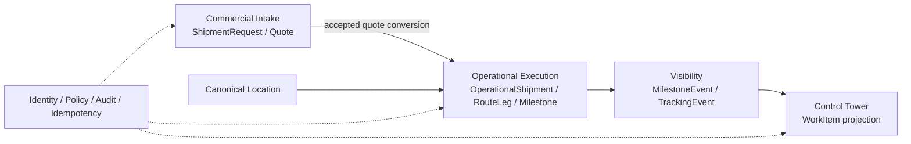

# Phase 0 Architecture Freeze

Status: **Frozen for Phase 1 design**
Base: `6590183569541af712695d4864438e151f118ea3`

## تصمیم‌های قطعی

1. backend به‌صورت **Modular Monolith** باقی می‌ماند.
2. `ShipmentRequest` فقط aggregate چرخه تجاری intake/quotation است.
3. `ShipmentRequest.status` هرگز وضعیت عملیات حمل را نگهداری نمی‌کند.
4. اصطلاح رسمی پرونده اجرا `OperationalShipment` است؛ `ShipmentJob` entity/table/API نیست.
5. هسته مدل `OperationalShipment → RouteLeg → Milestone` است.
6. `MilestoneEvent` شاهد append-only تحقق/تصحیح milestone است.
7. برج کنترل projection و **Work Queue** اقدام‌پذیر است، نه source of truth.
8. مهاجرت additive و سازگار با backward compatibility است.
9. Phase 0 فقط طراحی است؛ هیچ کد، migration، API، UI یا database تغییر نمی‌کند.

## مرزهای ماژول

هر ماژول مالک table و command خود است. دسترسی write مستقیم بین ماژول‌ها ممنوع؛ read بین‌ماژولی از contract/projection انجام می‌شود. extraction به microservice تنها با ADR جدید و شواهد scale/team/failure isolation مجاز است.

## Source of Truth

| مفهوم | منبع حقیقت |
|---|---|
| درخواست و نتیجه تجاری | ShipmentRequest/Quote |
| lifecycle اجرا | OperationalShipment |
| ترتیب و برنامه مسیر | RouteLeg/Milestone planned fields |
| تحقق milestone | MilestoneEvent و projection آن |
| مکان مرجع | CanonicalLocation؛ واقعیت تاریخی در snapshot |
| موارد نیازمند اقدام | WorkItem projection + command state |

## قواعد سازگاری

- `won` یا `accepted` فقط eligibility تبدیل است، نه شروع عملیات.
- conversion command idempotent است و lineage request/quote را حفظ می‌کند.
- plan منتشرشده overwrite نمی‌شود؛ revision جدید می‌گیرد.
- رخداد حذف/ویرایش نمی‌شود؛ correction event ثبت می‌گردد.
- public tracking فقط projection allowlisted می‌خواند.

## Architecture Freeze Points

| Freeze | تصمیم | تغییر آینده |
|---|---|---|
| F1 | واژگان و aggregate boundary | فقط ADR جایگزین |
| F2 | status separation | breaking change ممنوع |
| F3 | location reference + snapshot | schema detail قابل تکامل |
| F4 | event append-only و verification | schema version افزایشی |
| F5 | idempotency + optimistic locking | implementation قابل انتخاب |
| F6 | work-queue control tower | ranking rules قابل تنظیم |

## موارد باز

- cardinality دقیق Request/Quote به OperationalShipment؛
- milestone catalog هر mode/lane؛
- organization/tenant scope؛
- source خارجی canonical location و timezone/geocode؛
- SLA و severity thresholds؛
- RPO/RTO، volume و retention؛
- CustomerOrder در vertical slice اول.

این موارد «نیازمند تأیید» هستند، اما تصمیم‌های freeze را نقض نمی‌کنند.

## اسناد حاکم

- [Domain Dictionary](phase0_domain_dictionary.md)
- [State Transition Matrix](phase0_state_transition_matrix.md)
- [Permission Matrix](phase0_permission_matrix.md)
- [API Contract Draft](phase0_api_contract_draft.md)
- [Migration Sequence](phase0_migration_sequence.md)
- [Test Matrix](phase0_test_matrix.md)
- [Vertical Slice](phase0_vertical_slice_plan.md)
- [ADRها](adr/ADR-001-modular-monolith.md)

## Exit Gate Phase 0

هجده سند هماهنگ، terminology conflict صفر، تصمیم‌های ADR ثبت، matrixهای state/permission/test قابل پیاده‌سازی، migration sequence برگشت‌پذیر و vertical slice دارای acceptance criteria است. پذیرش سازمانی موارد باز پیش از Phase 1 لازم است.
