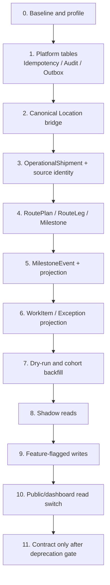

# Phase 0 Migration Sequence

این سند برنامه طراحی migration آینده است؛ در Phase 0 هیچ migration ایجاد یا اجرا نمی‌شود.

## اصول

Additive، backward-compatible، expand/migrate/verify/switch/contract، idempotent، checkpointed و rollback-ready. migration/seed در startup برنامه اجرا نمی‌شود.

## Sequence قطعی

## جزئیات مراحل

| مرحله | Write | Verification | Rollback |
|---|---|---|---|
| 0 baseline | ندارد | schema/status/data profile | N/A |
| 1 platform | table additive | empty DB + N/N-1 app | app ignores tables |
| 2 location bridge | identity/map additive | duplicate/orphan/code | disable bridge |
| 3 shipment | table/FK/index additive | unique source identity | flag off |
| 4 plan model | tables additive | sequence/time/invariants | no reads/writes |
| 5 events | append-only tables | dedupe/rebuild/order | projector off |
| 6 queue | projection tables | deterministic rules | queue off |
| 7 backfill | cohort insert | counts/hash/quarantine/rerun | cohort disabled |
| 8 shadow | read only | mismatch metrics | legacy response |
| 9 writes | selected cohort | audit/idempotency/SLO | flags off |
| 10 switch | read routing | public allowlist/regression | legacy routing |
| 11 contract | drop/deprecate احتمالی | zero use + backup restore | restore/redeploy plan |

## Source Identity

`source_system`, `source_entity_type`, `source_entity_id`, `accepted_quote_id`, `conversion_revision` ثبت می‌شوند. constraint نهایی cardinality **نیازمند تأیید** است؛ conversion idempotency نباید one-to-one اشتباه تحمیل کند.

## Canonical Location bridge

جداول Country/Province/City/IranPort/CustomsOffice/TrackingLocationReference حذف یا ادغام نمی‌شوند. bridge یک identity پایدار به رکورد موجود می‌دهد. RouteLeg/MilestoneEvent علاوه بر FK، snapshot immutable می‌گیرند. free text در quarantine/unverified قرار می‌گیرد.

## Backfill policy

- ابتدا dry-run report؛
- eligibility مصوب؛
- keyset batch و checkpoint؛
- timestamp/location ناموجود جعل نشود؛
- legacy tracking source=`legacy_manual`؛
- planned milestone از actual استنتاج نشود؛
- skip/quarantine reason اجباری؛
- rerun بدون duplicate.

## Startup، FK و Seed

- release job جدا برای migration؛
- seed catalog versioned/idempotent؛
- naming `fk_<child>_<parent>_<column>`؛
- `ondelete` صریح؛
- دو FK هم‌معنی ممنوع؛
- schema test روی PostgreSQL و SQLite compatibility فقط در صورت پشتیبانی؛
- merge head و مسیر canonical Alembic پیش از Phase 1 کنترل شود.

## انتقال tracking و dashboard

public tracking ابتدا shadow projection v2، سپس cohort switch و fallback legacy دارد. dashboard تجاری request-centric باقی می‌ماند؛ control tower endpoint/projection جداست. KPIهای تجاری و عملیاتی ادغام معنایی نمی‌شوند.

## Data gates

duplicate source صفر، orphan صفر، required field کامل، زمان معتبر، event dedupe، projection deterministic، public allowlist صددرصد، audit completeness و mismatch زیر threshold مصوب. thresholdها **نیازمند تأیید** هستند.

## Rollback triggers

افزایش خطای API، mismatch projection، duplicate/orphan، audit gap، latency خارج SLO یا public data leak. اقدام: flags off → route legacy → stop projector/consumer → preserve data → reconcile. drop یا delete کور ممنوع است.
