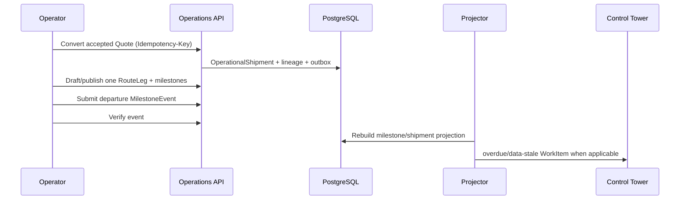

# Phase 0 First Vertical Slice Plan

## هدف

اولین slice آینده، یک shipment ساده را از quote پذیرفته‌شده تا تحقق milestone و نمایش در work queue، پشت feature flag و بدون شکستن مسیر فعلی، اثبات می‌کند.

## سناریوی مرجع

## دامنه Slice 1

- یک ShipmentRequest و accepted Quote؛
- یک OperationalShipment؛
- یک RoutePlan revision و یک RouteLeg؛
- دو Canonical Location با snapshot؛
- milestoneهای `leg_departed` و `leg_arrived`؛
- MilestoneEvent دستی، verify و correction؛
- idempotency، optimistic locking، audit/outbox؛
- detail projection داخلی؛
- یک WorkItem نوع `milestone_overdue`؛
- feature flags و rollback؛
- regression کامل Request/Quote/public tracking.

## خارج Slice 1

چند leg/unit/order، booking partner، document، finance، project، public projection v2 rollout، map، ETA، notification خارجی، microservice و AI.

## ترتیب پیاده‌سازی آینده

1. ADR sign-off و schema draft؛
2. migration additive platform/location/shipment/route/milestone/event؛
3. domain invariant و state services؛
4. idempotency/locking/audit/outbox؛
5. conversion و plan commands؛
6. MilestoneEvent submit/verify/correct؛
7. projection و work-item rule؛
8. OpenAPI/query endpoints؛
9. UI حداقلی operator/tower؛
10. backfill dry-run، staging UAT، cohort flag؛
11. rollback rehearsal.

## Acceptance Criteria

- conversion replay duplicate نمی‌سازد؛
- ShipmentRequest.status تغییر عملیاتی نمی‌گیرد؛
- ShipmentJob هیچ artifact ندارد؛
- plan منتشرشده immutable و leg معتبر است؛
- master location rename snapshot را تغییر نمی‌دهد؛
- actual milestone فقط از verified MilestoneEvent است؛
- correction تاریخچه را حفظ می‌کند؛
- stale version رد می‌شود؛
- overdue WorkItem دقیقاً یک‌بار ساخته می‌شود؛
- cross-org/unauthorized command رد می‌شود؛
- audit/correlation کامل است؛
- feature flag off مسیر legacy را سالم نگه می‌دارد؛
- T01-T17، T20-T27 مرتبط PASS هستند.

## Commit boundaries پیشنهادی

schema expand؛ domain models؛ state/idempotency؛ outbox/audit؛ commands/OpenAPI؛ projector/work queue؛ UI؛ migration tooling/tests؛ docs/UAT. هر commit independently testable است.

## UAT

Operator quote را convert، plan را publish، departure را report/verify و arrival را عمداً overdue می‌کند؛ Tower work item را claim و پس از event arrival resolve می‌کند. Sales هم‌زمان request/quote قبلی را بدون تغییر رفتار مشاهده می‌کند.

## Exit و Rollback

Exit: تمام acceptanceها، migration rehearsal، security review، data gate و owner/runbook PASS. Rollback: flags off، legacy routing، توقف projector، حفظ داده و reconciliation. production rollout تا تأیید SLO/organization scope مجاز نیست.

## ریسک‌های باز

business cardinality، role mapping، verification authority، milestone/SLA catalog، canonical location source، SLO/RPO/RTO و production data quality همگی **نیازمند تأیید** هستند.
