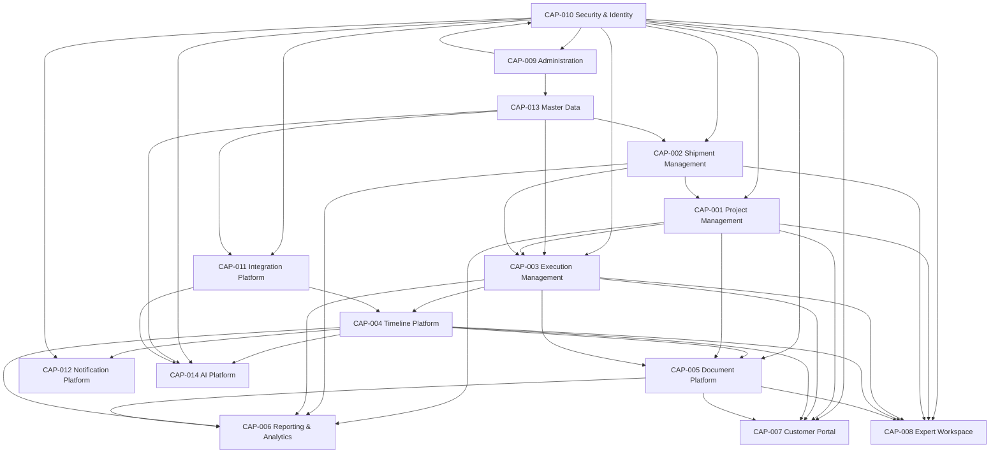

# Forwarder Platform Capability Map v1

- Capability Architecture Version: 1.0
- Status: Proposed
- Date: 2026-07-31
- Governance: [Platform Constitution](platform_constitution_v1.md)
- Architecture entry point: [Architecture Baseline](architecture_baseline_v1.md)
- Vocabulary: [Canonical Business Object Catalog](canonical_business_object_catalog.md)
- Compact registry: [Capability Registry](capability_registry.md)

This document is the bridge from Business Vision to Architecture to Development. It introduces no implementation and no new business rule. Capability scope, maturity, phase, slice, KPI, extension, and RFC references are proposed planning metadata until approved through the governing ADR/PDR/RFC/slice/release processes.

## Part 1 — Capability Architecture

### What a capability is

A **Capability** is a durable business-oriented ability the platform must provide, regardless of current UI, code structure, service boundary, vendor, or implementation technology. It describes **what business outcome can be achieved**, for whom, under which governance and evidence—not how the software is currently arranged.

Capabilities remain stable while their features, modules, services, components, and workflows evolve. A capability may be partially realized by existing behavior and expanded through several slices and releases.

### Distinctions

| Term | Meaning | Example | Not interchangeable with Capability because… |
|---|---|---|---|
| Capability | Durable business ability and outcome | Execution Management | It is the governed “what” and value boundary |
| Feature | User- or system-visible behavior implementing part of a capability | Bulk update 50 selected ExecutionUnits | A feature is narrower and may be replaced |
| Module | Code/architecture ownership boundary | Execution bounded module | A module is an implementation organization |
| Component | Reusable UI/backend technical element | ExecutionUnitTable | A component has no independent business outcome |
| Entity | Domain object with identity/invariants | ExecutionUnit | An entity participates in capabilities but is not the ability itself |
| Service | Application/domain/infrastructure behavior boundary | ExecutionUnitUpdateService | A service implements actions and may serve several capabilities |
| Workflow | Ordered collaboration of people/systems/actions | Quote accepted → create OperationalShipment | A workflow realizes a scenario across capabilities |
| Development Slice | Smallest approved end-to-end delivery increment | Paginated ExecutionUnit read model | A slice is a time-bounded delivery vehicle |

### Capability rules

- Capability names are business-oriented and technology-independent.
- Features implement capabilities; capabilities are not renamed after a UI or service.
- A capability has one accountable owner and may have many supporting actors/teams.
- Capability status is evidence-based and does not mean every child feature is complete.
- Capability dependencies describe required platform abilities, not code imports.
- A capability record does not approve its Proposed ADR/PDR or authorize implementation.

## Part 2 — Capability Hierarchy

### Levels

- **Level 1 — Business Capability:** broad enduring business outcome.
- **Level 2 — Product Capability:** platform ability supporting a Level 1 outcome.
- **Level 3 — Feature Capability:** coherent user/system behavior implementing part of a Product Capability.
- **Level 4 — Development Slice:** approved end-to-end increment with acceptance and release traceability.

### Hierarchical capability tree

```text
L1 Platform Business Capabilities
├── L2 CAP-001 Project Management
│   ├── L3 Project identity and ownership
│   ├── L3 Project aggregation and alerts
│   ├── L3 Project authority and lifecycle
│   └── L4 Proposed Slice: canonical Project foundation (blocked by PDR acceptance)
├── L2 CAP-002 Shipment Management
│   ├── L3 ShipmentRequest intake and Quotation
│   ├── L3 OperationalShipment creation and lifecycle
│   ├── L3 Route, Checkpoint, and Milestone planning
│   └── L4 Existing Phase 1A/1B operational slices
└── L2 CAP-003 Execution Management
    ├── L3 ExecutionUnit identity and lifecycle
    ├── L3 Unit current-state projection and alerts
    ├── L3 Unit batch operations and lineage
    └── L4 Proposed Slice: canonical ExecutionUnit list/detail foundation

L1 Platform Product Capabilities
├── L2 CAP-004 Timeline Platform
│   ├── L3 OperationalEvent envelope
│   ├── L3 Scoped permission-filtered Timeline
│   └── L4 Proposed Slice: unit Timeline projection
├── L2 CAP-005 Document Platform
│   ├── L3 Artifact/Attachment/Version/Requirement
│   ├── L3 Visibility, approval, retention, and download
│   └── L4 Proposed Slice: scoped internal DocumentAttachments
├── L2 CAP-006 Reporting & Analytics
│   ├── L3 Project/Shipment/Unit operational reporting
│   ├── L3 XLSX and asynchronous export
│   └── L4 Proposed Slice: unit and Timeline report
└── L2 CAP-012 Notification Platform
    ├── L3 Internal/customer notification
    ├── L3 Delivery/preferences/audit
    └── L4 Future Slice: event-driven notifications

L1 Platform Experience Capabilities
├── L2 CAP-007 Customer Portal
│   ├── L3 Customer Project/Shipment/Unit visibility
│   ├── L3 Customer-visible Timeline and documents
│   └── L4 Proposed Slice: scalable customer Project view
└── L2 CAP-008 Expert Workspace
    ├── L3 Commercial request workspace
    ├── L3 Operational Project/Shipment/Unit workspace
    ├── L3 Bulk work and exception handling
    └── L4 Proposed Slice: paginated searchable ExecutionUnit table

L1 Platform Governance Capabilities
└── L2 CAP-009 Administration
    ├── L3 User/role/reference/policy administration
    ├── L3 Document and operational policy administration
    └── L4 Future Slice: capability-aware policy administration

L1 Platform Foundation Capabilities
├── L2 CAP-010 Security & Identity
│   ├── L3 Authentication/session/revocation
│   ├── L3 Authorization/organization/resource scope
│   └── L4 Ongoing Slice: permission and public-access hardening
├── L2 CAP-011 Integration Platform
│   ├── L3 Stable APIs and external identity
│   ├── L3 Idempotency, outbox, adapters, and reconciliation
│   └── L4 Phase 7 Slice: ERP adapter foundation
├── L2 CAP-013 Master Data
│   ├── L3 Canonical locations and transport/customs references
│   ├── L3 Versioned backfill/governance
│   └── L4 Ongoing Slice: reference coverage and data-quality gates
└── L2 CAP-014 AI Platform
    ├── L3 Permission-filtered context and recommendations
    ├── L3 Prepared actions and explanations
    ├── L3 Controlled agent execution and audit
    └── L4 Phase 6 Slice: read/recommend AI assistant
```

Level 3 and Level 4 entries are planning decompositions, not newly accepted Product behavior. Their exact names/scope must be confirmed in the relevant RFC/ADR/PDR/slice.

## Part 3 — Capability Catalog

## CAP-001 — Project Management

| Field | Value |
|---|---|
| Capability ID | CAP-001 |
| Capability Name | Project Management |
| Purpose | Coordinate related commercial requests, executable shipments, units, stakeholders, status, alerts, documents, and reports under one Project boundary |
| Business Goal | Give customers and operations one governed coordination view for multi-shipment work |
| Business Value | Portfolio visibility, accountability, scalable aggregation, and reduced case fragmentation |
| Primary Actors | Product/Project Manager, Operations Manager |
| Supporting Actors | Customer, Expert, Security, Data, Administration, AI assistant |
| Canonical Objects | Project, ProjectCode, TrackingCode, Stakeholder, OperationalStatus, OperationalAlert |
| Related ADR | Accepted ADR-017; ADR-002, ADR-007 |
| Related PDR | PDR-001 through PDR-004; Accepted for SLICE-001 |
| Future RFC | Project foundation implementation RFC — identifier not assigned |
| Dependencies | CAP-010 Security & Identity, CAP-013 Master Data; consumes CAP-002/CAP-003 summaries |
| Parent Capability | Platform Business Capabilities |
| Child Capabilities | Project identity/ownership; authority/lifecycle; aggregation/alerts; stakeholder visibility |
| Current Phase | Phase 1 — Core Platform planning |
| Planned Slice | Canonical Project foundation after blocking PDR/ADR acceptance |
| Current Status | Defined |
| AI Readiness | Read/recommend design defined; execute/approve disabled pending policy |
| Operational Owner | Operations (supporting); accountable capability owner is Product |
| Product Owner | Product — Project/Commercial Domain |
| Security Classification | Mixed internal/customer; deny-by-default resource scope |
| KPIs | Candidate: Projects with unambiguous owner; aggregate projection latency; stale/alert action rate; completion reconciliation accuracy |
| Future Extensions | Multiple organizations, ERP project references, BPM coordination, AI risk recommendations |

## CAP-002 — Shipment Management

| Field | Value |
|---|---|
| Capability ID | CAP-002 |
| Capability Name | Shipment Management |
| Purpose | Manage commercial ShipmentRequest and executable OperationalShipment lifecycles without conflating them |
| Business Goal | Convert accepted commercial intent into traceable governed execution |
| Business Value | Commercial/operational clarity, route planning, milestone verification, and lineage |
| Primary Actors | Customer, Expert, Operator |
| Supporting Actors | Product, Operations Manager, Control Tower, Data, Security |
| Canonical Objects | ShipmentRequest, Quotation, OperationalShipment, Route, Checkpoint, Milestone |
| Related ADR | ADR-002 through ADR-005, ADR-007, ADR-009, ADR-010 |
| Related PDR | PDR-001/PDR-004 Accepted for SLICE-001; later behavior remains slice-governed |
| Future RFC | Request→OperationalShipment cardinality/conversion RFC — identifier not assigned |
| Dependencies | CAP-010 Security & Identity, CAP-013 Master Data |
| Parent Capability | Platform Business Capabilities |
| Child Capabilities | Intake/Quotation; accepted conversion; route planning; milestone evidence; shipment lifecycle |
| Current Phase | Existing core and Phase 1 continuation |
| Planned Slice | Preserve/harden current Phase 1A/1B behavior; Project linkage only after acceptance |
| Current Status | Operational |
| AI Readiness | Context/recommendation possible; operational action remains permission/policy controlled |
| Operational Owner | Operations (supporting); accountable capability owner is Product |
| Product Owner | Product — Shipment Domain |
| Security Classification | Mixed confidential commercial and operational data |
| KPIs | Candidate: conversion correctness; route validation success; verified milestone completeness; unauthorized access count; lifecycle reconciliation accuracy |
| Future Extensions | Multimodal planning, partner booking, ETA, finance references |

## CAP-003 — Execution Management

| Field | Value |
|---|---|
| Capability ID | CAP-003 |
| Capability Name | Execution Management |
| Purpose | Manage independently concurrent ExecutionUnits, state, updates, alerts, SLA, batch work, and lineage |
| Business Goal | Operate Projects containing tens or hundreds of physical/logical execution units safely |
| Business Value | Unit-level control, reduced manual repetition, scalable exception handling, and accurate aggregation |
| Primary Actors | Operator, Expert, Operations Manager |
| Supporting Actors | Customer, Carrier, Customs representative, Data, Security, AI assistant |
| Canonical Objects | ExecutionUnit, OperationalStatus, OperationalAlert, DelayCondition, ServiceLevelAgreement, Task, OperationalException |
| Related ADR | Proposed ADR-018; ADR-007, ADR-008, ADR-010, ADR-016 |
| Related PDR | PDR-005, PDR-006, PDR-007, PDR-010; Proposed |
| Future RFC | ExecutionUnit foundation/batch RFC — identifier not assigned |
| Dependencies | CAP-001, CAP-002, CAP-004, CAP-010, CAP-013 |
| Parent Capability | Platform Business Capabilities |
| Child Capabilities | Unit identity; lifecycle projection; alerts/SLA; batch updates; split/merge lineage |
| Current Phase | Phase 2 — Execution Units planning; legacy multi-unit tracking exists |
| Planned Slice | Paginated canonical ExecutionUnit read/detail foundation; batch and split/merge deferred unless approved |
| Current Status | Architected |
| AI Readiness | Strong read/recommend potential; bulk/critical actions require human approval and accepted policy |
| Operational Owner | Operations |
| Product Owner | Product — Execution Domain (supporting decision owner) |
| Security Classification | Mixed internal/customer/partner with resource-level controls |
| KPIs | Candidate: update freshness; unit state accuracy; batch success/conflict rate; alert time-to-action; query latency at 50/500 units |
| Future Extensions | Split/merge, custody, sensor/partner events, predictive delay risk |

## CAP-004 — Timeline Platform

| Field | Value |
|---|---|
| Capability ID | CAP-004 |
| Capability Name | Timeline Platform |
| Purpose | Provide deterministic, paginated, permission-filtered history across Project, Shipment, ExecutionUnit, and Document scopes |
| Business Goal | Make operational truth explainable and traceable without exposing internal data |
| Business Value | Faster investigation, customer transparency, correction history, AI evidence |
| Primary Actors | Operator, Customer, Auditor |
| Supporting Actors | Product, Security, Data, AI assistant, integrations |
| Canonical Objects | OperationalEvent, Timeline, Comment, AuditEntry |
| Related ADR | Proposed ADR-019; ADR-009, ADR-010, ADR-016 |
| Related PDR | PDR-006, PDR-008, PDR-010/PDR-011 as visibility/retention dependencies; Proposed where applicable |
| Future RFC | Unified event envelope/projector RFC — identifier not assigned |
| Dependencies | CAP-003 for unit events, CAP-010 for filtering, CAP-013 for references |
| Parent Capability | Platform Product Capabilities |
| Child Capabilities | Event envelope; projection/rebuild; ordering/correction; audience timelines |
| Current Phase | Phase 3 — Timeline planning; specialized events/timelines exist |
| Planned Slice | ExecutionUnit Timeline read projection after canonical unit identity |
| Current Status | Architected |
| AI Readiness | High for evidence-backed read/explain; event execution follows owning capability actions |
| Operational Owner | Architecture |
| Product Owner | Product — Operational Visibility (supporting) |
| Security Classification | Mixed; visibility/classification filtered before serialization |
| KPIs | Candidate: projection lag; rebuild determinism; duplicate/mismatch rate; unauthorized field leakage; timeline query latency |
| Future Extensions | External events, event archive, cross-scope investigation, AI evidence graph |

## CAP-005 — Document Platform

| Field | Value |
|---|---|
| Capability ID | CAP-005 |
| Capability Name | Document Platform |
| Purpose | Govern immutable artifacts, scoped attachments, versions, requirements, visibility, approval, download, and retention |
| Business Goal | Make operational/commercial evidence available to the right stakeholder without duplication or leakage |
| Business Value | Compliance, document completeness, safe collaboration, structured exports |
| Primary Actors | Expert, Customer, Compliance/Verifier |
| Supporting Actors | Carrier, Customs representative, Security, Operations, AI assistant |
| Canonical Objects | DocumentArtifact, DocumentAttachment, DocumentVersion, DocumentRequirement, AttachmentVisibility, Approval |
| Related ADR | Proposed ADR-020; ADR-006, ADR-015, ADR-016 |
| Related PDR | PDR-008, PDR-009, PDR-011; Proposed |
| Future RFC | Artifact/attachment migration and visibility RFC — identifier not assigned |
| Dependencies | CAP-001/CAP-002/CAP-003 scopes, CAP-010 security, CAP-004 event/audit references |
| Parent Capability | Platform Product Capabilities |
| Child Capabilities | Artifact storage; scoped attachment; version/requirement; visibility/approval; bulk package/manifest; retention |
| Current Phase | Phase 4 — Documents planning; Request-level case documents are operational |
| Planned Slice | Internal scoped attachment foundation; customer/bulk/purge deferred until accepted |
| Current Status | Architected |
| AI Readiness | Metadata/completeness recommendation possible; content/actions require explicit permission/approval |
| Operational Owner | Operations (supporting); accountable capability owner is Product |
| Product Owner | Product — Documents & Collaboration |
| Security Classification | Restricted/mixed; internal default and deny-by-default |
| KPIs | Candidate: required-document completeness; leakage incidents; verification time; checksum/version integrity; export failure rate |
| Future Extensions | Customer uploads, malware scanning, digital signature validation, legal hold, object storage |

## CAP-006 — Reporting & Analytics

| Field | Value |
|---|---|
| Capability ID | CAP-006 |
| Capability Name | Reporting & Analytics |
| Purpose | Produce reproducible scoped metrics, dashboards, XLSX, and future asynchronous exports |
| Business Goal | Turn commercial and operational data into trustworthy decisions and evidence |
| Business Value | Management visibility, customer reporting, performance improvement, compliance evidence |
| Primary Actors | Product, Operations Manager, Administrator, Customer |
| Supporting Actors | Data, Security, QA, AI assistant |
| Canonical Objects | Report, Dashboard, Project, OperationalShipment, ExecutionUnit, Timeline |
| Related ADR | ADR-007, ADR-008; proposed ADR-017 through ADR-020 |
| Related PDR | PDR-004, PDR-008, PDR-010/PDR-011 where scope/export/retention applies |
| Future RFC | Project/unit report and asynchronous export RFC — identifier not assigned |
| Dependencies | CAP-001–CAP-005, CAP-010, CAP-013 |
| Parent Capability | Platform Product Capabilities |
| Child Capabilities | Commercial reports; operational reports; unit/timeline reports; dashboards; export jobs/manifests |
| Current Phase | Existing reports plus Phase 5 expansion |
| Planned Slice | Unit/Timeline report after canonical projections; asynchronous ZIP later |
| Current Status | Operational |
| AI Readiness | High for analysis/recommendation when metrics are permission-filtered and policy-versioned |
| Operational Owner | Data |
| Product Owner | Product — Analytics (supporting) |
| Security Classification | Aggregated internal/customer depending on report policy |
| KPIs | Candidate: report reproducibility; export latency/failure; data reconciliation; freshness; access-denial/leakage rate |
| Future Extensions | Scheduled reports, semantic metrics, predictive analytics, governed AI summaries |

## CAP-007 — Customer Portal

| Field | Value |
|---|---|
| Capability ID | CAP-007 |
| Capability Name | Customer Portal |
| Purpose | Provide customers safe self-service visibility and approved actions for their requests, Projects, shipments, units, timelines, quotations, and documents |
| Business Goal | Reduce status uncertainty and manual support communication |
| Business Value | Customer trust, transparency, response speed, and self-service |
| Primary Actors | Customer User |
| Supporting Actors | Product, Expert, Security, Operations |
| Canonical Objects | Customer, User, ShipmentRequest, Project, OperationalShipment, ExecutionUnit, Timeline, Quotation, DocumentAttachment |
| Related ADR | ADR-002, ADR-007, ADR-016; proposed ADR-017 through ADR-020 |
| Related PDR | PDR-001, PDR-003, PDR-004, PDR-008, PDR-009 |
| Future RFC | Customer Project portal/public tracking v2 RFC — identifier not assigned |
| Dependencies | CAP-001–CAP-005, CAP-010, CAP-012 |
| Parent Capability | Platform Experience Capabilities |
| Child Capabilities | Request/Quotation view; Project summary; unit navigation; public/authenticated tracking; customer documents |
| Current Phase | Existing portal/public tracking plus phased expansion |
| Planned Slice | Scalable Project/ExecutionUnit customer view after ownership/identifier/visibility acceptance |
| Current Status | Operational |
| AI Readiness | Customer-safe explanations possible; no internal evidence or unauthorized actions |
| Operational Owner | Product |
| Product Owner | Product — Customer Experience |
| Security Classification | Customer-confidential/public subset through allowlist |
| KPIs | Candidate: self-service usage; page/query latency; support contact reduction; unauthorized disclosure count; customer update freshness |
| Future Extensions | Customer upload/acknowledgement, multilingual summaries, approved AI assistant |

## CAP-008 — Expert Workspace

| Field | Value |
|---|---|
| Capability ID | CAP-008 |
| Capability Name | Expert Workspace |
| Purpose | Give experts/operators one authorized workspace for commercial and operational work without mixing domain ownership |
| Business Goal | Improve throughput, prioritization, accuracy, and exception response |
| Business Value | Lower manual effort, fewer missed updates, faster customer service |
| Primary Actors | Expert, Operator, Project Manager |
| Supporting Actors | Administrator, Control Tower, Security, AI assistant |
| Canonical Objects | ShipmentRequest, Project, OperationalShipment, ExecutionUnit, Task, OperationalAlert, Timeline, Comment, DocumentAttachment |
| Related ADR | ADR-002, ADR-008, ADR-010; proposed ADR-017 through ADR-020 |
| Related PDR | PDR-002, PDR-004 through PDR-010 |
| Future RFC | Project/ExecutionUnit expert workspace RFC — identifier not assigned |
| Dependencies | CAP-001–CAP-006, CAP-010, CAP-012, CAP-013 |
| Parent Capability | Platform Experience Capabilities |
| Child Capabilities | Request workspace; Project workspace; unit table/detail; bulk work; document/report tabs; work queue |
| Current Phase | Existing expert console plus Phase 1/2 expansion |
| Planned Slice | Search/filter/paginated ExecutionUnit table and lazy detail |
| Current Status | Operational |
| AI Readiness | Strong copilot candidate; prepared actions require exact target review and permissions |
| Operational Owner | Operations |
| Product Owner | Product — Internal Experience (supporting) |
| Security Classification | Internal restricted with customer-visible preview controls |
| KPIs | Candidate: handling time; stale units resolved; batch conflict rate; task SLA; permission-denial correctness |
| Future Extensions | Saved views, advanced bulk jobs, AI-assisted prioritization/explanations |

## CAP-009 — Administration

| Field | Value |
|---|---|
| Capability ID | CAP-009 |
| Capability Name | Administration |
| Purpose | Govern platform users, roles, policies, reference configurations, definitions, and administrative oversight |
| Business Goal | Keep configuration and authority explicit, controlled, auditable, and supportable |
| Business Value | Reduced operational drift and safer delegated administration |
| Primary Actors | Administrator |
| Supporting Actors | Security, Product, Operations, Data |
| Canonical Objects | User, Role, Permission, Organization, DocumentRequirement, ServiceLevelAgreement, AuditEntry |
| Related ADR | ADR-008, ADR-010, ADR-014, ADR-015; proposed ADR-017/ADR-020 |
| Related PDR | PDR-002, PDR-008, PDR-010, PDR-011 |
| Future RFC | Policy/role/capability administration RFC — identifier not assigned |
| Dependencies | CAP-010, CAP-013; governs configuration used by other capabilities |
| Parent Capability | Platform Governance Capabilities |
| Child Capabilities | User/role administration; reference administration; policy/definition administration; audit oversight |
| Current Phase | Existing administration plus phased policy expansion |
| Planned Slice | Only as required by accepted capability slices |
| Current Status | Operational |
| AI Readiness | AI may analyze configuration; administrative changes require explicit human authorization |
| Operational Owner | Administration |
| Product Owner | Product — Platform Administration (supporting) |
| Security Classification | Highly restricted administrative |
| KPIs | Candidate: unauthorized admin attempts; configuration drift; audit completeness; reference/policy change error rate |
| Future Extensions | Delegated organization administration, approval workflows, policy simulation |

## CAP-010 — Security & Identity

| Field | Value |
|---|---|
| Capability ID | CAP-010 |
| Capability Name | Security & Identity |
| Purpose | Authenticate principals and enforce least-privilege organization/resource/action authorization with audit |
| Business Goal | Protect customer, operational, document, administrative, and AI actions as Product correctness |
| Business Value | Trust, compliance, leakage prevention, accountable access |
| Primary Actors | Security Administrator, User |
| Supporting Actors | Product, Architecture, Backend, Operations, QA, AI principals |
| Canonical Objects | User, Organization, Role, Permission, Stakeholder, AuditEntry, Approval |
| Related ADR | ADR-010, ADR-014, ADR-015, ADR-016; all security implications in ADR-017–020 |
| Related PDR | PDR-001/PDR-002/PDR-003/PDR-008/PDR-009/PDR-011 |
| Future RFC | Unified authorization/resource policy RFC — identifier not assigned |
| Dependencies | CAP-013 for governed references; otherwise foundational |
| Parent Capability | Platform Foundation Capabilities |
| Child Capabilities | Authentication/session; membership; authorization; sensitive approval; public access; file/document security; audit |
| Current Phase | Existing foundation and continuous hardening |
| Planned Slice | Organization/resource permission alignment for each new capability |
| Current Status | Operational |
| AI Readiness | Governs every AI principal/context/action; no broad agent bypass |
| Operational Owner | Security |
| Product Owner | Product — Platform Trust (supporting) |
| Security Classification | Critical/restricted |
| KPIs | Candidate: unauthorized access/leakage zero; auth availability; revocation effectiveness; audit completeness; security defect escape rate |
| Future Extensions | Enterprise identity, delegated access, break-glass governance, fine-grained policy engine |

## CAP-011 — Integration Platform

| Field | Value |
|---|---|
| Capability ID | CAP-011 |
| Capability Name | Integration Platform |
| Purpose | Connect external systems through stable contracts, identities, adapters, idempotency, events/outbox, and reconciliation |
| Business Goal | Exchange trusted logistics data without external systems directly owning internal domain state |
| Business Value | Automation, partner reach, ERP/BPM readiness, lower duplicate/manual entry |
| Primary Actors | Integration Administrator, External System |
| Supporting Actors | Architecture, Security, Data, Operations, AI platform |
| Canonical Objects | OperationalEvent, Organization, Project, OperationalShipment, ExecutionUnit, AuditEntry |
| Related ADR | ADR-001, ADR-005, ADR-006, ADR-010; proposed ADR-019 |
| Related PDR | None universally; specific integrations may require Product PDRs |
| Future RFC | ERP integration/adapters RFC — identifier not assigned |
| Dependencies | CAP-010, CAP-013, CAP-004; domain capability APIs |
| Parent Capability | Platform Foundation Capabilities |
| Child Capabilities | API contracts; external identity; adapter ingestion; outbox; reconciliation; integration observability |
| Current Phase | Phase 7 vision with existing API/outbox seams |
| Planned Slice | ERP adapter foundation after core canonical identities stabilize |
| Current Status | Defined |
| AI Readiness | AI integrations follow same adapter/action policies; no direct persistence |
| Operational Owner | Architecture |
| Product Owner | Product — Integrations (supporting) |
| Security Classification | Restricted system-to-system |
| KPIs | Candidate: duplicate event zero; reconciliation mismatch; integration latency/availability; retry success; unauthorized source rejection |
| Future Extensions | ERP, BPM, carrier/customs APIs, webhooks, event streaming |

## CAP-012 — Notification Platform

| Field | Value |
|---|---|
| Capability ID | CAP-012 |
| Capability Name | Notification Platform |
| Purpose | Deliver governed internal/customer/partner notifications derived from events, alerts, tasks, and approvals |
| Business Goal | Notify the right recipient at the right time without making delivery messages the source of business truth |
| Business Value | Faster response, customer communication, fewer missed obligations |
| Primary Actors | Customer, Expert, Operator |
| Supporting Actors | Product, Security, Operations, external channel providers |
| Canonical Objects | Notification, OperationalEvent, OperationalAlert, Task, User, Stakeholder |
| Related ADR | ADR-008; proposed ADR-019/ADR-020 where event/document visibility applies |
| Related PDR | PDR-001/PDR-002/PDR-008/PDR-010 depending recipient/trigger |
| Future RFC | Event-driven notification/preferences RFC — identifier not assigned |
| Dependencies | CAP-004, CAP-010; source capabilities |
| Parent Capability | Platform Product Capabilities |
| Child Capabilities | Recipient resolution; preferences; channel delivery; retry; delivery audit |
| Current Phase | Existing notification behavior plus future platform expansion |
| Planned Slice | Event-driven notification only after canonical event/visibility policies |
| Current Status | Operational |
| AI Readiness | AI may draft text; recipients/visibility/action require policy and human approval initially |
| Operational Owner | Operations |
| Product Owner | Product — Communications (supporting) |
| Security Classification | Mixed; content limited by recipient scope/visibility |
| KPIs | Candidate: delivery success/latency; duplicate notification rate; opt-out compliance; sensitive-content leakage zero |
| Future Extensions | Multi-channel providers, localization, escalation, AI-assisted summaries |

## CAP-013 — Master Data

| Field | Value |
|---|---|
| Capability ID | CAP-013 |
| Capability Name | Master Data |
| Purpose | Govern canonical location, geography, ports, customs, transport, and reference identities with provenance and compatibility |
| Business Goal | Provide consistent reference data for intake, execution, reporting, and integrations |
| Business Value | Data quality, valid routing, reliable reporting, reduced duplicate/free-text ambiguity |
| Primary Actors | Data Administrator |
| Supporting Actors | Operations, Product, Architecture, Integration administrators |
| Canonical Objects | CanonicalLocation and governed reference concepts documented by existing ADR/domain sources |
| Related ADR | ADR-005, ADR-006; reference-data operational documentation |
| Related PDR | None universally; domain-specific coverage decisions may require PDR |
| Future RFC | Master-data ownership/source-of-truth RFC — identifier not assigned |
| Dependencies | CAP-010 for administration/security |
| Parent Capability | Platform Foundation Capabilities |
| Child Capabilities | Geography/location; port/customs; transport references; aliases/mapping; versioned backfill/data quality |
| Current Phase | Existing reference foundation and ongoing governance |
| Planned Slice | Coverage/data-quality improvements as approved, independent of Project slice where possible |
| Current Status | Operational |
| AI Readiness | AI may recommend matches; unverified values remain quarantined and require governed approval |
| Operational Owner | Data |
| Product Owner | Product — Reference Data (supporting) |
| Security Classification | Internal reference; some data public, administration restricted |
| KPIs | Candidate: duplicate/orphan zero; verified coverage; unresolved aliases; backfill rejection/reconciliation rate |
| Future Extensions | External master-data providers, geocode/timezone, enterprise MDM |

## CAP-014 — AI Platform

| Field | Value |
|---|---|
| Capability ID | CAP-014 |
| Capability Name | AI Platform |
| Purpose | Provide governed AI context, recommendation, preparation, explanation, evaluation, and future controlled actions |
| Business Goal | Improve decision quality and operator productivity without bypassing human/domain/security authority |
| Business Value | Faster analysis, risk detection, assisted workflows, explainable operational insight |
| Primary Actors | AI Analyst/Assistant principal, authorized human reviewer |
| Supporting Actors | Product, Architecture, Security, Data, Operations, QA |
| Canonical Objects | AIRecommendation, AIAction (reserved), OperationalEvent, AuditEntry, Approval, all scoped business objects |
| Related ADR | AI-ready architecture docs; ADR-010; proposed ADR-017 through ADR-020 implications |
| Related PDR | Action-specific future PDRs; current PDR/Workshop human boundaries apply |
| Future RFC | AI assistant context/evaluation RFC — identifier not assigned |
| Dependencies | CAP-004, CAP-010, CAP-011, CAP-013 and relevant business capabilities |
| Parent Capability | Platform Foundation Capabilities |
| Child Capabilities | Context policy; recommendation/explanation; prepared actions; evaluation/monitoring; controlled execution/audit |
| Current Phase | Phase 6 roadmap; provider/context/governance foundations exist |
| Planned Slice | Read/analyze/recommend assistant; no critical autonomous execution |
| Current Status | Defined |
| AI Readiness | This capability governs AI readiness; initial maturity is assistive, not autonomous |
| Operational Owner | AI |
| Product Owner | Product — AI Experience (supporting) |
| Security Classification | Restricted; inherits source object visibility and purpose limits |
| KPIs | Candidate: recommendation precision/acceptance; unsupported-claim rate; leakage zero; explanation completeness; action approval/rejection; incident rate |
| Future Extensions | Policy-controlled agents, multi-agent orchestration, integration assistants, continuous evaluation |

## Part 4 — Capability Template

Every new or materially changed capability record must use the following template. Fields may be `Not applicable` only with rationale.

```text
Capability ID:
Capability Name:
Purpose:
Business Goal:
Business Value:
Primary Actors:
Supporting Actors:
Canonical Objects:
Related ADR:
Related PDR:
Future RFC:
Dependencies:
Parent Capability:
Child Capabilities:
Current Phase:
Planned Slice:
Current Status:
AI Readiness:
Operational Owner:
Product Owner:
Security Classification:
KPIs:
Future Extensions:
```

The accountable capability owner is defined separately in Part 6. `Operational Owner` and `Product Owner` fields identify key governance participants and must not be interpreted as shared capability ownership.

## Part 5 — Capability Dependency Graph



### Dependency interpretation

- An arrow from A to B means B consumes or requires the stable ability of A; it is not a code-import instruction.
- CAP-003 depends on Project/Shipment identity plus Security/Master Data; legacy multi-unit behavior can remain while canonical Project is unresolved through explicit compatibility.
- CAP-004 depends on events produced by execution and other subject capabilities; it does not own their business transitions.
- CAP-005 depends on canonical scopes and Security, but document artifacts remain their own governed boundary.
- CAP-006, CAP-007, and CAP-008 consume projections and cannot redefine source status or visibility.
- CAP-014 consumes permission-filtered evidence and explicit actions; it cannot bypass any dependency or become source of truth.

## Part 6 — Capability Ownership

### Ownership rule

Every capability has exactly one accountable owner from the approved owner categories. Supporting Product/Operational/Security/Data/Architecture/AI roles remain reviewers or delivery owners but do not dilute accountability.

| Capability | Accountable owner | Accountability rationale |
|---|---|---|
| CAP-001 Project Management | Product | Defines customer/business coordination outcome and acceptance |
| CAP-002 Shipment Management | Product | Owns commercial-to-operational Product behavior |
| CAP-003 Execution Management | Operations | Owns executable unit workflow validity and operating outcome |
| CAP-004 Timeline Platform | Architecture | Owns cross-domain event/projection architecture without owning source transitions |
| CAP-005 Document Platform | Product | Owns document collaboration/value behavior; Security/Compliance remain mandatory reviewers |
| CAP-006 Reporting & Analytics | Data | Owns metric semantics, reproducibility, and data quality |
| CAP-007 Customer Portal | Product | Owns customer experience and accepted self-service behavior |
| CAP-008 Expert Workspace | Operations | Owns internal operating workflow effectiveness |
| CAP-009 Administration | Administration | Owns administrative capability and delegated platform operation |
| CAP-010 Security & Identity | Security | Owns identity, authorization, least privilege, and security readiness |
| CAP-011 Integration Platform | Architecture | Owns adapter/contracts/source-of-truth architecture |
| CAP-012 Notification Platform | Operations | Owns operational communication delivery behavior |
| CAP-013 Master Data | Data | Owns reference semantics, provenance, quality, and reconciliation |
| CAP-014 AI Platform | AI | Owns governed AI capability, evaluation, and agent operating controls; no governance approval authority |

Owner changes require Capability Registry/Map review and may trigger PDR/ADR changes if authority or behavior changes.

## Part 7 — Capability Maturity

| Maturity | Definition | Minimum evidence to claim level |
|---|---|---|
| Vision | Desired durable ability is identified but boundaries/options remain open | Problem, actors, outcome, owner candidate, known risks |
| Defined | Purpose, value, canonical objects, owner, dependencies, scope, and open decisions are documented | Capability record and catalog alignment |
| Architected | Governing architecture, Product decisions or explicit blockers/fail-safe, security/data/AI impacts, and compatibility are designed | Applicable ADR/PDR status, dependency/design review, acceptance outline |
| Planned | Approved slice, acceptance criteria, owners, estimates/dependencies, migration/API/UI/test/release plan exist | Slice plan and readiness checklist |
| In Development | Authorized implementation is active with traceability and review gates | Work/branch plan, tests, implementation evidence |
| Operational | Capability is deployed and operated with runbook, monitoring, support, recovery, and release evidence | Production release identity, smoke/UAT, runbook, metrics |
| Enterprise Ready | Multi-organization scale, compliance, HA/DR, SLO, integration and governance are demonstrated | Enterprise controls, capacity/DR/compliance evidence |
| AI Ready | Canonical machine-readable context, evaluated recommendations/actions, permission/policy boundaries, explanation, audit, and human override are demonstrated | AI evaluation, security policy, approval/action audit, incident/rollback controls |

Maturity is not strictly linear for every child feature. `AI Ready` does not erase Enterprise/Operational requirements, and `Operational` does not imply every future extension exists.

### Initial maturity assessment

| Capability | Current maturity | Evidence summary | Principal gap to next level |
|---|---|---|---|
| CAP-001 | Defined | Proposed ADR/PDR/Workshop/Catalog | Accept blockers and architecture, then plan Slice |
| CAP-002 | Operational | Existing Request/Quotation/OperationalShipment/Route/Milestone APIs, tests, UAT/runbooks | Project linkage and broader operational scale |
| CAP-003 | Architected | Legacy multi-unit tracking plus proposed canonical ADR/PDR | Accept unit identity/lifecycle and plan scalable slice |
| CAP-004 | Architected | Specialized timelines/events plus proposed unified ADR | Accept event model and plan projector/read slice |
| CAP-005 | Architected | Operational Request-level documents plus proposed document ADR/PDR | Accept visibility/retention scope and plan attachments |
| CAP-006 | Operational | Admin summary/XLSX/report UI and tests | Canonical Project/Unit/Timeline reports and scalable jobs |
| CAP-007 | Operational | Customer dashboard/public tracking/quotation response | Canonical Project scale and document visibility |
| CAP-008 | Operational | Expert console/request/operational pages and UAT | Scalable canonical Project/Unit workspace/bulk behavior |
| CAP-009 | Operational | User/reference/document-definition administration | Broader policy/organization administration governance |
| CAP-010 | Operational | Auth/session/revocation/permissions/secret scanning/tests | Unified fine-grained resource policy and enterprise identity |
| CAP-011 | Defined | Stable APIs, idempotency/outbox seams, reference tooling | Approved integration architecture and first governed adapter |
| CAP-012 | Operational | Existing notification/message services/UI | Event-driven multi-channel policy, preferences, delivery evidence |
| CAP-013 | Operational | Geography/port/customs/tracking references and backfill governance | Source ownership/coverage/enterprise MDM |
| CAP-014 | Defined | AI provider/context/governance documents and human boundary | Approved use case, evaluation, permission-filtered assistant slice |

## Part 8 — Capability Health

### Assessment dimensions

Every capability review scores each dimension as `Red`, `Amber`, `Green`, or `Not Assessed`, with evidence and owner. Colors are evidence summaries, not substitutes for release gates.

| Dimension | Assessment question | Example evidence |
|---|---|---|
| Architecture | Are boundaries, canonical objects, dependencies, source of truth, compatibility, and decisions coherent? | ADR/PDR/Catalog alignment, architecture tests/review |
| Business | Is purpose/value accepted and are actors, outcomes, rules, and KPIs meaningful? | Product acceptance, PDR, UAT scenarios, KPI definition |
| Security | Are identity, permissions, sensitive actions, public/document visibility, audit, and threats controlled? | Permission matrix, threat model, negative tests, security review |
| Scalability | Does cardinality/load growth remain bounded through queries, pagination, jobs, storage, and projections? | 50/500-unit tests, query counts, payload/ZIP limits, capacity plan |
| Performance | Are latency, throughput, resource use, and projection/export timing within approved targets? | Benchmarks, APM/metrics, load tests, SLOs |
| Operational Readiness | Can the capability be deployed, observed, supported, backed up, recovered, and rolled back? | Runbook, monitoring, UAT/smoke, backup/restore, incident ownership |
| AI Readiness | Is context canonical/permission-filtered and are recommendation/action evaluation, explanation, approval, audit, and override defined? | AI context contract, evaluation, policy, action audit, human review |

### Initial health snapshot

| Capability | Architecture | Business | Security | Scalability | Performance | Operational Readiness | AI Readiness |
|---|---|---|---|---|---|---|---|
| CAP-001 | Amber | Amber | Amber | Amber | Not Assessed | Red | Red |
| CAP-002 | Green | Green | Green | Amber | Amber | Green | Amber |
| CAP-003 | Amber | Amber | Amber | Amber | Not Assessed | Amber | Red |
| CAP-004 | Amber | Amber | Amber | Amber | Not Assessed | Amber | Amber |
| CAP-005 | Amber | Amber | Amber | Amber | Not Assessed | Amber | Red |
| CAP-006 | Green | Green | Green | Amber | Amber | Green | Amber |
| CAP-007 | Green | Green | Amber | Amber | Amber | Green | Red |
| CAP-008 | Green | Green | Green | Amber | Amber | Green | Amber |
| CAP-009 | Green | Green | Green | Amber | Amber | Green | Red |
| CAP-010 | Green | Green | Green | Amber | Amber | Green | Amber |
| CAP-011 | Amber | Amber | Amber | Not Assessed | Not Assessed | Red | Red |
| CAP-012 | Green | Green | Green | Amber | Amber | Amber | Red |
| CAP-013 | Green | Green | Green | Amber | Amber | Green | Amber |
| CAP-014 | Amber | Amber | Amber | Not Assessed | Not Assessed | Red | Amber |

Snapshot ratings are proposed architecture assessments based on repository evidence, not production certification. A capability owner must validate them before using them for prioritization.

## Part 9 — Capability Traceability

### Required chain

```text
Capability
  ↕
RFC / evidence proposal (when needed)
  ↕
ADR (architecture trigger)
  ↕
PDR (Product behavior trigger)
  ↕
Development Slice and Acceptance Criteria
  ↕
Implementation, Tests, and Documentation
  ↕
Versioned Release and Manifest
  ↕
Runbook, User/Operator Guide, and Operational Evidence
```

### Traceability rules

1. Every RFC, ADR, PDR, slice, release note, runbook, and guide names affected Capability IDs.
2. Every capability record lists applicable ADR/PDR and does not change their status.
3. A capability may have `Future RFC — identifier not assigned`; no fictitious RFC ID is created.
4. A development slice identifies one primary capability and any supporting capabilities.
5. Acceptance criteria map to Product/architecture decisions and test IDs.
6. Releases list delivered slices/capabilities and actual maturity change evidence; planned phase is not delivery evidence.
7. Runbooks/guides identify the release/capability behavior they operate or explain.
8. A traceability gap blocks claims of `Planned`, `Operational`, `Enterprise Ready`, or `AI Ready` as applicable.
9. Deprecated behavior remains linked until compatibility removal is verified and released.
10. AI-generated proposals/actions include Capability ID plus canonical target objects.

### Capability traceability matrix

| Capability | RFC | ADR | PDR | Planned/Existing Slice | Release | Runbook | Guide |
|---|---|---|---|---|---|---|---|
| CAP-001 | RFC-001 | Accepted ADR-017 | PDR-001–004 Accepted | SLICE-001 Project aggregate foundation | Target 1.2.0 | Future | Workshop/Product guide future |
| CAP-002 | Conversion RFC future | ADR-002–005/007/009/010 | Project-related PDR subset Proposed | Existing Phase 1A/1B operational slices | Existing repository releases; per-manifest evidence | Phase 1A/1B migration/deploy/UAT runbooks | Existing user/operator docs |
| CAP-003 | Future, unassigned | Proposed ADR-018 | PDR-005–007/010 Proposed | Canonical ExecutionUnit foundation, not approved | None for canonical capability | Future | Future expert/operator guide |
| CAP-004 | Future, unassigned | ADR-009/010/016 + Proposed ADR-019 | Visibility/retention PDR subset Proposed | Unit Timeline projection future | None for unified model | Future projector/rebuild runbook | Future Timeline guide |
| CAP-005 | Future, unassigned | Proposed ADR-020 | PDR-008/009/011 Proposed | Request-level documents existing; scoped platform future | Existing case-document revision/release evidence | Existing storage/migration docs; future bulk/retention | Existing expert UI; future customer document guide |
| CAP-006 | Future export RFC | ADR-007/008 + proposed foundation ADRs | PDR-004/008/010/011 as applicable | Existing admin report/XLSX; unit report future | Existing report releases | Existing deployment; future export-job runbook | Existing admin UI docs |
| CAP-007 | Future portal v2 RFC | ADR-002/007/016 + Accepted ADR-017 + Proposed ADR-018–020 | PDR-001/003/004/008/009 | Existing customer/public tracking; Project view future | Existing releases | Existing deployment/auth docs | Existing user guide; future Project guide |
| CAP-008 | Future workspace RFC | ADR-002/008/010 + Accepted ADR-017 + Proposed ADR-018–020 | PDR-002/004–010 | Existing expert/operational UI; scalable unit view future | Existing releases | Existing UAT/operator docs | Expert/user guide |
| CAP-009 | Future admin policy RFC | ADR-010/014/015 + proposed ADRs | PDR-002/008/010/011 | Existing administration; policy expansion future | Existing releases | Admin/deployment/security docs | Admin setup/user docs |
| CAP-010 | Future authorization RFC | ADR-010/014–016 + permission matrices | Security-related PDRs | Existing auth/session/security; per-capability scope future | Existing releases | Auth/security/deployment runbooks | Admin/security guidance |
| CAP-011 | Future ERP RFC | ADR-001/005/006/010/019 proposed | Integration-specific future PDR | Phase 7 adapter foundation future | None | Future integration runbook | Future integration guide |
| CAP-012 | Future notification RFC | ADR-008/019 proposed | Trigger/visibility PDR subset | Existing notifications; event-driven future | Existing releases | Existing operational support; future delivery runbook | Existing UI; future preference guide |
| CAP-013 | Future source governance RFC | ADR-005/006 | Domain-specific future PDR | Existing reference/backfill slices | Existing revisions/releases | Reference backfill/seed/runbooks | Existing reference/UAT docs |
| CAP-014 | Future AI assistant RFC | AI-ready docs/ADR-010 and proposed ADR implications | Action-specific future PDR | Read/recommend assistant future | None for assistant | Future AI operations/evaluation runbook | Future AI user/reviewer guide |

## Part 10 — Capability Registry

The authoritative compact registry is maintained in [capability_registry.md](capability_registry.md). The Map is authoritative for detailed definitions; the Registry is authoritative for the compact ID/name/owner/parent/phase/status/priority view. A change must update both in the same authorized documentation change.

## Part 11 — Capability Roadmap

```text
Phase 1 — Core Platform
  CAP-001 Project foundation decision closure/planning
  CAP-002 Shipment Management hardening
  CAP-007 Customer Portal continuity
  CAP-008 Expert Workspace continuity
  CAP-009 Administration
  CAP-010 Security & Identity
  CAP-012 Notification continuity
  CAP-013 Master Data continuity
        ↓
Phase 2 — Execution Units
  CAP-003 canonical ExecutionUnit foundation and scale
        ↓
Phase 3 — Timeline
  CAP-004 unified OperationalEvent/Timeline projection
        ↓
Phase 4 — Documents
  CAP-005 scoped Document Platform and visibility
        ↓
Phase 5 — Reporting
  CAP-006 Project/Shipment/Unit/Timeline reporting and bounded export jobs
        ↓
Phase 6 — AI Assistant
  CAP-014 permission-filtered read/analyze/recommend/prepare/explain
        ↓
Phase 7 — ERP Integration
  CAP-011 governed adapter/external identity/reconciliation foundation
```

### Roadmap principles

- Phases express primary capability focus, not exclusive work or fixed release dates.
- Security, Identity, Master Data, Administration, Experience, and Operations are continuous cross-cutting capabilities.
- Blocking Proposed ADR/PDR decisions must become Accepted before their affected slice.
- Deferred capabilities remain disabled or fail safe.
- Each phase can be decomposed only through an approved slice with traceability and readiness evidence.
- Phase ordering may change through governance; Constitution/Baseline/Catalog principles remain stable unless formally changed.

## Part 12 — Consistency Review

### Platform Constitution

- Capability ownership uses exactly one accountable category and does not grant universal authority.
- Capability records preserve decision hierarchy and treat RFCs as non-authoritative until approved.
- AI capability remains governed and cannot approve or bypass architecture/Product/security/release controls.
- No implementation, migration, API, release, or deployment is introduced.

### Architecture Baseline

- Capability phases align with the directional Platform Evolution Roadmap.
- Reading/governance sources, additive evolution, security, event/document separation, and human approval are preserved.
- Phase labels differ slightly in emphasis: Baseline Phase 1 says Core OperationalShipment Foundation, while this Product Architecture calls Phase 1 Core Platform. This is a planning-name inconsistency, not a domain conflict; Architecture/Product review should select one label before status acceptance.

### Canonical Catalog

- All capability records use canonical object names or clearly qualified bounded/legacy terms.
- “Shipment Management” is a capability label spanning both ShipmentRequest and OperationalShipment; it does not make those objects synonyms.
- “Document Platform,” “Timeline Platform,” and “AI Platform” are capability names, not new business entities.
- Canonical Catalog reserves ERPIntegration and AIAction; this Map keeps them future/governed.

### ADR

- Accepted ADR-001–017 are represented in the relevant capability dependencies and traceability.
- ADR-017 is Accepted for SLICE-001. ADR-018–020 remain Proposed and are not treated as implementation authorization.
- No new aggregate, status, event, document, permission, or lifecycle decision is made here.

### PDR

- PDR-001–004 are Accepted; PDR-005/006/010 are Deferred; PDR-007–009/011 remain Proposed. Dependent later slices retain their applicable blockers.
- Candidate KPI/limit text is assessment metadata, not PDR acceptance or new threshold policy.

### Workshop

- Capability dependencies and roadmap follow the workshop’s Project→Shipment→ExecutionUnit→Timeline→Document/report direction.
- Human approval boundaries and deferred fail-safe behavior remain intact.

### Reported inconsistencies and gaps

1. **Phase 1 label:** Architecture Baseline uses “Core OperationalShipment Foundation”; this request/Map uses “Core Platform.” Resolve label during Product Architecture review without changing scope silently.
2. **Foundation completion versus decision acceptance:** ADR-017 and PDR-001–004 are Accepted for SLICE-001, while the Baseline/Constitution/Catalog, ADR-018–020, Deferred PDRs, and remaining Proposed PDRs retain their individual statuses. Capability maturity must reflect this mixed decision state.
3. **RFC governance:** Constitution reports no established RFC template/directory/ID process. All “Future RFC” fields therefore use “identifier not assigned”; no fabricated references are created.
4. **Capability owner vs Product/Operational owner fields:** The requested template contains Operational Owner and Product Owner while ownership law requires exactly one owner. This Map explicitly separates one accountable capability owner from supporting governance participants.
5. **Existing release traceability:** Current release notes/manifests do not use Capability IDs because the registry did not exist. Future authorized releases should add IDs; historical files remain unchanged.
6. **Existing docs index:** README/System Architecture do not link to Foundation/Capability documents due to prior read-only constraints. This is a navigation gap, not an architecture conflict.
7. **CAP-012 maturity:** Notification behavior exists, but platform-wide delivery/preference/observability evidence is incomplete; Operational status should be reviewed by Operations/QA.
8. **Health ratings:** Initial ratings are architecture estimates based on repository evidence and require owner validation; they are not production certification.

### Consistency verdict

The proposed Capability Architecture is consistent with the Constitution, Baseline, Canonical Catalog, ADRs, PDRs, and Workshop when individual document statuses are respected. The listed naming, RFC, ownership-field, traceability, and evidence gaps require review but do not constitute a new domain contradiction.

## Capability Architecture Readiness

The platform now has:

- a canonical 14-capability catalog;
- a four-level hierarchy from business ability to development slice;
- one accountable owner per capability;
- dependencies, maturity, health, traceability, and roadmap views;
- explicit preservation of Proposed/Accepted decision status;
- a compact registry aligned to the detailed map.

This is ready for Product Architecture review, not implementation. Before any capability enters `Planned`, its blocking ADR/PDR decisions, slice, acceptance criteria, security/data/migration/API/UI/test/version/release impacts, and operational ownership must pass the Platform Constitution and Architecture Baseline readiness gates.

---

Capability Architecture Version: 1.0

Status: Proposed

Ready for Product Architecture Review

## Strategic roadmap extension

[PDR-015](PDR-015-forwarder-domain-development-roadmap.md) is Accepted strategic direction across seven domain maturity layers. [PDR-016](PDR-016-logistics-network-foundation.md) and [ADR-025](adr/ADR-025-logistics-network-aggregate-boundaries.md) authorize LogisticsPointType under CAP-013, LogisticsPoint under CAP-013 with CAP-010 controls, and ProjectLogisticsPoint under CAP-001 with CAP-003 operational consultation. [The roadmap matrix](forwarder-domain-roadmap-matrix.md) records that implementation has not started. No new capability ID is required.

DA-1.0 navigation is provided by the [Architecture Handbook](README.md), [FDD-001](FDD-001-forwarder-data-dictionary.md), and [FDM-001](FDM-001-forwarder-domain-map.md). These views map existing capability ownership and do not change maturity ratings.
