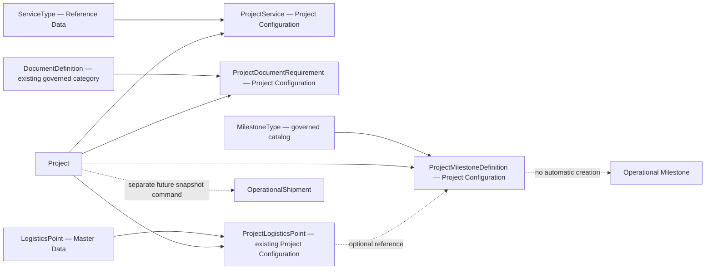

# Release 1.8.0 — Project Configuration Slice Contract

- **Status:** Implementation Complete — Not Published — Not Deployed
- **Version candidate:** 1.8.0
- **Theme:** Project Configuration Foundation
- **Date:** 2026-08-03

Implementation closure: the bounded contract is implemented with migration `20260811_project_configuration`. Production is unchanged; Seed was not executed; the MilestoneType catalog is prepared but not applied. Defaults and snapshots remain deferred, and visibility engine, reporting, and automatic execution side effects are absent.
- **Implementation authority:** YES — only the bounded scope in this contract
- **Accepted scope:** Option B — tightly bounded Balanced

## Business objective

Turn Project into a simple reusable operating configuration that answers which services are offered, which logistics points are expected, which documents are required, which milestones are expected, and what simple elapsed targets apply—without becoming a workflow, rules, or execution engine.

## Included and excluded boundary

Included: ProjectService; reuse of existing ProjectLogisticsPoint; ProjectDocumentRequirement referencing DocumentDefinition as the existing governed document category; the accepted additive immutable UUIDv4 `DocumentDefinition.public_id` identity and existing-row technical identity backfill; ProjectMilestoneDefinition referencing the governed MilestoneType catalog; elapsed target and optional warning duration on milestone definitions; internal organization-scoped configuration APIs/UI; active/inactive and optimistic version lifecycle.

Excluded: defaults; customer/carrier/public access; automatic inheritance/materialization; enforcement/blocking; generated RoutePlans, Checkpoints, Milestones, Documents, events, or work; full SLA semantics; and every advanced item listed in the discovery report. Existing operational behavior remains unchanged.

## Accepted domain model and aggregate boundary



ProjectService is configuration, not execution. ProjectDocumentRequirement is not a Document, Attachment, or Evidence and proves neither receipt nor validity. ProjectMilestoneDefinition is not an operational Milestone. Target fields are configuration, not measured performance. Changes never rewrite history and have no hidden cross-aggregate side effects. ADR-027 is Accepted.

### Candidate fields

- ProjectService: opaque public ID, Project reference, ServiceType reference, `is_primary`, `is_required`, display order, optional display label, notes, active state, optimistic version, and audit metadata.
- ProjectDocumentRequirement: opaque public ID, Project reference, DocumentDefinition reference, requirement level `REQUIRED|OPTIONAL|CONDITIONAL`, display order, optional notes/conditional description, active state, optimistic version, and audit metadata. An optional stage/milestone reference is allowed only if implementation proves a clean governed reference; otherwise it is omitted.
- ProjectMilestoneDefinition: opaque public ID, Project reference, MilestoneType reference, sequence, required/optional flag, optional ProjectLogisticsPoint reference, optional target duration, optional warning duration, unit `MINUTE|HOUR|DAY`, basis fixed to `ELAPSED_TIME`, optional bilingual/project-specific display label where justified, notes, active state, optimistic version, and audit metadata.

No separate ProjectSlaDefinition is proposed.

## D01–D15 decision register

All decisions are **Accepted** for this bounded Slice by Product, Architecture, Operations, and Data role authorities, with Security consulted where applicable. No named individual approval is asserted.

| ID | Options | Recommendation and rationale | UX / data / operations / reporting / security / migration impact | Dependencies, risks, approvers, fail-safe |
| --- | --- | --- | --- | --- |
| D01 Scope | A Minimal; B Balanced; C Broad | Tightly bounded B: smallest slice with reusable expectations and simple targets. | Four grouped panels; three additive concepts plus existing network; no execution; future dimensions only. | PDR-017/ADR-027; overreach risk. Product, Architecture, Operations, Data, Security. Fail-safe: reduce to A or do nothing. |
| D02 ProjectService identity/multiplicity | Duplicate rows; unique service per Project; versioned repeats | One active association per Project+ServiceType; deactivation preserves history. | Simple selector; stable dimension; no duplicate active meaning; tenant-scoped unique constraint. | ServiceType available; historical association risk. Product, Data, Architecture. Fail-safe: reject duplicate. |
| D03 Primary policy | Multiple; exactly one; zero-or-one | Zero-or-one PRIMARY; others SECONDARY; required/optional is separate. | Clear badge; nullable initial adoption; supports reporting without forcing configuration. | Business confirmation. Product, Operations, Data. Fail-safe: block second active primary. |
| D04 TransportMode | Merge with service; ProjectService field; separate axis | Keep separate and do not add a mode default in 1.8.0. | Avoid confusing selectors and schema; no modal reporting from this slice. | Canonical mode unresolved. Product, Data, Architecture, Operations. Fail-safe: omit. |
| D05 Requirement levels | Required only; required/optional; three levels | REQUIRED/OPTIONAL/CONDITIONAL. | Clear level selector; explicit enum; no blocking; category reporting. | Document category reuse. Product, Operations, Data. Fail-safe: no requirement write without governed category. |
| D06 Conditional behavior | Expression engine; notes; defer level | Store level plus bounded explanatory notes; no executable condition or automatic validation. | Human-readable only; no rules data or operational block. | Later enforcement decision. Product, Operations, Architecture. Fail-safe: treat as advisory. |
| D07 Milestone boundary | Reuse operational rows; separate definition; defer | Separate ProjectMilestoneDefinition. | Configuration list; explicit table; no live milestone mutation; future expectation dimension. | Canonical codes and ADR-027. Product, Operations, Architecture, Data. Fail-safe: omit milestone capability. |
| D08 Auto creation | On Project edit; on shipment creation; none | None in 1.8.0. | UI states “does not create operations”; no cross-aggregate writes/migration. | Future snapshot command. Product, Operations, Architecture. Fail-safe: no-op. |
| D09 SLA | Full engine; separate SLA model; simple target fields; defer | Elapsed target/warning fields on milestone definition; label “target,” not SLA. | Duration inputs; constrained fields; no compliance action; future variance only. | Target semantics. Product, Operations, Data, Architecture. Fail-safe: omit target fields. |
| D10 Defaults | All candidates; subset; none | None in 1.8.0. | No defaults panel/schema/snapshot behavior. | Missing governed Currency/Incoterm/Mode evidence. Product, Data, Operations. Fail-safe: current manual entry. |
| D11 Visibility | New engine; existing membership; customer/carrier | Existing organization membership and explicit internal permissions only. | Hide unauthorized panels but backend is authoritative; no public API. | Security threat review. Security, Product, Architecture, Operations. Fail-safe: deny. |
| D12 Snapshot | Live reference; creation snapshot; defer implementation | Principle: future creation-time snapshot may be needed; implementation separately authorized. | UI makes no inheritance promise; no snapshot schema now; reporting cannot treat current config as history. | Creation contract. Product, Architecture, Operations, Data. Fail-safe: no automatic copy. |
| D13 Lifecycle/history | Hard delete; edit in place; deactivate/version | Active/inactive, optimistic version, no hard delete after use; edits never rewrite operations. | Status badges/conflict message; audit metadata; historical readability. | Usage detection/audit. Product, Data, Architecture. Fail-safe: refuse delete. |
| D14 Organization isolation | Client filter; inherited Project scope; shared config | Inherit organization from Project; authorize before lookup/match/serialization. | No org selector; same-org composite constraints; no cross-tenant reporting. | CAP-010. Security, Architecture, Data, Product. Fail-safe: 404/deny without existence leak. |
| D15 Authority | Contract authorizes; governance acceptance authorizes; separate implementation gate | This closure explicitly authorizes only the bounded Release 1.8.0 Slice. | Implementation may begin within this contract; deployment and Production remain unauthorized. | All prior decisions. Product, Architecture, Operations, Data, Security consulted and Release authority. Fail-safe: stop outside scope. |

### MilestoneType catalog

No reusable governed configuration milestone taxonomy exists. Existing `operational_milestone.milestone_type` values are execution-instance constraints and are not a category catalog. Implement a separate governed `MilestoneType` catalog with immutable code, Persian and English labels, definition, active/inactive state, and display order. The initial cross-project codes are limited to `REQUEST_RECEIVED`, `CARGO_READY`, `PICKUP`, `LOADING`, `DEPARTURE`, `BORDER_ARRIVAL`, `CUSTOMS_START`, `CUSTOMS_COMPLETE`, `PORT_ARRIVAL`, `DISCHARGE`, `DELIVERY`, `COMPLETION`, and `OTHER_GOVERNED`. Transport-mode-specific additions require later governance.

## API design requirements

Proposed internal endpoints group under `/api/v2/projects/{project_public_id}/configuration/...` for `services`, `document-requirements`, and `milestone-definitions`; existing `/api/v2/projects/{project_public_id}/logistics-points` is reused. Reads are bounded/paginated with allowlisted sorting. Create/update/activate/deactivate/reorder are explicit commands. Payloads and projections use opaque IDs only, accept `version` for optimistic conflict handling, return 409 on stale writes, and never accept organization identity from the client as authority. DocumentDefinition selectors accept and return its `public_id` only and resolve the numeric key server-side. Legacy case-document numeric APIs are temporarily tolerated for compatibility, are not normative, and must not be copied. Inactive references cannot be selected for new associations but remain readable historically. No hard delete after use, public/customer endpoint, condition evaluator, bulk API, or execution side effect.

## Low-fidelity UI flows

```text
Project detail → Configuration
  Services | Network | Documents | Milestones

Services: select existing ServiceType → choose primary/secondary and required/optional → save
Network: reuse existing ordered ProjectLogisticsPoint panel
Documents: select governed category → choose requirement level → optional explanatory note → save
Milestones: select canonical code → labels/order/required → optional existing Project point → elapsed target → save

Every panel: active/inactive badge → deactivate/reactivate; stale edit → conflict message → reload/reapply
```

Panels are mobile-safe and bilingual where platform support exists. Governed concepts use selectors, not unrestricted free-text creation. A persistent note distinguishes configuration from live operation. No visual workflow designer appears.

## Permissions and security

Use existing membership mechanics with explicit read/manage permissions; final permission names are an implementation-contract decision. Resolve organization from authenticated membership and Project before child lookup. Deny by default and do not leak forbidden counts, matches, IDs, logs, or errors. Customer and carrier visibility is unauthorized. Numeric IDs are never serialized.

## Migration, Seed, and compatibility

Authorized migration: `20260811_project_configuration`, following verified head `20260810_logistics_network`. In addition to the four approved new tables, it may add nullable `document_definition.public_id`, populate every existing row with a newly generated UUIDv4, enforce uniqueness and non-nullability, and leave the numeric primary key and foreign keys unchanged. This is authorized technical identity backfill, not Seed. No other Project, DocumentDefinition semantic, Document/Attachment/Evidence, or OperationalShipment mutation, automatic association, default, or catalog row is authorized. Downgrade must be safe and the chain must retain one Alembic head. After dependent configuration exists, default rollback retains the additive schema; destructive database downgrade requires explicit authority and preserved/exported data.

Seed boundary: no catalog rows in migration and no Seed execution is authorized. MilestoneType values use a separate versioned/checksummed governed catalog with read-only plan and explicit, audited, idempotent apply; Production apply requires separate authorization. Existing ServiceType and DocumentDefinition records are inspected and reused and prior accepted catalogs are not silently altered.

## Snapshot implications

Configuration changes do not alter existing operations. A later separately accepted OperationalShipment creation command may snapshot active configuration and source versions. Until that contract exists, current Project configuration must not be reported as the historical configuration of prior shipments.

## Test and PostgreSQL strategy (future implementation only)

Unit/domain: enum, multiplicity, primary uniqueness, duration, lifecycle, and immutability rules. API: opaque IDs, paging/sorting, 409 conflicts, inactive reference rejection, permission matrix, no side effects. Integration/PostgreSQL: composite same-organization foreign keys, partial active uniqueness, concurrency, migration upgrade/downgrade, N/N-1 reads, and query plans. UI: bilingual/mobile selectors, disabled unauthorized actions, conflict recovery, and clear configuration/live-operation separation. Negative tests prove no cross-organization disclosure and no generated operations. No application tests are run by this discovery.

Development performance profile: page size default 25/max 100; allowlisted sort; indexed `(project_id,is_active,sequence)` and tenant-aware lookup paths; no unbounded joins or counts; representative PostgreSQL `EXPLAIN` verification before approval.

### Testable acceptance criteria

- ProjectService supports create/read/update/deactivate, prevents duplicate active `(Project, ServiceType)` and more than one active primary, rejects inactive ServiceType for new configuration, and enforces organization isolation.
- ProjectDocumentRequirement uses DocumentDefinition, supports all three levels and a conditional description, prevents duplicate active category use, preserves lifecycle/history, and creates no Document or file.
- ProjectMilestoneDefinition uses MilestoneType, has unique active sequence within Project, supports required/optional, optional ProjectLogisticsPoint, and constrained target/warning durations, preserves lifecycle/history, and creates no operational Milestone.
- Security tests cover the permission matrix, IDOR resistance, 404-safe cross-tenant behavior, absence of public endpoints, and absence of internal numeric IDs.
- Compatibility tests prove existing Projects remain valid; ProjectLogisticsPoints, OperationalShipments, RoutePlans, Checkpoints, and Milestones are unchanged; and no backfill occurs.
- Migration tests cover a fresh chain, parent upgrade, downgrade/re-upgrade, indexes, constraints, foreign keys, a single head, safe downgrade, and zero automatic rows.
- Frontend tests cover governed selectors/catalog administration where needed, all four panels, mobile Persian/English layouts, accessibility, conflict/error UX, and absence of uncontrolled governed-identity creation.

## Rollout, rollback, and acceptance

Rollout after authority: additive migration → verify PostgreSQL → deploy disabled/internal-only → enable authorized organization(s) → observe audit/errors → broaden. Rollback disables configuration writes/UI, preserves additive records for reconciliation, and keeps legacy behavior; destructive deletion is not rollback.

Governance acceptance is complete: D01–D15 and ADR-027 are Accepted, document taxonomy is resolved to DocumentDefinition, MilestoneType is accepted, and explicit bounded implementation authority is recorded in the closure. Implementation acceptance still requires the migration chain and rollback to be proven; organization-first authorization and opaque IDs; no automatic execution; unchanged 1.7.0 behavior; and documentation/API/UI/test traceability. This status does not mean implemented or deployed.

## Explicit out-of-scope

Separate ProjectSlaDefinition; workflow/BPMN/rules/conditional expressions; event bus; GIS/maps; ETA/route/capacity optimization; allocation/cargo-to-unit allocation; customer/public/carrier visibility configuration; a new visibility engine; dashboards/reporting UI; automatic OperationalShipment snapshots; automatic RoutePlan/Checkpoint/Milestone/Event creation; document enforcement/blocking; business calendars, holidays, pause/resume clocks, penalties, or escalations; defaults; bulk import; EAV/JSON settings; AI; Production changes; and deployment.
