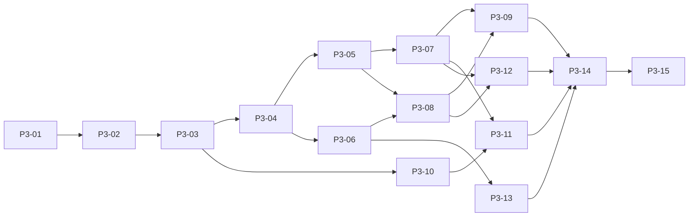

# طرح اجرای فاز ۳ — نسخه ۱

> وضعیت مأموریت جاری: [دستور پنج‌مرحله‌ای P3-06 تا P3-10](P3-06-10-MISSION-AUTHORITY.md) اکنون مرجع اختیار اجراست. DN10 با تصمیم صریح مالک محصول و [ADR-062](../../operational/adr/ADR-062-explicit-customer-entitlement.md) حل شده است؛ P3-06 روی Product `0e65fd89882e23453d7c3bfe4d520cd7f44a6c32` با [شواهد تازه](../../operational/evidence/phase3-p3-06-dn10-requalification-status-20260925.md) تأیید شده و ادغام کنترل‌شده آن مجاز است. DN06 و DN07 نیز در محدوده P3-07 همین مأموریت تصمیم مصوب دارند؛ P3-06 در canonical `13c0fed2d5971907d93f23860cc5689c7ebe33f8` یکپارچه شده و P3-07 طبق [ADR-063](../../operational/adr/ADR-063-scoped-reported-facts-and-safe-effects.md) روی Product `cd83f21ca1ac0db6e940475fcd9067713831a581` با [شواهد تازه](../../operational/evidence/phase3-p3-07-reported-facts-status-20260925.md) تأیید شده و ادغام کنترل‌شدهٔ آن مجاز است؛ P3-07 در canonical `682e83ed3a51badb3938d66dbd337e8e10e57797` یکپارچه و با github برابر ۰/۰ است. P3-08 طبق [ADR-064](../../operational/adr/ADR-064-partial-cargo-delivery-and-exact-evidence.md) در محیط جداگانه در حال پیاده‌سازی و تأیید است؛ P3-09/10 هنوز آغاز نشده‌اند و تابع گیت ترتیبی مأموریت‌اند. متن طرح و رکوردهای قدیمی زیر، شواهد زمان خود هستند؛ هیچ یک مجوز دورزدن وابستگی، Release یا Production نیستند.

تاریخ: ۲۰۲۶-۰۹-۲۵. وضعیت: **طرح آماده؛ اجرای فاز ۳ شروع نشده است.**

> **رکورد وضعیت پیش از مأموریت پنج‌مرحله‌ای (۲۰۲۶-۰۹-۲۵):** متن و وضعیت بالا رکورد تاریخی زمان تصویب طرح است. P3-01 تا P3-05 در canonical SHA `bd3610c4016cf643b6243fb0490260ac49a8b92d` یکپارچه‌اند؛ [شواهد P3-05](../../operational/evidence/phase3-p3-05-cargo-allocation-status-20260925.md) ثبت شده است. مأموریت ترتیبی مالک محصول اکنون P3-06 را در محیط جداگانه مجاز می‌کند؛ ADR-061 و [وضعیت P3-06](../../operational/evidence/phase3-p3-06-contextual-documents-status-20260925.md) مرز جاری‌اند. این یادداشت به P3-07، Release، Deployment یا Production اختیاری نمی‌دهد.

این سند ترتیب کار و مرزهای بررسی را مشخص می‌کند. تأیید UX به معنی پیاده‌سازی، تأیید سفرهای واقعی محصول یا آمادگی انتشار نیست. شروع هر کار اجرایی همچنان نیازمند دستور بعدی مالک محصول با مضمون `START PHASE 3 IMPLEMENTATION`، رفع تصمیم‌های وابسته و گیت معماری همان بخش است.

## ۱. اختیار، مبنا و شواهد

| موضوع | مبنای قابل ردیابی |
| --- | --- |
| حاکمیت | `AGENTS.md` مخزن هدف؛ LPAF v2.7 فعال، منجمد و canonical؛ rigor سطح B؛ تصمیم محصول فقط نزد Product Owner، تصمیم معماری در فرایند ADR، ساخت و شواهد در مأموریت جدا |
| اختیار این مأموریت | درخواست صریح مالک: ثبت تأیید نهایی V2.1، ادغام مستندات UX، ساخت و ادغام طرح؛ هیچ اختیار تغییر runtime، schema، داده، انتشار یا Production وجود ندارد |
| Product Authority Record | همین بخش + [قرارداد محصول](../FORWARDER-OPERATIONAL-SHIPMENT-PRODUCT-CONTRACT-V1-FA.md) + [سفرهای پذیرش v1.1](../FORWARDER-PRODUCT-ACCEPTANCE-JOURNEYS-V1.1-FA.md) + [تأیید نهایی UX](../ux/phase3/FINAL-PRODUCT-OWNER-APPROVAL.md) |
| UX مرجع | [Blueprint](../ux/PHASE3-OPERATIONAL-SHIPMENT-UX-BLUEPRINT-V1-FA.md) و Prototype V2.1؛ V1=`COMPLETED_NEEDS_CHANGE`، V2=`COMPLETED_CONDITIONAL_PASS_VISUAL_ALIGNMENT_REQUIRED`، V2.1=`PASS` |
| canonical پیش از کار | `d83b1aa7c0011221188e753c0f38d2058859400b`؛ شاخه `integration/golden-controlled` |
| artifact تصویری تأییدشده | `32d5a14ae70f0b74747f4ab4c3a7bea185002dc5`؛ نامزد بازبینی `39af12a814f3cddcb294ff5f5e3b8299ba1fa4aa` |
| ادغام UX و مبنای بررسی کد | `8995812d979e5121f57d9d08c7055256451bcf13`؛ fast-forward و push به `github/integration/golden-controlled` انجام شد؛ برابری SHA و ahead/behind برابر `0/0` بررسی شد |
| شاخه و محل طرح | `codex/phase3-implementation-plan-v1` در `D:\1-webapp\forwarder-dev\phase3-implementation-plan-v1`، منشعب از SHA بالا |
| migration موجود | فقط `20260929_operational_monitoring_reliability`؛ بررسی graph با Alembic، بدون اتصال یا تغییر داده |
| شواهد تاریخی | [preflight UX](../ux/phase3/evidence/FINAL-APPROVAL-PREFLIGHT.json)؛ گزارش‌های Prototype تاریخی‌اند و اجرای جدید آزمون محصول محسوب نمی‌شوند |

**FACT:** مدل‌ها، سرویس‌ها، routeها، مؤلفه‌ها، migrationها و آزمون‌های موجود در همین مبنا بررسی شدند. Product Contract و Journey Pack بازنویسی نشده‌اند. بررسی داده زنده یا Production انجام نشده است. هیچ عددی درباره کیفیت داده فعلی مشتریان ادعا نمی‌شود.

بسته مرور `39af12a` نسبت به artifact `32d5a14` فقط در پوشه Prototype دو تفاوت مستنداتی از پیش موجود دارد: README منشأ فونت و حذف فاصله انتهای یک خط license. کد، صفحه، style و فونت artifact یکسان‌اند؛ تمام بسته مرور در این مأموریت بدون تغییر حفظ شده است.

**ASSUMPTION:** ترتیب زیر برای ساخت افزایشی در modular monolith فعلی است؛ زمان‌بندی تیم، مدت هر بخش و اندازه داده واقعی معلوم نیست. **UNKNOWN:** حجم و کیفیت داده قدیمی، نگاشت هویت مشتری و چند سیاست دقیق محصول. برای مهاجرت واقعی `RELEASE_DATA_ASSESSMENT_REQUIRED` در مأموریت مجاز بعدی ثبت می‌شود؛ unknown به داده ساختگی یا مجوز دسترسی تبدیل نمی‌شود.

بررسی و طراحی وابسته به مالکیت، مدل، زمان، tenant، اسناد و Cargo طبق [Development Gate](../../architecture/CODEX-DEVELOPMENT-GATE.md) باید قبل از ساخت ADR پذیرفته‌شده داشته باشد. پیشنهاد رابطه یا ترتیب در این طرح، خودِ پذیرش ADR نیست. ارجاع پوشه آغازین به LPAF 2.6 تاریخی است؛ مخزن canonical هدف و اسناد هنجاری فعلی LPAF 2.7 حاکم‌اند؛ خود چارچوب تغییر نکرده است.

## ۲. وضع موجود در برابر هدف

در ستون رویکرد، `REUSE` یعنی استفاده مستقیم، `EXTEND` یعنی تکمیل همان مالک حقیقت، `ADAPT` یعنی اصلاح adapter/نمایش با حفظ مالک، و `NEW` فقط یک مفهوم محدودِ فاقد ذخیره‌سازی کافی است؛ نه ساخت سامانه موازی. `REPLACE_ONLY_IF_REQUIRED` برای هیچ هسته‌ای توجیه نشده است. GPS، ناوگان و AI در این طرح `NOT_APPLICABLE` هستند.

| CAPABILITY | CURRENT IMPLEMENTATION | TARGET PHASE3 / GAP | REUSE / EXTEND / NEW | SLICE | JOURNEY IMPACT |
| --- | --- | --- | --- | --- | --- |
| A ـ ساختار Shipment/Cargo | OperationalShipment و ShipmentCargoItem با snapshot کاتالوگ، quantity/UOM و HS متنی | تکمیل تدریجی ساختار بار، بسته‌بندی، وزن، حجم و منشأ با حفظ snapshot | EXTEND | 01,02 | J03,J09,IPJ01,IPJ04 |
| B ـ چند Request و Customer | `OperationalShipment.shipment_request_id`/accepted quote منفرد؛ `RequestCargoItem` جدا؛ `ShipmentCargoItem.cargo_owner_customer_id` موجود و برای legacy nullable | lineage اختیاری هر بار از Request/ردیف آن، owner مستقل؛ direct بدون Request ساختگی؛ مشتری سربرگ مجوز تمام بار نیست | EXTEND | 02,09 | J02,J03,J08,J09,IPJ01,IPJ04 |
| C ـ Requested/Planned/Actual | درخواست qty جدا دارد؛ بار عملیاتی فقط یک quantity | سه معنای مستقل با ثبت اصلاح؛ تبدیل ضمنی UOM ممنوع | EXTEND | 02,05,08 | J03,J09,IPJ04 |
| D ـ تخصیص و split | `ExecutionUnitCargoAllocation`؛ lock بار و سقف مجموع؛ update و delete فعلی تاریخ کامل نمی‌سازند | تخصیص مرحله‌ای planned/actual، split، انتقال با حفظ سابقه و جلوگیری از تخصیص بیش از مقدار | EXTEND | 05 | J04,J08,J09,IPJ04 |
| E ـ planned/actual route | `RoutePlan` revision، `RouteLeg`، checkpoint dependency DAG؛ زمان‌های leg اجباری | اجرای واقعی جدا از طرح؛ draft ناقص بدون تضعیف invariant طرح فعال | EXTEND | 03 | J03,J04,J09,IPJ04 |
| F ـ مقصد شاخه‌ای | ترتیب leg و dependency موجود، اما رابطه مقصد/مسیر هر Cargo کامل نیست | رابطه هر بار با مقصد و شاخه‌های مسیر در همان Shipment | EXTEND | 03 | J03,J04,J09,IPJ04 |
| G ـ اجرای مرحله | `ExecutionUnit` tenant-owned و event دارد؛ بعضی readها هنوز project/shipment قدیمی را join می‌کنند | اتصال روشن stage به اجرای واقعی؛ کامل کردن readهای direct/shared | EXTEND / ADAPT | 04,07 | J04,J07,J09,IPJ02,IPJ04 |
| H ـ Means/Equipment | unit_type و vehicle_reference؛ تفکیک هویت مستقل کافی نیست | وسیله حرکت، تجهیز و container جدا، در همان محدوده اجرا | EXTEND | 01,04 | J09,IPJ04 |
| I ـ چند وسیله در مرحله | چند unit ممکن، رابطه stage/means کامل نیست | چند اجرای مرحله با اتصال بار و تجهیز؛ بدون registry دائمی fleet | EXTEND | 04,05 | J09,IPJ04 |
| J ـ چند Carrier | carrier فعلی یک CRM Customer با نقش CARRIER به ازای unit | carrier مستقل هر اجرای مرحله؛ carrier مالک Shipment نمی‌شود | REUSE / EXTEND | 04 | J08,J09,IPJ04 |
| K ـ اسناد زمینه‌دار | `CaseDocumentFile`، version، audit، `ArtifactAssociation` و MDPM؛ ارتباط Request فعلی محدود | زمینه Shipment/Cargo/unit/leg/delivery مستقل از visibility؛ exact-version و سیاست مجوز | EXTEND | 06,08,09 | J02,J04,J08,J09,IPJ04 |
| L ـ نمای Customer | پورتال Requestهای `gamification_customer_id`؛ نمای Shipment مشترک ندارد | projection بار خود، shared مجاز و تحویل خود؛ نگاشت هویت DN10 | NEW read projection / REUSE SOR | 09 | J01,J02,J08,J09,IPJ03,IPJ04 |
| M ـ reported location | event با occurred/recorded و supersedes؛ evidence مکان immutable | گزارش و اصلاح قابل ردیابی، منشأ و عدم‌قطعیت روشن؛ بدون GPS | EXTEND | 07 | J01,J04,J09,IPJ04 |
| N ـ Customer Timeline | timeline اجرا و unified history داخلی وجود دارند | allowlist رخداد و پیام امن، اثر بر بار مجاز، حذف یادداشت داخلی | ADAPT | 07,09 | J01,J02,J08,J09,IPJ04 |
| O ـ فاصله/زمان مرجع | برنامه leg و logistics catalog؛ provider فاصله یا مرجع زمان مسیر کشف نشد | زمان مرجع سازمان با effective/version؛ فاصله برنامه‌ای جدا و دروازه انتخاب منبع | NEW bounded reference / EXTEND route | 10,11 | J06,J09,IPJ03,IPJ04 |
| P ـ ETA | propagation قطعی checkpoint از برنامه/actual در route service | ETA بعدی/نهایی با مبنا، بازه، تازگی و تاریخچه؛ الگوریتم DN04 | EXTEND projection | 11 | J04,J07,J09,IPJ02,IPJ04 |
| Q ـ کاتالوگ | master data صریح، Cargo Catalog، adoption مکان مرکزی به سازمان | تکمیل خانواده‌های لازم و فعال‌سازی سازمانی؛ بدون EAV جدید یا seed خودکار | REUSE / EXTEND | 01 | J06,J08,J09,IPJ03,IPJ04 |
| R ـ HS/UOM/packaging | CargoType و UOM مرکزی، HS snapshot؛ packaging کامل نیست | انتخاب معتبر و snapshot؛ نقطه اجبار HS باز است | EXTEND | 01,02,12 | J03,J06,J09,IPJ04 |
| S ـ تحویل جزئی | lifecycle عمومی delivered/completed؛ رکورد تحویل تفصیلی بار کافی نیست | مقدار، محل، زمان و مدرک تحویل؛ مانده هر بار و اصلاح | NEW bounded delivery | 08 | J02,J04,J09,IPJ04 |
| T ـ checklist بسته‌شدن | lifecycle فعلی Shipment؛ checklist فاز۳ وجود ندارد | delivered از closed جدا؛ checklist نسخه‌دار عمومی/روش حمل | NEW bounded policy / EXTEND shipment | 12 | J04,J06,J09,IPJ03,IPJ04 |
| U ـ استثنای closure | exception و audit موجود؛ اختیار bypass جدید وجود ندارد | فقط Org Admin مجاز با علت، نقص‌های باقی‌مانده و تاریخچه | EXTEND | 12 | J05,J06,J08,J09,IPJ04 |
| V ـ انتقال مالک | ORM و trigger پایگاه‌داده مالک را write-once نگه می‌دارند | انتقال استثنایی مجاز Org Admin با قدیم/جدید/علت؛ سایر تغییرات همچنان منع | EXTEND؛ supersession محدود ADR-047 | 13 | J03,J04,J06,J08,J09,IPJ01,IPJ03,IPJ04 |
| W ـ UX تأییدشده | صفحات عملیاتی و ui موجود؛ Prototype مستقل | یک context، هدایت تدریجی، افشای جزئیات اختیاری، Responsive و RTL | REUSE / ADAPT | همه؛ جمع‌بندی 14 | J01..J09,IPJ01..IPJ04 |
| Workspace/Tower | readهای governed، authorization پیش از count، health و OIP | همان facts و rank با adapterهای فاز۳؛ حقیقت عملیاتی موازی ممنوع | REUSE / ADAPT | 07,11,12,13,14 | J04,J05,J07,J08,IPJ02,IPJ03,IPJ04 |
| SLA/Attention | Exception، WorkItem، دو process SLA، evaluator مستقل مرورگر | ورودی‌های مجاز جدید در pipeline موجود؛ بدون SLA پیش‌فرض یا خانواده هشدار جدید | REUSE | 07,12,14 | J04,J05,J06,J07,IPJ02,IPJ03 |

شناسه‌های کوتاه جدول همگی با پیشوند `FWD-` هستند؛ مثلاً J09=`FWD-J09` و IPJ04=`FWD-IPJ-04`. شناسه‌های کامل در رکورد هر بخش آمده‌اند.

## ۳. تصمیم‌های بسته، انتخاب‌های فنی و تصمیم‌های باز

**A ـ بسته شده با اختیار محصول:** یک Shipment مشترک با انتساب Cargo به Customer؛ منشأ چند Request و direct؛ جدایی Requested/Planned/Actual؛ تفکیک Means/Equipment و Carrier از مالک؛ جدایی planned/actual route؛ اصلاح همراه تاریخ؛ تحویل جزئی؛ جدایی delivery/closure؛ اصل checklist و استثنای Admin؛ اصل انتقال استثنایی مالک؛ Customer فقط projection مجاز؛ مدیریت سند فقط owning Expert؛ DNA و ساختار UX V2.1. تأیید نهایی UX، سیاست‌های دقیق باز زیر را نبسته است.

**B ـ فنی و قابل پیشنهاد در design:** کلید و index، reuse مؤلفه، شکل DTO افزایشی، ترتیب transaction/lock، storage exact-version و adapterهای read. این اختیار اجازه تعیین transition محصول، تبدیل واحد، ادغام هویت مشتری، رتبه تجاری جدید یا مجوز تازه را نمی‌دهد. ADR-020/023 Proposed همچنان مجوز ساخت نیستند؛ قیود قدیمی same-project نباید ADR-046 tenant-owned execution را عقب ببرند. ADR-050/PDR-020 برای مدیریت اسناد حفظ می‌شوند؛ تنها اصل انتقال مالک طبق قرارداد جدید جایگزینی محدود می‌خواهد. مثال‌های checklist قرارداد، تنظیمات پیش‌فرض مصوب نیستند.

**C ـ باز:** ۱۰ موضوع فاز۳ و ۴ تصمیم موروثی Journey Pack؛ مجموع **۱۴ موضوع تصمیم**، نه ۱۴ پاسخ یا ۱۴ مانع برای اولین بخش. شمارش تجمیعی و بدون دوباره‌شماری DN02/DN09 است. تصمیم‌گیر Product Owner است؛ Architecture/Security اثر فنی گزینه‌ها را قبل از پذیرش نشان می‌دهند.

| ID | پرسش محصول و مرز تصمیم | DECISION_REQUIRED_BEFORE_SLICE | اثر و گزینه‌هایی که باید برای مالک قابل بررسی شوند |
| --- | --- | --- | --- |
| DN01 | lifecycle/status/transition دقیق Shipment، allocation و closure | 02 فقط برای transition جدید؛ 05 و12 پیش از منطق وابسته | داده تدریجی می‌تواند بدون status تازه آغاز شود؛ تغییر نام نمایشی status موجود نباید معنای آن را عوض کند |
| DN02 | read/download اسناد در هر context و اختیارات دقیق فرمان انتقال | 06 برای سیاست سند؛ 13 برای فرمان انتقال | scope سند با visibility برابر نیست؛ اصل Admin transfer تصویب شده، ماتریس جزئی و شرط اجرای آن هنوز نه |
| DN03 | اقلام universal/mode checklist و شرایط استثنای closure | 12 | چک‌های نمونه به‌جای سیاست مصوب نصب نمی‌شوند؛ نحوه نمایش نقص و علت استثنا باید تصویب شود |
| DN04 | ورودی/الگوریتم ETA، confidence/freshness و مبنای planned distance | 11؛ 10 فقط اگر سیاست ثبت مرجع به آن وابسته شود | reuse propagation موجود ممکن است؛ انتخاب مسیر/تأخیر/بازه و منبع فاصله بدون تصمیم معتبر نمی‌شود؛ provider جدید خودکار اضافه نمی‌شود |
| DN05 | HS در کدام نقطه و برای چه بار اجباری است؟ | 02 اگر validation اجباری شود؛ 12 اگر شرط closure باشد | نگهداری اختیاری HS مجاز است؛ اجبار زودهنگام می‌تواند شروع پرونده ناقص را ببندد |
| DN06 | taxonomy گزارش مکان/رخداد و معنای منبع/اطمینان | 07 | source مکان فعلی با اعتبار گزارش یکی نیست؛ label یا confidence ساختگی ممنوع |
| DN07 | مجموعه پیام امن Customer، fallback و زبان آن | 07 پیش از انتشار پیام؛ 09 پیش از عرضه projection | اثر عملیاتی باید دیده شود؛ یادداشت داخلی و نام مشتری دیگر نباید برای ساخت پیام مصرف شود |
| DN08 | جزئیات تعریف اختصاصی، promotion و مرجع تأیید کاتالوگ | 01 فقط برای جریان جدید مربوط | انتخاب از داده موجود متوقف نمی‌شود؛ انتشار تعریف محلی به مرکزی خودکار نیست |
| DN09 | دسترسی مالک پیشین/جدید، کارهای باز و اسناد بعد از transfer | 13؛ 06 قرارداد extension را باز می‌گذارد | حفظ audit با حفظ مجوز جاری یکسان نیست؛ هیچ دسترسی تازه‌ای تا تصمیم و آزمون داده نمی‌شود |
| DN10 | اتصال معتبر حساب پورتال به CRM Customer/Cargo owner | 09؛ پیش از هر نمایش خصوصی جدید | ADR-053 این اتصال را باز گذاشته؛ گزینه‌های پیوند صریحِ اداره‌شده یا entitlement محدود باید جدا تصویب شوند؛ نام/ایمیل/موبایل و source Request مجوز ضمنی تمام Cargo نیست |
| FWD-DEC-01 | تعیین تکلیف پیشنهادهای Journey Pack برای critical شدن | 15 فقط اگر دامنه critical عوض شود | فهرست مصوب فعلی اجرا می‌شود؛ پیشنهادها خودکار critical نمی‌شوند |
| FWD-DEC-02 | اولویت رفع شکاف navigation مدیریت حساب Customer | 14 برای مأموریت رفع شکاف؛ 15 برای بستن مانع سفر Admin | route وجود دارد اما پیوند عادی منو کم است؛ این طرح آن را رفع‌شده اعلام نمی‌کند |
| FWD-DEC-03 | محیط و شواهد پذیرش recovery حساب و تحویل واقعی پیام | 15 پیش از ادعای قبولی recovery مربوط | تست سرویس به‌تنهایی delivery در محیط release را ثابت نمی‌کند |
| FWD-DEC-04 | Project Public Tracking سفر بحرانی مستقل می‌شود یا نه؟ | 15 فقط برای توسعه فهرست سفرها | مسیر موجود و Request Public Tracking حفظ می‌شوند؛ سفر جدید به‌جای مالک اضافه نمی‌شود |

`DECISION_NEEDED` یعنی فقط کار وابسته متوقف می‌شود. DN04 مانع انتساب بار نیست، جزئیات راننده مانع تخصیص نیست و Carrier Portal وابستگی تعیین Carrier نیست. طراحی امنیت capability عمومی Shipment نیز قبل از عرضه 09 لازم است: ADR-052 مربوط به Request است؛ سیاست آن خودکار به Shipment تعمیم نمی‌یابد. اگر انتخاب امنیتی نتیجه قابل مشاهده تازه‌ای ایجاد کند، همان مورد باید به تصمیم محصول ارجاع شود.

## ۴. ترتیب و وابستگی‌ها

`RECOMMENDED_PHASE3_SEQUENCE=P3-01,P3-02,P3-03,P3-04,P3-05,P3-06,P3-07,P3-08,P3-09,P3-10,P3-11,P3-12,P3-13,P3-14,P3-15`

اول کاتالوگ و معنای بار روشن می‌شود؛ مسیر و اجرای حمل سپس به تخصیص معنا می‌دهند. اسناد و تحویل باید قبل از نمایش کامل Customer مرز مجوز داشته باشند. زمان مرجع و ETA پس از داده مسیر و پیشرفت می‌آیند. بسته‌شدن و انتقال مالک بعد از روشن‌شدن شواهد، مجوز و تاریخچه عرضه می‌شوند. هر بخش UX خودش را دارد؛ بخش 14 فقط ترکیب نهایی است.

| SLICE | وابستگی اجباری کامل‌شده | نتیجه کوتاه |
| --- | --- | --- |
| P3-01 | ندارد؛ مجوز شروع آتی لازم | انتخاب مرجع معتبر |
| P3-02 | P3-01 | بار و مالک آن، منشأ و سه مقدار |
| P3-03 | P3-02 | مسیر هر بار و جدایی طرح/واقعیت |
| P3-04 | P3-01,P3-03 | اجرای مرحله با means/equipment/carrier |
| P3-05 | P3-02,P3-04 | تخصیص و انتقال بدون نابودی تاریخ |
| P3-06 | P3-02,P3-03,P3-04 | اسناد contextدار و قرارداد visibility |
| P3-07 | P3-03,P3-04,P3-05 | reported location، اصلاح و timeline امن |
| P3-08 | P3-02,P3-03,P3-05,P3-06 | تحویل جزئی با مدرک |
| P3-09 | P3-02,P3-05,P3-06,P3-07,P3-08 | projection امن Customer |
| P3-10 | P3-01,P3-03 | مرجع زمان سازمان |
| P3-11 | P3-02,P3-03,P3-05,P3-07,P3-10 | ETA قابل توضیح و مبنای فاصله |
| P3-12 | P3-06,P3-07,P3-08 | closure و استثنای Admin |
| P3-13 | P3-02,P3-06 | انتقال استثنایی مالک با کنترل دسترسی |
| P3-14 | P3-09,P3-11,P3-12,P3-13 | ترکیب UX، Workspace و Tower |
| P3-15 | P3-14 | پذیرش یکپارچه نامزد نهایی |



نمودار خلاصه است؛ جدول همه یال‌ها را دارد و مبنای بررسی بدون cycle است. **مسیر بحرانی وابستگی**: `P3-01→P3-02→P3-03→P3-04→P3-05→P3-08→P3-09→P3-14→P3-15`. شاخه `05→07→09` و شاخه‌های `07→11/12→14` نیز هم‌طول‌اند و در joinها باید تمام شوند. بدون برآورد مدت، این یک ادعای CPM تقویمی نیست؛ DN10 یا DN04 می‌تواند مسیر زمانی واقعی را تغییر دهد.

`PARALLELIZABLE_SLICES`: پس از تثبیت قراردادها، بررسی UX/آزمون 06 و07؛ طراحی زمان مرجع 10 پس از03؛ طراحی انتقال13 پس از06. merge مدل مشترک و migrationها **سریال** است. طراحی موازی مجوز شروع Build یا عبور از تصمیم باز نیست. اولین پیشنهاد `P3-01` است، در محدوده reuse کاتالوگ موجود و بدون بستن اجباری DN08.

## ۵. قاعده مشترک پذیرش هر بخش (Q0)

Q0 جزئی از `QUALIFICATION_PLAN` تک‌تک رکوردهای زیر است، نه کاری که تا آخر عقب بیفتد:

1. backend: invariant و command idempotency/version، correction، ورودی ناقص و replay؛ frontend: حالت loading/empty/error/denied/stale، RTL و تعامل keyboard و فرم؛ نام تست‌های موجود در نقشه ماژول نقطه شروع است، نه نتیجه PASS جدید.
2. PostgreSQL: fixture مصنوعی حداقل دو tenant، دو Customer در یک Shipment، owning/other/inactive Expert و Admin؛ رقابت تراکنش و precision مقدار در بخش‌های مؤثر. هر migration: upgrade از head پیشین، legacy ناقص، N/N-1 compatibility، round-trip یا مانع downgrade مستند، invariant و فقط یک head. برای بخش بدون migration: graph تک‌head و عدم تغییر schema؛ آزمون PostgreSQL همچنان برای read/permission لازم است.
3. مجوز منفی: دسترسی مستقیم با شناسه معتبر دیگری، tenant جعلی، parent/child mismatch، revoked session، stale cache و download؛ محدودیت باید پیش از count/search/page/export اعمال شود. 404/403 طبق قرارداد موجود بدون افشای وجود رکورد.
4. browser سفر همان بخش از **navigation عادی** با actor درست، ایجاد/اصلاح/reopen، حالت خطا، موبایل و desktop؛ deep-link جایگزین اثبات دسترسی از منو نیست. سفرهای قدیمی متأثر نیز regression می‌شوند.
5. architecture/governance، tenant ownership inventory، مدل زمانی UTC aware و تقویم نمایشی موجود، OpenAPI/DTO، type/lint/build و مجموعه regression متناسب با تغییر؛ خروجی warning یا skip به PASS تبدیل نشود.
6. evidence به commit کامل نامزد، branch، clean tree، migration head، نسخه محیط/مرورگر، policy/config، fixture/actor/tenant، زمان اجرا، فرمان و exit status، screenshot/log با hash و cleanup غیرتولیدی bind شود. شواهد پس از تغییر source/policy/data/role مرتبط stale هستند و آزمون متأثر دوباره لازم است. manifest نمی‌تواند SHA خودِ commit حاوی خودش را پیشاپیش ادعا کند؛ evidence-only descendant باید برابری tree آزموده‌شده را ثابت کند.
7. DONE هر بخش شامل نتیجه browser همان بخش و نبود تغییر محصول غیرمجاز است؛ هیچ بخش به تنهایی `GLOBAL_PRODUCT_VALIDATION=PASS` یا `RELEASE_READY=YES` نمی‌دهد. Human Product Walkthrough نهایی بعد از نامزد یکپارچه و قبل از Release Ready می‌آید؛ اکنون `NOT_RUN` است.

## ۶. رکوردهای استاندارد بخش‌ها

در همه رکوردها، `REFERENCE_IMPACT` مربوط به **مأموریت اجرایی آتی** است؛ این مأموریتِ صرفاً طرح پس از به‌روزرسانی indexها `REFERENCE_IMPACT=NONE` دارد. YES برای migration پیش‌بینی است و دستور ساخت فایل migration نیست. هر بخش در یک نامزد قابل بازبینی، با write gate و حفظ read قدیمی تا پایان qualification عرضه می‌شود؛ جمع‌کردن همه به یک PR بزرگ توصیه نمی‌شود.

### P3-01 ـ انتخاب مرجع معتبر

- SLICE_ID=P3-01
- NAME=کاتالوگ و انتخاب سازمانی
- PRODUCT_OUTCOME=Expert از نوع و واحد معتبر انتخاب کند و سابقه با تغییر کاتالوگ عوض نشود.
- USER / ACTOR=Platform Admin، Organization Admin، Transport Expert
- CURRENT_STATE=جداول صریح CargoType/UOM/DocumentDefinition و LogisticsPoint adoption موجود؛ همه خانواده‌های means/equipment/packaging موجود نیستند.
- TARGET_STATE=تکمیل حداقلی خانواده‌ها، activation سازمانی و انتخاب tenant-safe با snapshot در مصرف‌کننده.
- AUTHORIZED_PRODUCT_BEHAVIOR=قرارداد §20 و §7: catalog مرکزی، فعال‌سازی/تعریف محلی کنترل‌شده، انتخاب Expert.
- PROTECTED_BEHAVIOR=نصب خالی معتبر، عدم seed خودکار، کد پایدار و عدم بازنویسی snapshot قدیمی.
- REUSED_FOUNDATIONS=ADR-021/022/028/041، MasterDataAdminTab، CargoCatalogAdminTab، GlobalLogisticsNetworkAdminTab.
- LIKELY_SCHEMA_IMPACT=روابط adoption/activation یا خانواده صریح فقط در شکاف اثبات‌شده؛ از ساخت EAV یا کپی کل کاتالوگ پرهیز شود.
- API_IMPACT=تکمیل endpointهای master data موجود با scope و active state؛ DTO انتخاب تاریخی همچنان قابل خواندن.
- FRONTEND_IMPACT=selector و empty-state در ui فعلی؛ Admin تنظیم می‌کند، Expert در فرم اجرا انتخاب می‌کند.
- AUTHORIZATION_IMPACT=Platform مرجع مرکزی؛ Org فقط تنظیمات خود؛ Expert مجاز به تغییر نوع استاندارد نیست.
- HISTORY_IMPACT=غیرفعال‌سازی به‌جای حذف مرجع مصرف‌شده؛ snapshot تراکنش تغییرناپذیر.
- JOURNEY_IMPACT=AFFECTS_EXISTING_JOURNEY
- AFFECTED_JOURNEYS=FWD-J06,FWD-J08,FWD-J09,FWD-IPJ-03,FWD-IPJ-04
- DEPENDENCIES=NONE؛ دستور صریح شروع آینده
- DECISIONS_REQUIRED_BEFORE_START=DN08 پیش از تعریف/promotion جدید؛ reuse انتخاب فعلی مستقل است؛ ADR افزایشی برای خانواده/tenant جدید.
- QUALIFICATION_PLAN=Q0؛ backend activation/code uniqueness و عدم rewrite؛ frontend empty/disabled/current historical selection؛ PostgreSQL unique و tenant FK؛ browser Admin→Expert→reopen؛ regression کاتالوگ و locations.
- MIGRATION_REQUIRED=YES
- REFERENCE_IMPACT=UPDATE_REQUIRED در اجرای آینده: ADR/catalog contract و ownership inventory برای مدل افزوده.
- STOP_CONDITIONS=نیاز به seed تأییدنشده، نوع free-text بی‌قاعده یا تغییر snapshot تاریخی.
- DONE_CRITERIA=چرخه تنظیم و انتخاب خانواده‌های مصوب با سابقه و isolation اثبات شود؛ خانواده وابسته به DN08 تا تصمیم فعال نشود.

### P3-02 ـ بار، مشتری، منشأ و مقدار

- SLICE_ID=P3-02
- NAME=انتساب Cargo و Requested/Planned/Actual
- PRODUCT_OUTCOME=یک Shipment بار چند Customer/Request را با منشأ و مقادیر روشن نگه دارد؛ direct هم ممکن بماند.
- USER / ACTOR=owning Transport Expert؛ Customer فقط از projection بعدی
- CURRENT_STATE=بار عملیاتی snapshot و یک quantity دارد؛ owner nullable و lineage Shipment منفرد است؛ RequestCargo مستقل است.
- TARGET_STATE=رابطه اختیاری منشأ هر بار، owner معتبر، سه مقدار با معنا و revision جدا؛ وزن/حجم/بسته‌بندی/مقصد تدریجی.
- AUTHORIZED_PRODUCT_BEHAVIOR=قرارداد §6–§8: چندمنشأ، مالک هر بار، تکمیل تدریجی و عدم اختلاط سه مقدار.
- PROTECTED_BEHAVIOR=پذیرش Quote هنوز خودکار Shipment نمی‌سازد؛ Request بدون Cargo مجاز؛ snapshot و accepted-quote lineage قدیمی حفظ.
- REUSED_FOUNDATIONS=ShipmentRequest/RequestCargoItem، ShipmentCargoItem، cargo_service، operational_service و PDR-019.
- LIKELY_SCHEMA_IMPACT=افزودن lineage/quantity roles/revision و جزئیات اختیاری کنار مدل موجود؛ تغییر quantity قدیمی نیازمند adapter روشن است.
- API_IMPACT=DTO افزایشی Cargo و commandهای versioned؛ shipment list/filter دیگر صرفاً customer_id سربرگ را نماینده تمام بار فرض نکند.
- FRONTEND_IMPACT=ShipmentCargoItems و مسیر NewOperation؛ نشان منشأ و نوع مقدار، جلوگیری از ورود تکراری بدون اختراع auto-import.
- AUTHORIZATION_IMPACT=tenant/owner از سرور؛ Request و Customer منشأ باید در همان دامنه مجاز باشند؛ هیچ grant پورتال ضمنی ساخته نمی‌شود.
- HISTORY_IMPACT=درخواست تاریخی ثابت؛ planned/actual با زمان و عامل اصلاح ثبت شوند؛ نامعلوم legacy صریح بماند.
- JOURNEY_IMPACT=AFFECTS_EXISTING_JOURNEY
- AFFECTED_JOURNEYS=FWD-J02,FWD-J03,FWD-J04,FWD-J08,FWD-J09,FWD-IPJ-01,FWD-IPJ-04
- DEPENDENCIES=P3-01
- DECISIONS_REQUIRED_BEFORE_START=DN01 برای status جدید؛ DN05 برای الزام HS؛ نمایش خصوصی تا DN10 در09 بسته؛ ADR داده/lineage لازم.
- QUALIFICATION_PLAN=Q0؛ backend چند Request و direct، precision/UOM، snapshot/revision؛ frontend فرم ناقص و سه مقدار؛ PostgreSQL legacy null/FK؛ browser دو Customer→reopen؛ regression intake/quote/catalog/owner.
- MIGRATION_REQUIRED=YES
- REFERENCE_IMPACT=UPDATE_REQUIRED: مدل Cargo، lineage، API و شرح semantics quantity؛ هیچ بازنویسی Contract.
- STOP_CONDITIONS=انتساب owner با حدس، تبدیل quantity قدیمی به actual، اجبار HS بدون تصمیم یا ساخت Request جعلی.
- DONE_CRITERIA=بار چندمنشأ با انتساب امن و مقادیر متمایز ساخته/اصلاح/بازخوانی شود؛ legacy بدون جعل داده خوانده شود.

### P3-03 ـ مسیر هر بار و واقعیت اجرا

- SLICE_ID=P3-03
- NAME=مسیر شاخه‌ای و planned/actual
- PRODUCT_OUTCOME=بارهای یک Shipment بتوانند مقصد و مسیر مرحله‌ای متفاوت داشته باشند و اصلاح طرح واقعیت قبلی را پاک نکند.
- USER / ACTOR=owning Expert
- CURRENT_STATE=RoutePlan revision و RouteLeg sequence، checkpoint DAG، actual/projected timestamps موجود؛ leg زمان برنامه‌ای اجباری دارد.
- TARGET_STATE=رابطه Cargo/مقصد با stage، draft تدریجی و route revision؛ actual traversal جدا از نسخه plan.
- AUTHORIZED_PRODUCT_BEHAVIOR=قرارداد §10–§11: برنامه و اجرا جدا، شاخه و replan با علت؛ انحراف الزاماً Exception نیست.
- PROTECTED_BEHAVIOR=active-plan uniqueness، checkpoint dependency بدون cycle، milestone و زمان‌های واقعی قبلی.
- REUSED_FOUNDATIONS=RoutePlan/RouteLeg/Checkpoint/RouteDependency/Milestone، route_orchestration_service و RouteAuthoringSection.
- LIKELY_SCHEMA_IMPACT=رابطه Cargo-stage و actual traversal/revision محدود؛ draft اختیاری با invariant مستقل از plan فعال.
- API_IMPACT=تکمیل route-plan commands و read graph؛ expected_version/idempotency و حفظ route قدیمی.
- FRONTEND_IMPACT=همان صفحه Shipment با plan/actual مشخص و ویرایش مرحله‌ای؛ فرم مجبور به زمان جعلی نشود.
- AUTHORIZATION_IMPACT=source/target Cargo، logistics point و plan باید tenant و Shipment مجاز یکسان داشته باشند.
- HISTORY_IMPACT=source_leg و created_from_plan حفظ؛ تغییر مقصد/طرح علت و نسخه دارد؛ actual overwrite نشود.
- JOURNEY_IMPACT=AFFECTS_EXISTING_JOURNEY
- AFFECTED_JOURNEYS=FWD-J03,FWD-J04,FWD-J08,FWD-J09,FWD-IPJ-01,FWD-IPJ-04
- DEPENDENCIES=P3-02
- DECISIONS_REQUIRED_BEFORE_START=ADR مسیر/زمان؛ DN01 فقط در صورت transition محصول تازه؛ جزئیات ETA در این بخش تعیین نمی‌شود.
- QUALIFICATION_PLAN=Q0؛ backend branch/cycle/replan/actual preservation؛ frontend مقایسه و draft؛ PostgreSQL active unique و رقابت revision؛ browser دو مقصد→replan→reopen؛ regression multileg و propagation موجود.
- MIGRATION_REQUIRED=YES
- REFERENCE_IMPACT=UPDATE_REQUIRED: ADR-004 تکمیل محدود، route contract و مدل رابطه.
- STOP_CONDITIONS=ایجاد Milestone موازی، overwrite actual یا اجبار زمان تخمینی به‌عنوان fact.
- DONE_CRITERIA=دو بار با مسیر متفاوت و replan قابل ردیابی، با رفتار legacy سالم پذیرفته شود.

### P3-04 ـ اجرای مرحله با وسیله، تجهیز و Carrier

- SLICE_ID=P3-04
- NAME=اجرای حمل مرحله‌ای
- PRODUCT_OUTCOME=هر مرحله چند وسیله حمل و Carrier مستقل، همراه تجهیز لازم داشته باشد.
- USER / ACTOR=owning Expert
- CURRENT_STATE=ExecutionUnit tenant-owned با carrier_customer_id و vehicle_reference؛ رابطه کامل stage/means/equipment ندارد.
- TARGET_STATE=رابطه مرحله با اجرای واقعی روی ExecutionUnit موجود؛ تمایز means/equipment/container؛ جزئیات سبک راننده.
- AUTHORIZED_PRODUCT_BEHAVIOR=قرارداد §12–§13: چند means/carrier و جدایی نقش‌ها، بدون fleet management.
- PROTECTED_BEHAVIOR=ADR-046 اجرای مشترک tenant-wide، legacy project/shipment فقط compatibility، Carrier ≠ Shipment owner.
- REUSED_FOUNDATIONS=ExecutionUnit، shared_transport_service.assign_carrier، CustomerRoleAssignment CARRIER، OperationalExecutionSection.
- LIKELY_SCHEMA_IMPACT=رابطه مرحله و means/equipment محدود و snapshot مشخصات؛ registry دائمی وسیله/راننده ساخته نشود.
- API_IMPACT=commandهای execution tenant-scoped با parent validation؛ تکمیل adapter مسیرهای project قدیمی.
- FRONTEND_IMPACT=نمای اجرای مرحله، چند means و تجهیز قابل تشخیص در context Shipment؛ انتخاب Carrier موجود.
- AUTHORIZATION_IMPACT=Carrier باید فعال، همان tenant و دارای نقش درست باشد؛ انتخاب Carrier حق مشاهده پرونده ایجاد نمی‌کند.
- HISTORY_IMPACT=تعویض means/equipment/carrier با زمان مؤثر و سابقه؛ event قدیمی به وسیله تازه منتسب نشود.
- JOURNEY_IMPACT=AFFECTS_EXISTING_JOURNEY
- AFFECTED_JOURNEYS=FWD-J04,FWD-J07,FWD-J08,FWD-J09,FWD-IPJ-02,FWD-IPJ-04
- DEPENDENCIES=P3-01,P3-03
- DECISIONS_REQUIRED_BEFORE_START=ADR تکمیل ExecutionUnit؛ DN08 فقط انواع مرجع تازه؛ Carrier/Driver Portal تصمیم وابسته نیست.
- QUALIFICATION_PLAN=Q0؛ backend دو means/دو Carrier/تجهیز مشترک مجاز طبق design؛ frontend تفکیک نقش؛ PostgreSQL cross-project same-tenant و cross-tenant deny؛ browser مرحله→تعویض→reopen؛ regression execution/tracking.
- MIGRATION_REQUIRED=YES
- REFERENCE_IMPACT=UPDATE_REQUIRED: ADR-046 extension، ownership inventory و execution API.
- STOP_CONDITIONS=SharedTransport SOR دوم، بازگشت به الزام same-project یا گسترش به ناوگان/پورتال.
- DONE_CRITERIA=اجرای چندوسیله‌ای مرحله با سابقه و حدود tenant، بدون شکستن execution فعلی اثبات شود.

### P3-05 ـ تخصیص، split و انتقال

- SLICE_ID=P3-05
- NAME=تخصیص مرحله‌ای با تاریخچه
- PRODUCT_OUTCOME=مقدار بار میان اجرای حمل تقسیم/منتقل شود و منشأ هر تغییر محفوظ بماند.
- USER / ACTOR=owning Expert
- CURRENT_STATE=سقف تخصیص با row lock و Decimal؛ یک row برای cargo/unit؛ update in-place و release با delete.
- TARGET_STATE=planned/actual allocation مرتبط با مرحله؛ مانده درست، split و transfer اتمیک با سابقه غیرقابل حذف.
- AUTHORIZED_PRODUCT_BEHAVIOR=قرارداد §8–§9: تخصیص جزئی معتبر، منع بیش‌تخصیص و حفظ سابقه انتقال.
- PROTECTED_BEHAVIOR=دقت UOM و سقف؛ عبور همان بار از مراحل متوالی نباید دوباره مصرف کل Shipment شمرده شود؛ policy مرحله مصوب لازم.
- REUSED_FOUNDATIONS=ExecutionUnitCargoAllocation و shared_transport_service، row locking، idempotency/audit/outbox موجود.
- LIKELY_SCHEMA_IMPACT=stage/quantity-kind/version و persistence محدود allocation revision/transfer؛ تغییر unique فعلی تنها پس از ADR.
- API_IMPACT=command انتقال مبدأ/مقصد در یک transaction با قفل مرتب، expected_version و replay؛ release آینده حذف تاریخ نیست.
- FRONTEND_IMPACT=نمای تخصیص با مقدار قابل تخصیص و تفکیک planned/actual؛ خطای رقابت روشن و reload امن.
- AUTHORIZATION_IMPACT=هر دو unit، cargo و owner در scope مجاز؛ count و ظرفیت مشتری دیگر از API خارج نشود.
- HISTORY_IMPACT=before/after، from/to، occurred/recorded، actor/reason؛ تاریخِ پیش از migration از وضعیت فعلی اختراع نشود.
- JOURNEY_IMPACT=AFFECTS_EXISTING_JOURNEY
- AFFECTED_JOURNEYS=FWD-J04,FWD-J08,FWD-J09,FWD-IPJ-04
- DEPENDENCIES=P3-02,P3-04
- DECISIONS_REQUIRED_BEFORE_START=DN01 lifecycle تخصیص و مبنای سقف planned/actual؛ ADR concurrency/history.
- QUALIFICATION_PLAN=Q0؛ backend partial/over/release/transfer/replay؛ frontend conflict/remaining؛ PostgreSQL دو نویسنده و deadlock order/rollback؛ browser split→transfer→history؛ regression legacy allocation adapters.
- MIGRATION_REQUIRED=YES
- REFERENCE_IMPACT=UPDATE_REQUIRED: تخصیص، constraint و history contract.
- STOP_CONDITIONS=حذف تاریخ، تبدیل واحد پنهان، انتقال غیراتمیک یا دوباره‌شماری بار در مراحل متوالی.
- DONE_CRITERIA=دو تخصیص رقابتی نتوانند سقف مصوب را بشکنند؛ انتقال با مانده و تاریخ درست بازخوانی شود.

### P3-06 ـ سند زمینه‌دار و visibility

- SLICE_ID=P3-06
- NAME=اسناد contextدار
- PRODUCT_OUTCOME=Expert سند را به موضوع درست متصل کند و فقط مخاطب مجاز همان نسخه را ببیند.
- USER / ACTOR=owning Expert مدیریت؛ Admin/Customer صرفاً read مجاز
- CURRENT_STATE=CaseDocumentFile و audit/version، اسناد direct Shipment و Request منفرد؛ MDPM exact-version با محدودیت source Request.
- TARGET_STATE=contextهای Shipment/Cargo/unit/leg، قرارداد اتصال delivery برای08؛ visibility مستقل، exact-version و readiness محفوظ.
- AUTHORIZED_PRODUCT_BEHAVIOR=قرارداد §14–§15 و PDR-020/ADR-050: مدیریت owning Expert و projection مجاز مشتری.
- PROTECTED_BEHAVIOR=Customer/Admin upload ممنوع؛ append با replace متفاوت؛ نسخه تاریخی readiness را افزایش نمی‌دهد؛ فایل bytes تکرار نشود.
- REUSED_FOUNDATIONS=CaseDocumentFile، ArtifactAssociation، OperationalDocumentRequirement، shipment_document_service و MDPM.
- LIKELY_SCHEMA_IMPACT=روابط typed context و visibility/version policy؛ scope جدید MDPM پس از ADR؛ delivery FK فقط همراه مدل08 اضافه شود.
- API_IMPACT=list/read/download و association command با parent authorization؛ storage key یا URL قدیمی مجوز مستقل نیست.
- FRONTEND_IMPACT=ShipmentDocuments/DocumentReadinessSection با context و برچسب مخاطب روشن؛ preview نقش بدون انتشار ناخواسته.
- AUTHORIZATION_IMPACT=سیاست دقیق DN02؛ Customer فقط own یا shared explicitly allowed؛ Admin مدیریت ندارد؛ unknown deny.
- HISTORY_IMPACT=اتصال به نسخه مشخص؛ replacement assessment تازه می‌خواهد؛ هر تغییر audience/context audit شود.
- JOURNEY_IMPACT=AFFECTS_EXISTING_JOURNEY
- AFFECTED_JOURNEYS=FWD-J02,FWD-J04,FWD-J08,FWD-J09,FWD-IPJ-03,FWD-IPJ-04
- DEPENDENCIES=P3-02,P3-03,P3-04
- DECISIONS_REQUIRED_BEFORE_START=DN02 visibility؛ DN09 فقط extension بعد از transfer در13؛ ADR تغییر محدودیت source Request در MDPM.
- QUALIFICATION_PLAN=Q0؛ backend list/download/exact version/replace؛ frontend multi-file partial failure؛ PostgreSQL association FK/version و legacy documents؛ browser مالک→دو Customer→denied download؛ regression documents/readiness.
- MIGRATION_REQUIRED=YES
- REFERENCE_IMPACT=UPDATE_REQUIRED: ADR-030/050 تکمیل محدود و permission matrix.
- STOP_CONDITIONS=scope=visibility، افزودن Customer upload، اتصال فایل tenant دیگر یا حذف نسخه قدیمی.
- DONE_CRITERIA=همان سند در context مصوب با مجوز و تاریخ درست عرضه شود؛ delivery adapter به08 واگذار و چرخه وابستگی ایجاد نشود.

### P3-07 ـ گزارش مکان و روایت امن رخداد

- SLICE_ID=P3-07
- NAME=Reported Location و اصلاح Timeline
- PRODUCT_OUTCOME=گزارش مکان/پیشرفت با زمان واقعی و ثبت، منبع و اصلاح دیده شود؛ اثر مشکل بدون افشای یادداشت داخلی قابل بیان باشد.
- USER / ACTOR=owning Expert ثبت؛ Customer projection در09؛ Workspace/Tower خواندن
- CURRENT_STATE=OperationalEvent، supersedes، immutable location evidence و projectionها موجود؛ بعضی queryها project-bound هستند.
- TARGET_STATE=تکمیل scope stage/cargo در گزارش، taxonomy مصوب، اصلاح غیرمخرب و adapter امن timeline؛ shared event به همه مشتریان بی‌دلیل منتشر نشود.
- AUTHORIZED_PRODUCT_BEHAVIOR=قرارداد §15،§17–§18: reported نه GPS؛ واقعیت و توضیح داخلی جدا؛ correction نمایان.
- PROTECTED_BEHAVIOR=ADR-040 event authority، occurred/recorded، عدم انتخاب «آخرین unit» به‌عنوان مکان کل Shipment، بدون auto Exception.
- REUSED_FOUNDATIONS=OperationalEvent/OperationalEventLocationEvidence، execution_unit_service، multi_unit_tracking_service و unified history.
- LIKELY_SCHEMA_IMPACT=scope و metadata گزارش/اصلاح فقط جایی که envelope فعلی کافی نیست؛ persistence محدود، بدون event sourcing کامل.
- API_IMPACT=command event/correction و DTO امن جدا از history داخلی؛ tracking read برای direct و tenant-shared کامل شود.
- FRONTEND_IMPACT=OccurrenceTimeAction و Timeline در context Shipment؛ نشان reported، corrected و freshness، زمان نامعلوم صریح.
- AUTHORIZATION_IMPACT=اثر رخداد از Cargo مجاز مشتق؛ internal_note هرگز fallback پیام Customer نیست؛ Public فقط allowlist جدا.
- HISTORY_IMPACT=supersedes و علت/عامل حفظ؛ occurred اصلی و recorded اصلاح مخلوط نشوند؛ audit حذف نشود.
- JOURNEY_IMPACT=AFFECTS_EXISTING_JOURNEY
- AFFECTED_JOURNEYS=FWD-J01,FWD-J04,FWD-J05,FWD-J07,FWD-J08,FWD-J09,FWD-IPJ-02,FWD-IPJ-04
- DEPENDENCIES=P3-03,P3-04,P3-05
- DECISIONS_REQUIRED_BEFORE_START=DN06 taxonomy و DN07 پیام امن؛ هر attention family جدید خارج از این بخش و نیازمند تصمیم جدا.
- QUALIFICATION_PLAN=Q0؛ backend superseded/tie-order/late event؛ frontend اصلاح و stale/unknown؛ PostgreSQL immutable evidence و event replay؛ browser report→correct→reopen؛ regression public tracking/OIP/exception/action.
- MIGRATION_REQUIRED=YES
- REFERENCE_IMPACT=UPDATE_REQUIRED: event scope، safe timeline contract و freshness source adapters.
- STOP_CONDITIONS=گزارش به‌عنوان GPS، افشای note، mix منبع legacy/canonical یا write از projection به fact.
- DONE_CRITERIA=دو unit با گزارش متفاوت بدون مکان کلی جعلی نمایش داده شوند؛ correction و پیام safe از منبع درست بازخوانی شود.

### P3-08 ـ تحویل جزئی

وضعیت اجرای مأموریت جاری: IN_PROGRESS؛ اختیار صریح §§۳۱–۴۴ و ADR-064 پیش از ساخت ثبت شدند. وابستگی‌های 02/03/05/06 یکپارچه‌اند؛ head والد واقعی `20261007_phase3_reported_facts` است. نتیجهٔ تأیید هنوز صادر نشده است.

- SLICE_ID=P3-08
- NAME=مقدار و مدرک تحویل هر بار
- PRODUCT_OUTCOME=بخشی از بار یک Customer تحویل شود و مانده دیگران و Shipment همچنان درست بماند.
- USER / ACTOR=owning Expert ثبت؛ Customer خواندن از09
- CURRENT_STATE=وضعیت delivered در execution و completed در Shipment، بدون ledger جزئی تحویل موردنیاز.
- TARGET_STATE=رکورد محدود delivery با Cargo/مقصد/qty/UOM/time/evidence و correction؛ delivery به‌تنهایی closure نیست.
- AUTHORIZED_PRODUCT_BEHAVIOR=قرارداد §21 و§23: تحویل جزئی و مستقل مشتریان با حفظ مانده و سند.
- PROTECTED_BEHAVIOR=عدم closure پس از اولین تحویل؛ عدم تغییر Requested یا Plan برای برابر کردن Actual.
- REUSED_FOUNDATIONS=Cargo actual از02، allocation05، route03، document exact-version06 و audit/idempotency.
- LIKELY_SCHEMA_IMPACT=persistence محدود delivery/correction و typed document link؛ FK delivery اینجا و بدون وابستگی معکوس06.
- API_IMPACT=ثبت/اصلاح تحویل و مانده؛ transaction و version؛ Customer read همان policy09.
- FRONTEND_IMPACT=فرم تحویل با بار، مقصد، مقدار و مدرک؛ مانده و اصلاح در همان context.
- AUTHORIZATION_IMPACT=owning Expert برای command؛ delivery به Cargo مجاز tenant متصل؛ Customer فقط تحویل خود.
- HISTORY_IMPACT=اصلاح به رکورد پیشین اشاره کند؛ file exact-version و actor/time/علت محفوظ؛ تحویل inferred از lifecycle قدیمی ممنوع.
- JOURNEY_IMPACT=AFFECTS_EXISTING_JOURNEY
- AFFECTED_JOURNEYS=FWD-J02,FWD-J04,FWD-J08,FWD-J09,FWD-IPJ-04
- DEPENDENCIES=P3-02,P3-03,P3-05,P3-06
- DECISIONS_REQUIRED_BEFORE_START=ADR delivery و سقف سازگار با مقادیر مصوب؛ DN01 در صورت transition تازه؛ checklist DN03 در12.
- QUALIFICATION_PLAN=Q0؛ backend partial/duplicate/over/correction؛ frontend مانده و مدرک؛ PostgreSQL تحویل همزمان و rollback؛ browser Customer A partial و B pending→reopen؛ regression lifecycle/documents/allocation.
- MIGRATION_REQUIRED=YES
- REFERENCE_IMPACT=UPDATE_REQUIRED: delivery SOR محدود و history/ownership inventory.
- STOP_CONDITIONS=کاهش مانده مشتری دیگر، تبدیل delivered به closed یا از بین بردن مدرک نسخه قبلی.
- DONE_CRITERIA=تحویل جزئی و اصلاح با مقدار قابل اثبات، بدون closure ناخواسته و بدون افشای سایر بارها کار کند.

### P3-09 ـ نمای امن Shipment برای Customer

- SLICE_ID=P3-09
- NAME=Customer-scoped shared Shipment
- PRODUCT_OUTCOME=هر Customer همان Shipment مشترک را فقط با بار، سند، تحویل و رخداد مجاز خودش ببیند.
- USER / ACTOR=Customer Account؛ Public Tracking در allowlist جدا
- CURRENT_STATE=customer_portal_service بر ShipmentRequest.gamification_customer_id تکیه دارد؛ identity با CRM Customer یکی نیست.
- TARGET_STATE=read projection از یک SOR با entitlement مصوب و deny-by-default؛ ETA/closure بعداً به همین DTO افزوده شوند.
- AUTHORIZED_PRODUCT_BEHAVIOR=قرارداد §15–§16 و UX Customer؛ ایجاد account هنوز اختیاری و Request public مسیر مستقل است.
- PROTECTED_BEHAVIOR=ADR-052 Request SR2 و ADR-053 session/revoke؛ عدم ساخت Shipment تکراری یا تغییر Public Tracking فعلی.
- REUSED_FOUNDATIONS=CustomerPortalLayout، customerPortalApi، account/session policies، Cargo attribution و safe timeline.
- LIKELY_SCHEMA_IMPACT=projection صرف به migration نیاز ندارد؛ DN10 ممکن است پیوند/entitlement معتبر persisted بخواهد؛ هنوز انتخاب نشده.
- API_IMPACT=endpoint خصوصی Shipment با DTO allowlist؛ Public Shipment فقط پس از security contract مجاز، نه با uuid یا reuse خودکار SR2 Request.
- FRONTEND_IMPACT=سطح پیشنهادی /customer/shipments/:id و فهرست مرتبط در portal؛ مسیر پیشنهادی است نه route موجود.
- AUTHORIZATION_IMPACT=حل principal→entitlement مصوب قبل از query؛ filter پیش از count/search/page/cache/export/download؛ revoke در هر درخواست اعمال شود.
- HISTORY_IMPACT=نمای امن history شامل correction مجاز؛ actor داخلی و customer دیگر حذف؛ audit اصلی کامل و خصوصی باقی می‌ماند.
- JOURNEY_IMPACT=AFFECTS_EXISTING_JOURNEY
- AFFECTED_JOURNEYS=FWD-J01,FWD-J02,FWD-J08,FWD-J09,FWD-IPJ-03,FWD-IPJ-04
- DEPENDENCIES=P3-02,P3-05,P3-06,P3-07,P3-08
- DECISIONS_REQUIRED_BEFORE_START=DN10، DN02 وDN07 مصوب؛ ADR entitlement و طرح capability عمومی پیش از عرضه بخش مربوط.
- QUALIFICATION_PLAN=Q0؛ backend دو Customer، shared allowlist، unknown deny؛ frontend empty/denied/freshness؛ PostgreSQL pagination/count nondisclosure؛ browser A/B/public/revoke/direct-link؛ regression account/recovery/request SR2/project tracking.
- MIGRATION_REQUIRED=UNKNOWN
- REFERENCE_IMPACT=UPDATE_REQUIRED: private/public projection و هویت مصوب؛ semantics Request tracking تغییر نکند.
- STOP_CONDITIONS=هویت حدسی، افشای count/filename/customer، استفاده از internal history خام یا دسترسی با شناسه تنها.
- DONE_CRITERIA=ماتریس مثبت/منفی دو Customer و Public در مرورگر و API قبول شود؛ identity gate بدون دورزدن بسته شود.

### P3-10 ـ زمان مرجع سازمان

- SLICE_ID=P3-10
- NAME=Reference Time مسیر و روش حمل
- PRODUCT_OUTCOME=Admin زمان/بازه مرجع حرکت و توقف را نسخه‌دار تعریف کند و برنامه به مبنای مشخص اشاره کند.
- USER / ACTOR=Organization Admin تنظیم؛ Expert مصرف
- CURRENT_STATE=planned timestamps در RouteLeg و SLA duration وجود دارد؛ مرجع زمان مسیر/روش حمل مستقل کشف نشد.
- TARGET_STATE=پیکربندی محدود effective-dated مسیر/روش حمل؛ حرکت و توقف/انتظار جدا؛ snapshot مصرف در برنامه/برآورد.
- AUTHORIZED_PRODUCT_BEHAVIOR=قرارداد §19: زمان مرجع سازمان، بازه و version؛ نه SLA و نه تغییر خودکار برنامه‌های قبلی.
- PROTECTED_BEHAVIOR=OrganizationSlaRule دو process خودش را حفظ کند؛ نبود مرجع با صفر یا default پر نشود.
- REUSED_FOUNDATIONS=governed catalogs، logistics points، RouteLeg و الگوی pinned configuration؛ نه جدول SLA به‌عنوان owner جدید.
- LIKELY_SCHEMA_IMPACT=persistence محدود reference time/version با tenant و effective interval و کلیدهای مرجع مصوب.
- API_IMPACT=Org CRUD versioned و read انتخاب مبنا؛ تاریخ مصرف‌کننده نسخه را pin کند.
- FRONTEND_IMPACT=بخش Admin کنار تنظیمات موجود، انتخاب مرجع در route؛ نمایش بازه و «تعریف نشده».
- AUTHORIZATION_IMPACT=فقط Org Admin مجاز تنظیم؛ Expert read tenant خود؛ Platform مجوز ضمنی مدیریت tenant ندارد.
- HISTORY_IMPACT=تغییر مرجع آینده اثر دارد؛ داده گذشته و ETA قبلی مجدداً با نسخه تازه بازنویسی نشود.
- JOURNEY_IMPACT=AFFECTS_EXISTING_JOURNEY
- AFFECTED_JOURNEYS=FWD-J06,FWD-J08,FWD-J09,FWD-IPJ-03,FWD-IPJ-04
- DEPENDENCIES=P3-01,P3-03
- DECISIONS_REQUIRED_BEFORE_START=ADR مرجع زمان؛ DN04 تنها اگر معنای ورودی/مصرف هنوز مبهم باشد؛ فرمول ETA اینجا انتخاب نمی‌شود.
- QUALIFICATION_PLAN=Q0؛ backend interval/version/no-default؛ frontend Admin→Expert؛ PostgreSQL overlap policy مصوب و immutable pins؛ browser update→old/new plan؛ regression SLA و route.
- MIGRATION_REQUIRED=YES
- REFERENCE_IMPACT=UPDATE_REQUIRED: مرجع زمان و ownership inventory، جدایی SLA.
- STOP_CONDITIONS=افزودن SLA پیش‌فرض، تغییر خودکار برنامه گذشته یا فرض سرعت/زمان بدون منبع.
- DONE_CRITERIA=مرجع سازمان با نسخه و مصرف قابل ردیابی کار کند؛ نبود مرجع صریح بماند.

### P3-11 ـ ETA و مبنای فاصله

- SLICE_ID=P3-11
- NAME=برآورد قطعی قابل توضیح
- PRODUCT_OUTCOME=وقتی داده کافی است ETA بعدی/نهایی با مبنا، بازه و تازگی نمایش داده شود؛ نبود داده پنهان نشود.
- USER / ACTOR=Expert، Customer مجاز، Workspace/Tower
- CURRENT_STATE=route service زمان checkpoint را از actual/planned و predecessor propagate می‌کند؛ این خودش ETA محصول و distance provider نیست.
- TARGET_STATE=محاسبه قطعی مصوب از مسیر/مرجع/پیشرفت/تأخیر مجاز، history برآورد و planned distance با منبع مصوب اگر موجود شود.
- AUTHORIZED_PRODUCT_BEHAVIOR=قرارداد §19: برآورد پویا بدون AI؛ planned distance ≠ actual travelled distance.
- PROTECTED_BEHAVIOR=عدم overwrite actual، عدم ادعای مسافت پیموده‌شده دقیق بدون path evidence، بدون provider/GPS پنهان.
- REUSED_FOUNDATIONS=route propagation، reported facts07، reference10 و health/fingerprint موجود؛ Customer DTO09.
- LIKELY_SCHEMA_IMPACT=estimate snapshot/version/input provenance و distance provenance محدود؛ owner محاسبه projection است، مالک fact نیست.
- API_IMPACT=DTO next/final/range/as-of/basis/unavailable؛ stale برآورد با داده تازه سالم نمایش داده نشود.
- FRONTEND_IMPACT=کارت ETA در Shipment/Customer/Workspace با برچسب مبنا و فقدان داده؛ نقشه زنده لازم نیست.
- AUTHORIZATION_IMPACT=ETA Customer برای بار/مقصد مجاز؛ مسیر یا مقصد دیگری از توضیح محاسبه نشت نکند.
- HISTORY_IMPACT=نسخه فرمول/مرجع و input fingerprint و نتیجه قبلی حفظ؛ recalculation جدید است نه تاریخ‌سازی عقب‌گرد.
- JOURNEY_IMPACT=AFFECTS_EXISTING_JOURNEY
- AFFECTED_JOURNEYS=FWD-J02,FWD-J04,FWD-J06,FWD-J07,FWD-J08,FWD-J09,FWD-IPJ-02,FWD-IPJ-03,FWD-IPJ-04
- DEPENDENCIES=P3-02,P3-03,P3-05,P3-07,P3-10
- DECISIONS_REQUIRED_BEFORE_START=DN04؛ ADR فرمول/health/provenance و هر provider آینده؛ بدون تصمیم، این بخش وارد Build نمی‌شود.
- QUALIFICATION_PLAN=Q0؛ backend determinism/missing inputs/late correction؛ frontend range/stale/unavailable؛ PostgreSQL version pin و estimate concurrency؛ browser reference change→report correction→ETA history؛ regression route/OIP/customer/privacy.
- MIGRATION_REQUIRED=YES
- REFERENCE_IMPACT=UPDATE_REQUIRED: ETA contract و source registry؛ algorithm در این طرح نهایی نشده.
- STOP_CONDITIONS=دقت جعلی، AI، provider بدون مجوز، تبدیل reported location به GPS یا ETA به تعهد SLA.
- DONE_CRITERIA=خروجی برای fixtureهای مصوب قابل تکرار و توضیح، freshness صحیح و خطای داده صریح باشد؛ فاصله فاقد منبع تولید نشود.

### P3-12 ـ بسته‌شدن با checklist

- SLICE_ID=P3-12
- NAME=Closure و استثنای Org Admin
- PRODUCT_OUTCOME=پس از تحویل، شرایط بسته‌شدن جدا ارزیابی شود؛ نقص‌های باقیمانده حتی با استثنای مجاز محفوظ بمانند.
- USER / ACTOR=owning Expert اقدام معمول؛ Organization Admin استثنای مصوب
- CURRENT_STATE=Shipment lifecycle و documents/exception/action موجود؛ checklist عمومی/روش حمل فاز۳ وجود ندارد.
- TARGET_STATE=policy نسخه‌دار، ارزیابی از facts و closure decision با evidence؛ Admin exception با علت و نواقص، بدون پاک‌کردن آن‌ها.
- AUTHORIZED_PRODUCT_BEHAVIOR=قرارداد §23؛ تحویل ≠ closure؛ Expert bypass ندارد.
- PROTECTED_BEHAVIOR=Exception و Action جدا resolve شوند؛ بسته‌شدن آن‌ها نتیجه ضمنی closure نیست؛ نمونه checklist پیش‌فرض نصب نشود.
- REUSED_FOUNDATIONS=delivery08، MDPM06، OperationalException/WorkItem، audit/idempotency و pinned policy.
- LIKELY_SCHEMA_IMPACT=policy/checklist version، assessment/closure decision محدود؛ lifecycle migration فقط با DN01 پذیرفته‌شده.
- API_IMPACT=evaluate/read و command close/exception با expected version؛ هنگام ثبت، facts و مجوز دوباره ارزیابی شوند.
- FRONTEND_IMPACT=پنل «برای بسته‌شدن چه مانده» و dialog دلیل Admin؛ missingها پس از exception دیده شوند.
- AUTHORIZATION_IMPACT=Expert فقط مسیر عادی مجاز؛ Org Admin در tenant خود با capability مصوب؛ Customer read safe از09.
- HISTORY_IMPACT=نسخه checklist، evidence، missingها، actor/time/reason ثبت؛ تغییر policy تاریخ closure را عوض نکند.
- JOURNEY_IMPACT=AFFECTS_EXISTING_JOURNEY
- AFFECTED_JOURNEYS=FWD-J04,FWD-J05,FWD-J06,FWD-J08,FWD-J09,FWD-IPJ-02,FWD-IPJ-03,FWD-IPJ-04
- DEPENDENCIES=P3-06,P3-07,P3-08
- DECISIONS_REQUIRED_BEFORE_START=DN01,DN03؛ DN05 اگر HS شرط شود؛ ADR closure/policy؛ ETA شرط closure فرض نشود.
- QUALIFICATION_PLAN=Q0؛ backend missing/checklist version/exception/replay؛ frontend نقص و علت؛ PostgreSQL concurrent delivery/doc change versus close؛ browser Expert denied→Admin exception→history؛ regression WorkItem/Exception/SLA.
- MIGRATION_REQUIRED=YES
- REFERENCE_IMPACT=UPDATE_REQUIRED: closure و مرز exception؛ هیچ معنای جدیدی از نمونه‌ها استنباط نشود.
- STOP_CONDITIONS=بسته‌شدن با اولین تحویل، پاک‌شدن نقص، bypass Expert یا resolve خودکار کارهای مستقل.
- DONE_CRITERIA=مسیر عادی و استثنا با policy مصوب، مجوز و تاریخ درست قابل بازبینی باشند.

### P3-13 ـ انتقال استثنایی مالک

- SLICE_ID=P3-13
- NAME=Owner Transfer کنترل‌شده
- PRODUCT_OUTCOME=Org Admin در شرایط مصوب مسئول Shipment را با دلیل و تاریخ منتقل کند؛ امنیت و سوابق قبلی باقی بماند.
- USER / ACTOR=Organization Admin مجاز؛ Expert قدیم/جدید تحت policy مصوب
- CURRENT_STATE=مالک Shipment در ORM و trigger write-once است؛ تغییر Request assignee مالک آن را عوض نمی‌کند.
- TARGET_STATE=فقط command استثنایی مصوب با old/new/actor/reason/time؛ همه writeهای عمومی هنوز از تغییر مالک منع شوند.
- AUTHORIZED_PRODUCT_BEHAVIOR=قرارداد §22: supersession محدود اصل انتقال‌ناپذیری ADR-047؛ نه اعطای document management به Admin.
- PROTECTED_BEHAVIOR=ثبات owner در مسیرهای معمول، event actor تاریخی، tenant و active membership؛ Request reassignment مستقل.
- REUSED_FOUNDATIONS=OperationalShipment owner، authorization مرکزی، document authority، audit/outbox/idempotency.
- LIKELY_SCHEMA_IMPACT=transfer history محدود و سازوکار DB کنترل‌شده؛ تغییر trigger بدون backdoor و با ADR پیشین.
- API_IMPACT=command مستقل با concurrency token؛ reauthorize تمام descendantها، download، WorkItem، list/count/cache پس از انتقال.
- FRONTEND_IMPACT=Admin transfer dialog و تاریخ انتقال؛ سطح Expert با policy دسترسی تازه refresh شود.
- AUTHORIZATION_IMPACT=DN02 وDN09 تعیین می‌کنند چه کسی انتقال می‌دهد و پس از آن چه دسترسی می‌ماند؛ نام actor تاریخی مجوز جاری نیست.
- HISTORY_IMPACT=owner اولیه و زنجیره انتقال کامل؛ timestamp/actor قبلی بازنویسی نشود؛ سابقه سند همان نسخه بماند.
- JOURNEY_IMPACT=AFFECTS_EXISTING_JOURNEY
- AFFECTED_JOURNEYS=FWD-J03,FWD-J04,FWD-J06,FWD-J08,FWD-J09,FWD-IPJ-01,FWD-IPJ-03,FWD-IPJ-04
- DEPENDENCIES=P3-02,P3-06
- DECISIONS_REQUIRED_BEFORE_START=DN02,DN09؛ ADR پذیرفته‌شده supersession محدود047 و design trigger/rollback.
- QUALIFICATION_PLAN=Q0؛ backend owning/revoked/old/new actor و replay؛ frontend stale tabs؛ PostgreSQL raw SQL bypass/دو transfer همزمان/ordinary-write deny؛ browser transfer→old/new download/workspace/tower؛ regression fixed-owner/documents/request reassignment.
- MIGRATION_REQUIRED=YES
- REFERENCE_IMPACT=UPDATE_REQUIRED: ADR-047/050 فقط دامنه مصوب، ownership inventory و ماتریس post-transfer.
- STOP_CONDITIONS=حذف بی‌قید write-once، Admin upload، تصمیم حدسی دسترسی قبلی یا rollback به مالک نامعتبر.
- DONE_CRITERIA=تنها انتقال مجاز موفق شود و تمام سطوح read/write طبق policy تازه و history ثابت عمل کنند.

### P3-14 ـ ترکیب UX و حقیقت مشترک

- SLICE_ID=P3-14
- NAME=تکمیل UX مصوب، Workspace و Control Tower
- PRODUCT_OUTCOME=کاربر در یک context روشن از وضعیت به اقدام و تاریخ برسد؛ Customer نمایش ساده و Admin تنظیمات منسجم ببیند.
- USER / ACTOR=Expert، Customer، Organization Admin
- CURRENT_STATE=صفحات جدا و foundationهای UI/Workspace/Tower موجود؛ Prototype V2.1 تأییدشده مستقل از runtime است.
- TARGET_STATE=اتصال سطوح ساخته‌شده به IA مصوب با همان tokens؛ facts و rank و freshness مشترک در Workspace/Tower.
- AUTHORIZED_PRODUCT_BEHAVIOR=قرارداد §24 و UX V2.1: guided progressive UX، نه wizard اجباری یا rebrand.
- PROTECTED_BEHAVIOR=رتبه Attention موجود، countهای کامل مجاز و fail-closed؛ اعلان/engine/command خودکار جدید ساخته نشود.
- REUSED_FOUNDATIONS=OperationalShipmentDetail، OperationalWorkspace، OperationsControlTower، AdminPanel، CustomerPortalLayout و components/ui.
- LIKELY_SCHEMA_IMPACT=هیچ schema جدید برای ترکیب UI؛ نیاز index تازه فقط با شواهد و مأموریت/ADR جدا.
- API_IMPACT=adapterهای read مشترک و صحت relational selection/hydration؛ تغییر قرارداد فقط افزایشی و مبتنی بر facts بخش‌های پیشین.
- FRONTEND_IMPACT=header/context، next-action مبتنی بر semantics موجود، navigation و responsive؛ UX هر بخش قبلاً آزموده شده است.
- AUTHORIZATION_IMPACT=scope یکسان در Workspace/Tower/جزئیات؛ deep link و cache مجوز را دور نزنند؛ Customer DTO مستقل.
- HISTORY_IMPACT=unified history ترکیب خواندنی منابع است؛ click/summary هیچ fact را تغییر نمی‌دهد.
- JOURNEY_IMPACT=AFFECTS_EXISTING_JOURNEY
- AFFECTED_JOURNEYS=FWD-J01,FWD-J02,FWD-J03,FWD-J04,FWD-J05,FWD-J06,FWD-J07,FWD-J08,FWD-J09,FWD-IPJ-01,FWD-IPJ-02,FWD-IPJ-03,FWD-IPJ-04
- DEPENDENCIES=P3-09,P3-11,P3-12,P3-13
- DECISIONS_REQUIRED_BEFORE_START=FWD-DEC-02 برای رفع شکاف navigation Admin در مأموریت مربوط؛ رتبه تجاری تازه next-action اگر لازم شد تصمیم جدا، در این طرح تصویب نشده.
- QUALIFICATION_PLAN=Q0؛ backend parity SQL/detail/count/fingerprint؛ frontend mobile390/RTL/keyboard/stale response؛ PostgreSQL authorized population و query bounds؛ browser navigation هر نقش؛ regression کامل مسیرهای متأثر و source/package checks.
- MIGRATION_REQUIRED=NO
- REFERENCE_IMPACT=UPDATE_REQUIRED: UX route/component map و read-model adapters؛ عدم تغییر معنای Product.
- STOP_CONDITIONS=design system موازی، KPI صفحه‌ای، stale healthy، rank متفاوت Tower/Workspace یا navigation غیرقابل دسترس.
- DONE_CRITERIA=سطوح مصوب با داده واقعی غیرتولیدی و مجوزهای مصوب کار کنند؛ parity و DNA با شواهد مرورگر تأیید شوند.

### P3-15 ـ پذیرش یکپارچه و نامزد نهایی

- SLICE_ID=P3-15
- NAME=Integrated qualification و hardening مجاز
- PRODUCT_OUTCOME=یک نامزد کامل فاز۳ با شواهد قابل تکرار برای بازدید انسانی آماده شود.
- USER / ACTOR=تمام نقش‌های مصوب؛ Product Owner یا نماینده انسانی صریحاً مجاز برای walkthrough
- CURRENT_STATE=FWD-IPJ-04 هدف تعریف‌شده و NOT_RUN؛ PASSهای تاریخی هر بخش، قبولی release نیستند.
- TARGET_STATE=اجرای خودکار سفرهای متأثر روی یک candidate ثابت، رفع نقص در همان اختیار و سپس walkthrough انسانی.
- AUTHORIZED_PRODUCT_BEHAVIOR=Journey Pack v1.1 و LPAF v2.7؛ این بخش قابلیت یا سفر critical جدید نمی‌سازد.
- PROTECTED_BEHAVIOR=عدم تبدیل UX approval یا test unit به Product validation؛ عدم عبور از gate انتشار.
- REUSED_FOUNDATIONS=تست‌های موجود، browser journeys، evidence manifests و Q0؛ تمام slices پیشین.
- LIKELY_SCHEMA_IMPACT=هیچ migration برای پذیرش؛ نقص schema کشف‌شده به بخش مالک برگردد و دوباره qualify شود.
- API_IMPACT=هیچ قابلیت جدید؛ API evidence و negativeها مکمل سفر browser هستند.
- FRONTEND_IMPACT=فقط رفع نقص دارای اختیار در candidate بازآزموده؛ تغییر UX محصول تازه نیازمند مالک.
- AUTHORIZATION_IMPACT=ماتریس کامل tenant/actor/Customer/public/revoke/post-transfer و شمارش/جست‌وجو/دانلود.
- HISTORY_IMPACT=از ایجاد تا اصلاح/انتقال/تحویل/closure در یک زنجیره قابل مشاهده؛ شواهد hash و candidate-bound.
- JOURNEY_IMPACT=AFFECTS_EXISTING_JOURNEY
- AFFECTED_JOURNEYS=FWD-J01,FWD-J02,FWD-J03,FWD-J04,FWD-J05,FWD-J06,FWD-J07,FWD-J08,FWD-J09,FWD-IPJ-01,FWD-IPJ-02,FWD-IPJ-03,FWD-IPJ-04
- DEPENDENCIES=P3-14 و اتمام تمام شاخه‌های graph
- DECISIONS_REQUIRED_BEFORE_START=تمام DNهای مؤثر بسته؛ FWD-DEC-01/04 فقط برای تغییر critical set؛ FWD-DEC-02/03 و شکاف‌های مربوط پیش از PASS همان سفر تعیین تکلیف شوند.
- QUALIFICATION_PLAN=Q0؛ full regression backend/frontend و PostgreSQL migration chain؛ browser FWD-IPJ-01..04 و FWD-J01..09؛ source/package/architecture؛ سپس HUMAN_PRODUCT_WALKTHROUGH روی candidate معتبر و ثبت نتیجه توسط انسان.
- MIGRATION_REQUIRED=NO
- REFERENCE_IMPACT=UPDATE_REQUIRED: نتایج واقعی Journey/evidence و وضعیت شکاف‌ها؛ وضعیت تاریخی پاک نشود.
- STOP_CONDITIONS=سفر NOT_RUN/FAIL، evidence stale، شکاف مجوز، تصمیم باز مؤثر یا نبود walkthrough انسانی پیش از Release Ready.
- DONE_CRITERIA=بسته شواهد نامزد یکپارچه آماده و نتایج واقعی ثبت شود؛ Release Ready فقط پس از gates جدا و انسانی؛ انتشار همچنان دستور جدا می‌خواهد.

## ۷. مدل مفهومی، migration و سازگاری

هیچ نام جدول فیزیکی جدید در این طرح تثبیت نمی‌شود. «جدید» در جدول یعنی persistence محدود زیر مالک دامنه موجود، پس از design/ADR. همه روابط جدید tenant را از parent معتبر می‌گیرند؛ شناسه opaque مجوز نیست. جدول schema با مدل source مقایسه شده، نه با داده Production.

| مفهوم / مدل فعلی | محدودیت و رابطه هدف | additive migration | backfill لازم | سازگاری / history / tenant |
| --- | --- | --- | --- | --- |
| CargoType, UnitOfMeasure, DocumentDefinition و کاتالوگ مکان | خانواده کم‌بود و activation سازمانی بدون clone truth مرکزی | YES ـ01 | NO برای reference data؛ seed نیست | ارجاع تاریخی inactive معتبر؛ tenant overlay مستقل؛ code/version ثابت |
| ShipmentCargoItem + RequestCargoItem + OperationalShipment | lineage چندمنشأ و سه مقدار به بار؛ سربرگ قدیمی نماینده همه مشتریان نیست | YES ـ02 | YES فقط projection سازگار از facts اثبات‌شده؛ UNKNOWNها nullable | انتقال quantity قدیمی به actual یا پرکردن owner از حدس ممنوع؛ FK same-tenant؛ snapshot ثابت |
| RoutePlan/RouteLeg/Checkpoint/RouteDependency | Cargo مقصد/stage، draft و actual traversal جدا | YES ـ03 | NO برای actual؛ map plan قدیمی فقط اگر یک‌به‌یک اثبات شود | revision قدیمی ثابت؛ فعال‌بودن طرح با draft ناقص مخلوط نشود |
| ExecutionUnit + carrier CRM role | رابطه stage/means/equipment با اجرای tenant-owned | YES ـ04 | YES برای نگاشت legacy معلوم؛ vehicle_reference به تجهیز حدس زده نشود | nullable legacy project/shipment حفظ؛ یک SOR اجرا، event actor ثابت |
| ExecutionUnitCargoAllocation | stage/kind/version و transfer history | YES ـ05 | YES برای وضعیت جاری با provenance «legacy snapshot»؛ NO برای تاریخ گمشده | unique/sum فعلی تا switch معتبر؛ قفل Cargo، scope مرحله، precision و tenant |
| CaseDocumentFile + ArtifactAssociation + MDPM | context/visibility مستقل و exact-version؛ source Request محدود باید تکمیل شود | YES ـ06 | YES فقط context موجود قابل اثبات؛ visibility مشتری قدیمی حدس زده نشود | bytes و versions دست‌نخورده؛ ناشناخته خصوصی؛ scope جدید permission جدید نیست |
| OperationalEvent + LocationEvidence | metadata/source taxonomy و scope بار/مرحله | YES ـ07 | NO برای source/confidence نامعلوم | event/supersedes immutable؛ adapter legacy کامل یا canonical کامل، بدون mixing |
| lifecycle delivered موجود | delivery محدود Cargo/qty/time/place/document و correction | YES ـ08 | NO؛ delivered قدیمی رسید تفصیلی نیست | نبود detail صریح؛ FK مدرک exact-version و tenant و owner |
| CustomerGamification در برابر Customer | entitlement مصوب برای خواندن Cargo | UNKNOWN ـ09 | NO تا DN10؛ هر نگاشت بعدی مجوز جدا می‌خواهد | session/revoke موجود؛ عدم infer با تماس، نام یا صرف Request |
| RouteLeg planned times؛ OrganizationSlaRule مستقل | reference-time effective/versioned جدید | YES ـ10 | NO؛ SLA یا timestamp قدیمی زمان مرجع نیست | برنامه گذشته pin؛ مرجع سازمانی، نه default جهانی |
| projected checkpoint time موجود | ETA snapshot/input provenance و planned distance basis | YES ـ11 | NO برای برآورد تاریخی یا مسافت ساختگی | formula/source version؛ no actual path claim؛ Customer-scope |
| Shipment lifecycle + existing conditions | closure policy/assessment/exception decision | YES ـ12 | NO برای checklist/closure evidence قدیمی | legacy completed به closure جدید ترجمه قطعی نشود؛ actor/policy/missing حفظ |
| owner write-once + audit | مسیر خاص انتقال و transfer history | YES ـ13 | YES فقط owner اولیه از fact موجود با provenance؛ تاریخ انتقال پیشین اختراع نشود | trigger عمومی محکم؛ تمام descendants reauthorize؛ downgrade حساس |
| Workspace/Tower/OIP read models | adapter مشترک به facts فوق | NO ـ14 | NO | source fingerprint و rank برابر؛ هیچ SOR دوم |
| qualification | مدل تازه ندارد | NO ـ15 | NO | آزمون روی fixture غیرتولیدی و candidate ثابت |

**نقشه migration:** ۱۲ بخش `YES` یعنی 01–08 و10–13؛ 09=`UNKNOWN`؛ 14 و15=`NO`. تعداد فایل واقعی migration هنوز تعیین نشده و ممکن است یک بخش بیش از یک مرحله expand/constraint داشته باشد. parent اولین فایل آینده head موجود `20260929_operational_monitoring_reliability` است؛ parent هر فایل بعدی **head نهایی پذیرفته‌شده قبلی در canonical در لحظه مأموریت** خواهد بود. شناسه migration فرضی یا branch دوم ساخته نمی‌شود.

| گروه آینده | parent | introduction / backfill / constraint timing | rollback / PostgreSQL gate |
| --- | --- | --- | --- |
| 01→02 | head موجود، سپس head01 | ستون/رابطه اختیاری؛ read سازگار؛ mapping اثبات‌شده؛ constraint فقط پس از گزارش پوشش | catalog مصرف‌شده حذف نشود؛ legacy null و immutable snapshot در PG |
| 03→04 | head02 سپس head03 | draft/رابطه افزایشی؛ compatibility plan/unit؛ عدم تبدیل متن وسیله به هویت قطعی | rollback read قدیمی فقط برای شکل قابل فهم؛ active-plan/FK/unit tenant و round-trip |
| 05→06 | head04 سپس head05 | history/association افزایشی؛ شروع ثبت تاریخ از cutover معلوم؛ constraint جدید پس از reconciliation | حذف allocation history یا visibility امن برای downgrade مجاز نیست؛ race/deny/version در PG |
| 07→08 | head06 سپس head07 | metadata nullable، delivery جدید؛ fact قدیمی دست‌نخورده | بدون از دست دادن correction/delivery؛ یک head و duplicate/replay/race |
| 09 در صورت نیاز | head08 یا head canonical همان زمان | فقط پیوند DN10 مصوب؛ backfill نیازمند authority و evidence؛ بدون ارتباط استنباطی | downgrade که دسترسی اضافه دهد ممنوع؛ revoke/count/query در PG |
| 10→11 | head09 اگر migration داشت وگرنه head08؛ سپس head10 | مرجع و estimate افزایشی؛ هیچ default یا پیش‌بینی تاریخی؛ constraint نسخه/effective پس از design | برآورد جدید را unavailable کن، fact را تغییر نده؛ pins/fingerprint/late events در PG |
| 12→13 | head11 سپس head12 | policy/history پیش از commands؛ گیت DNها؛ trigger transfer فقط پس از design پذیرفته‌شده | بازگرداندن owner قدیمی برای اجرای old code ممنوع؛ raw SQL ordinary-write deny و race در PG |

روال هر گروه: **expand → read سازگار → نگاشت اثبات‌شده → verify → فعال‌سازی محدود write → switch → constraint**. حذف ستون قدیمی/contract خارج از این طرح است و مأموریت جدا می‌خواهد. dual-write مستقل به دو حقیقت ممنوع؛ اگر adapter انتقالی لازم شد در یک مرز transactional و با reconciliation صریح طراحی شود. feature/write gate خودِ مجوز محصول نیست.

N/N-1: نسخه قدیمی می‌تواند فقط داده‌ای را بخواند/بنویسد که semantics آن را می‌فهمد. پس از ورود multi-Customer یا انتقال مالک، rollback کور برنامه قدیمی ایمن فرض نمی‌شود. تا تعیین recovery، write مربوط متوقف و read ناشناخته بسته/صریح unavailable می‌ماند؛ بازکردن دسترسی یا حذف داده برای سازگاری ممنوع. forward-fix، حفظ شواهد و بازگردانی backup فقط در مأموریت عملیاتی جدا و مجاز بررسی می‌شود.

| رفتار قدیمی | قاعده compatibility |
| --- | --- |
| Shipment از Quote یا direct | lineage موجود و owner فعلی حفظ؛ رابطه تازه Cargo آن را از تاریخ حذف نمی‌کند |
| Cargo بدون owner/detail کافی | قابل خواندن با unknown؛ به Customer جدید عرضه نشود و actual فرض نشود |
| combined transport | intent درخواست با method مرحله واقعی مخلوط نشود؛ scalar قدیمی به چند اجرای جعلی تبدیل نشود |
| documents | نسخه‌ها/bytes و owning-Expert management باقی؛ visibility تازه نیازمند تصمیم و allowlist |
| tracking | ADR-040 canonical precedence؛ عدم mix legacy/current؛ نقش‌های location aggregate حفظ |
| Workspace/Tower | همان authorized population، count، rank و health؛ adapter parity قبل از switch |
| Customer Account | optional بودن، Requestهای خصوصی موجود، reset/revoke و session generation حفظ |
| Public Tracking | Request SR2 و Project capability جدا حفظ؛ UUID یا Customer account مجوز عمومی تازه نیست |

## ۸. تاریخچه و مالک حقیقت

| واقعیت | SOR / مالک نوشتن | تاریخ مناسب | مصرف downstream |
| --- | --- | --- | --- |
| Request و Requested | ShipmentRequest/RequestCargoItem، command تجاری مجاز | snapshot/نسخه تجاری موجود | lineage Cargo؛ از execution بازنویسی نمی‌شود |
| بار و Planned/Actual | ShipmentCargoItem در Shipment، owning Expert | quantity revision/audit محدود؛ catalog snapshot immutable | allocation، delivery و projection |
| طرح و مسیر واقعی | RoutePlan revision/RouteLeg؛ traversal افزوده در همان دامنه | نسخه طرح و actual evidence مجزا | execution، ETA، تاریخ یکپارچه |
| execution و گزارش مکان | ExecutionUnit + OperationalEvent + LocationEvidence | event occurred/recorded و supersedes؛ evidence immutable | tracking، Workspace/Tower و Customer safe |
| allocation/transfer | canonical ExecutionUnitCargoAllocation تکمیل‌شده | revision/transfer persistence جدید؛ audit به‌تنهایی جای amount lineage کافی نیست | مانده، stage progress، delivery |
| سند | requirement؛ CaseDocumentFile bytes/version؛ exact association | immutable version، association و audit؛ current/history مستقل | MDPM/readiness، delivery evidence، safe read |
| delivery | persistence محدود دامنه Shipment/Cargo | رکورد و correction با provenance؛ نه صرف تغییر status | مانده Customer و checklist |
| زمان مرجع و ETA | تنظیم سازمان + derived estimate | effective versions، pinned inputs و estimate history | readها؛ ETA حق نوشتن actual ندارد |
| closure و transfer | command مصوب Shipment و policy snapshot | تصمیم، actor، علت، before/after و missingها | audit، read projections، permission invalidation |

`UnifiedShipmentHistory` فقط این منابع را ترکیب می‌کند؛ journal کامل داخلی می‌تواند actor و note خصوصی داشته باشد و API مشتری نیست. `AuditLog` برای «چه کسی چه commandی زد» و outbox برای انتقال قابل اتکای رخداد استفاده می‌شود؛ هیچ‌کدام جایگزین تمام SORها نیستند. حفظ تاریخِ آینده ممکن است؛ تاریخ حذف‌شده تخصیص فعلی از روی snapshot قابل بازسازی قطعی نیست. full event sourcing، stream عمومی تازه و workflow engine پیشنهاد نشده‌اند.

## ۹. کاتالوگ و مرجع استاندارد

| خانواده | reuse فعلی / شکاف | مرز برنامه |
| --- | --- | --- |
| transport mode | TransportMethod در intent و transport_mode در RouteLeg | یک taxonomy مصوب با adapter؛ intent و actual یک fact نشوند |
| means type | ExecutionUnit.unit_type بخشی از معنا را دارد | خانواده صریح حداقلی در01، مصرف در04؛ label آزاد جای نوع governed نگیرد |
| equipment/container type | vehicle_reference مدل کامل تجهیز نیست | تعریف مرجع و رابطه محدود04؛ container از means جدا؛ registry ناوگان ایجاد نشود |
| UOM | UnitOfMeasure موجود | code و snapshot ثابت؛ conversion فقط با تصمیم/مبنای مجاز جدا |
| packaging | foundation کامل این هدف کشف نشد | خانواده کوچک governed و مصرف تدریجی Cargo؛ داده پیش‌فرض تأییدنشده ندارد |
| Cargo category | CargoType و CargoCatalogItem موجود | نوع مرجع با item tenant و snapshot تراکنش متفاوت بماند |
| document type | DocumentDefinition و requirement policies | reuse نوع؛ context و visibility در06؛ تعریف نوع به‌تنهایی اجازه دانلود نیست |
| HS | hs_code در snapshot موجود | ذخیره/انتخاب مرجع دارای منبع؛ کامل‌بودن taxonomy جهانی ادعا نشود؛ اجبار DN05 |
| geography/logistics | GlobalLogisticsPoint، sources/codes/modes، OrganizationGlobalLogisticsPointAdoption و LogisticsPoint | reuse adoption/materialization طبق041؛ مکان مرکزی duplicate یا tenant nullable جدید نشود |

مرجع مرکزی توسط مسئول platform، activation/custom مصوب توسط Org Admin و انتخاب توسط Expert است. نسخه، منشأ و اعتبار داده استاندارد باید قبل از ورود بررسی شوند. درخواست منبع در UX مجوز fetch/import/seed یا promotion خودکار نیست؛ تصمیم DN08 و review مرجع لازم است. اسناد Proposed قدیمی یا کاتالوگ نمونه Prototype authority داده واقعی نیستند.

## ۱۰. مجوز و privacy چندمشتری

در جدول، «owning Expert» یعنی هویت فعال با membership معتبر و مالک persisted Shipment؛ Expert دیگر در همان tenant صرفاً به علت عضویت دسترسی نمی‌گیرد. «Admin read» فقط oversight موجودِ پذیرفته‌شده است، نه grant همه داده‌ها. Platform Admin به‌طور ضمنی عضو عملیات tenant نیست.

| قابلیت | Transport Expert | Organization Admin | Customer Account | Public Tracking | Platform Admin |
| --- | --- | --- | --- | --- | --- |
| مالکیت Shipment | owner commandهای معمول؛ تغییر owner ممنوع | transfer استثنایی فقط DN02/09+13 | حق مالکیت داخلی ندارد | ندارد | ندارد |
| Cargo و انتساب | owning Expert در tenant مجاز | read oversight؛ edit از نقش Admin استنباط نشود | فقط بار دارای entitlement مصوب DN10 | جزئیات خصوصی ممنوع | بدون grant tenant ندارد |
| Customer projection | read عملیاتی خودش مستقل | oversight مجاز؛ impersonation خودکار ندارد | own + shared allowlisted | projection کم‌خطر مستقل | ندارد |
| documents | مدیریت فقط owning Expert؛ read parent-scoped | read مصوب؛ upload/replace ممنوع | read/download طبق DN02؛ write ممنوع | هیچ فایل خصوصی | مدیریت نوع مرکزی؛ نه فایل tenant |
| reported location | ثبت/اصلاح مجاز با تاریخ | read نظارتی موجود | گزارش مجاز مربوط به بار خود، بدون note داخلی | allowlist کم‌خطر | ندارد |
| Timeline | history عملیاتی مجاز | read مصوب | safe event/message/correction | allowlist مستقل | ندارد |
| delivery | ثبت/اصلاح بار مجاز | read مجاز؛ command تازه فرض نشود | تحویل خود و مدرک مجاز | جزئیات تحویل خصوصی ممنوع | ندارد |
| closure | مسیر عادی طبق DN01/03 | استثنای مصوب با علت و missing | وضعیت امن؛ بدون command | فقط status کم‌خطر مصوب | ندارد |
| owner transfer | command ندارد؛ دسترسی پس از انتقال DN09 | فقط capability/شرایط مصوب DN02 | ندارد | ندارد | حق ضمنی ندارد |
| reference configuration | انتخاب از مرجع مجاز | activation/custom/زمان/checklist سازمان طبق policy | انتخاب عملیاتی/مدیریت ندارد | ندارد | کاتالوگ مرکزی در دامنه مصوب |

مسیر Customer: احراز account و generation جاری → entitlement مصوب DN10 → tenant و Cargo membership مجاز → query روی facts مشترک → فیلتر context/visibility سند، delivery و event → DTO allowlist → pagination/count و cache مقید به principal، policy و source version. download هر بار parent و exact-version را دوباره بررسی می‌کند؛ URL/file ID مجوز نیست. cache revoke/transfer/cargo-owner change باید invalidate یا در خواندن دوباره authorize شود. export/search/error و نبودن رکورد نیز همین مرز را دارند.

اگر مشکل بر بار Customer اثر دارد اما متن امن ثبت نشده، فقط fallback مصوب DN07 از catalog ثابت استفاده می‌شود؛ internal note، نام Carrier حساس یا نام مشتری دیگر به پیام تبدیل نمی‌شود. Timeline مشتری نسخه sanitised کل log داخلی نیست؛ مجموعه facts مجاز با serializer مستقل است. shared-document نیازمند هم context معتبر و هم visibility صریح است. هیچ Shipment کپی‌شده به ازای هر Customer ساخته نمی‌شود. unknown owner/identity/visibility یعنی deny، نه نمایش عمومی.

Public Tracking مسیر مستقل کم‌خطر است. SR2 Request فعلی، Project tracking و قابلیت احتمالی Shipment سه context جدا هستند؛ گسترش allowlist، لینک خصوصی یا capability جدید فقط پس از طراحی امنیت پذیرفته‌شده و authority محصول وابسته در09 انجام می‌شود. این طرح هیچ TTL، scope یا revocation policy جدیدی را نهایی نمی‌کند.

## ۱۱. Workspace، Tower، SLA و تازگی

حقیقت در Cargo/Route/Execution/Event/Document/Delivery/Closure باقی می‌ماند. adapterهای domain همین facts را به `operational_workspace_service`، `control_tower_read_model` و pipeline موجود OIP می‌دهند. نه cache UI، نه estimate و نه Attention حق تغییر fact عملیاتی ندارند.

ADR-051: authorized population در SQL **قبل** از search/count/page/rank؛ hydration دوباره scope را بررسی می‌کند؛ failure واقعی `503 EVALUATION_UNAVAILABLE` و نه `200` ناقص. هر ورودی تازه باید هم در selection/aggregate و هم در detail evaluator معادل باشد. آزمون parity برای same actor/filter/fingerprint و اندازه‌های 0/1/99/100/101/250/500 و در صورت دامنه تغییر 1000+ با PostgreSQL برنامه‌ریزی می‌شود؛ اندازه صفحه KPI کل نیست.

ADR-031/032/054/055: Exception، Action و FOLLOW_UP و دو process SLA موجود دوباره ساخته نمی‌شوند؛ تعهدها pinned و prospective هستند. حالات health فقط `FRESH/STALE/REBUILDING/DEGRADED`؛ fingerprint باید facts جدید مؤثر و policy نسخه‌دار را در همان مرز governed پوشش دهد. ارزیاب مستقل مرورگر و قفل PostgreSQL موجود reuse می‌شود. freshness ETA، operational fact و OIP هر کدام معنا و source خود را دارند؛ PASS یکی به دیگری سرایت نمی‌کند. نوع هشدار، وزن، SLA یا ترتیب تجاری تازه از Prototype حدس زده نمی‌شود. تغییر معنای attention نیازمند تصمیم جدا و آزمون SQL/detail است.

## ۱۲. نقشه UX به runtime موجود

routeهای ستون «فعلی» در `src/App.tsx` موجودند. نام‌های پیشنهادی پنل تازه تعهد به نام فایل یا route نهایی نیستند. همه EXPها می‌توانند section همان `/operations/shipments/:id` باشند؛ ۱۱ سطح UX الزاماً ۱۱ URL نیست. در هر سطح Q0 و مجوز server-side اجباری است.

| صفحه مرجع | route/component فعلی و reuse | سطح/مؤلفه لازم | داده / اختیار / responsive |
| --- | --- | --- | --- |
| EXP-01 نمای کلی | OperationalShipmentDetail، OperationsNav، Card/Badge | overview/context و اقدام بعدی؛14 | facts slices، owner/read مجاز؛ desktop خلاصه+جزئیات، narrow اقدام اصلی بدون ازدحام |
| EXP-02 مشتری/Request | همان detail، NewOperation و ShipmentCargoItems | پنل رابطه مشتری/منشأ؛02 | Cargo lineage؛ owner؛ جدول desktop و کارت narrow بدون نمایش مشتری دیگر در portal |
| EXP-03 کالاها | ShipmentCargoItems، Input/Select/Dialog | requested/planned/actual و جزئیات تدریجی؛02 | Catalog+Cargo، owner؛ label روشن و فرم RTL |
| EXP-04 مسیر | RouteAuthoringSection | شاخه هر بار و plan/actual؛03 | Route/Cargo؛ parent scope؛ graph با معادل متنی و summary narrow |
| EXP-05 اجرا | OperationalExecutionSection و /operations/projects/:projectId/units | stage means/equipment/carrier؛04 | ExecutionUnit؛ tenant+owner، legacy route adapter؛ کارت‌های مرحله narrow |
| EXP-06 تخصیص | ShipmentCargoItems و allocation UI موجود | پنل split/transfer/history؛05 | Cargo/Stage/Unit و lock؛ owner؛ فرم کوتاه با مقدار باقی‌مانده، خطای conflict |
| EXP-07 اسناد | ShipmentDocuments و DocumentReadinessSection | context/visibility/نسخه؛06 | exact association، DN02؛ table/card و status هر فایل، keyboard |
| EXP-08 روند | UnifiedShipmentHistory، OccurrenceTimeAction | گزارش مکان و correction؛07 وETA11 | event authority؛ owner؛ Timeline عمودی موبایل با occurred/recorded روشن |
| EXP-09 مشکلات | OperationalConditionsSection، OperationalActionsSection | رابطه مشکل/پیگیری/پیام Customer؛07/14 | Exception/WorkItem/SLA موجود، پیام DN07؛ resolveهای مستقل و RTL |
| EXP-10 تحویل | detail و ui/dialog موجود؛ قابلیت کامل تازه | پنل delivery/evidence؛08 | Cargo actual/مدرک؛ owner؛ receipt و مانده قابل خواندن در narrow |
| EXP-11 بستن | detail و state فعلی | checklist/exception request؛12 | policy+delivery+documents؛ Expert عادی/Admin exception؛ missingهای قابل اقدام |
| CUS-01 خلاصه | /customer/requests و CustomerPortalLayout | Shipment summary جدید زیر portal؛09/11/12 | DN10 + safe DTO؛ mobile-first390، navigation پایین مصوب و target44px |
| CUS-02 مسیر/روند | CustomerPortalRequestDetail؛ tracking فعلی به‌صورت جدا حفظ | safe route/timeline/ETA panel؛09/11 | own scope وDN07؛ correction/unknown/freshness واضح، بدون map زنده |
| CUS-03 کالای من | layout و ui فعلی؛ Cargo داخلی قابل reuse مستقیمِ داده نیست | own cargo list/detail؛09 | explicit entitlement؛ هیچ count نامجاز؛ بدون scroll افقی |
| CUS-04 اسناد من | components/ui و layout؛ document backend موجود | safe files/receipt viewer؛09 | DN02 و exact-version؛ download reauth؛ نام/متادیتا نیز فیلتر شود |
| CUS-05 تحویل | layout موجود؛ delivery تازه | own delivery/remaining panel؛08/09 | own Cargo؛ تاریخ و مقدار و سند مجاز؛ موبایل خوانا |
| ADM-01 تعاریف | /admin، AdminPanel، MasterDataAdminTab، CargoCatalogAdminTab، LogisticsNetworkAdminTab/GlobalLogisticsNetworkAdminTab | activation و خانواده‌های کم‌بود؛01 | Org config و platform boundary؛ table/filter desktop، کارت narrow |
| ADM-02 زمان مرجع | AdminPanel و form/ui موجود | reference-time panel تازه؛10 | Org-only/version؛ range/effective بدون SLA label |
| ADM-03 closure policy | OrganizationDocumentPolicyTab و OrganizationSlaRulesTab فقط الگوی UI، نه SOR closure | پنل checklist مستقل محدود؛12 | DN03 و policy version؛ preview اثر بدون تغییر گذشته |
| ADM-04 استثنا | AdminPanel و Dialog موجود | missing/reason/decision panel؛12؛ owner transfer سطح مرتبط13 | permission دقیق Admin و audit؛ action واضح و keyboard |

صفحات پیرامونی `/operations`=OperationalWorkspace، `/operations/shipments`=OperationalShipments، `/operations/work-queue` و `/operations/control-tower` در14 به همان context متصل می‌شوند. `/admin/customer-portal-accounts` route دارد ولی navigation عادی آن شکاف ثبت‌شده Journey Pack است؛ صرف وجود route قبولی سفر نیست. ورود از `/expert` و Request/Quote در FWD-IPJ-01 و intake عمومی `/` در FWD-J01 باید regression شوند.

DNA: [موجودی بصری](../ux/phase3/FORWARDER-VISUAL-DNA-INVENTORY.md)، `src/index.css`، `tailwind.config.ts` و `src/components/ui` مرجع اجرا هستند: تایپوگرافی موجود Vazirmatn، primary موجود، forms/controls، spacing و radius فعلی، table/card و focus. RTL، dual calendar نمایشی، موبایل Customer حدود390px بدون horizontal overflow، touch target44px و keyboard/focus بخشی از پذیرش‌اند. مقادیر واقعی token از source مصرف شوند؛ palette یا library موازی و کپی یکپارچه HTML/CSS Prototype به runtime برنامه نیست. فونت/رنگ تنها معیار PASS نیست؛ روایت، سلسله‌مراتب و stateهای خالی/خطا نیز با V2.1 مقایسه می‌شوند.

## ۱۳. نقشه ماژول‌های واقعی و مرز تغییر آینده

مسیرها نسبت به ریشه مخزن‌اند. این مأموریت هیچ‌یک از ماژول‌های runtime زیر را تغییر نداده است. فایل‌های model در `backend/*_models.py` و `backend/models.py` هستند؛ پوشه فرضی `backend/models/` یا `src/services/` مبنا نیست. سرویس/DTO فرانت عمدتاً در `src/lib/api.ts` و `src/lib/customerPortalApi.ts` است.

| محدوده | فایل‌ها و منابع فعلی | اثر آینده / بخش |
| --- | --- | --- |
| Request/CRM/reference | `backend/models.py` | RequestCargoItem، ShipmentRequest، CustomerGamification، Customer/role، TransportMethod، CargoType، UnitOfMeasure، CaseDocumentFile؛01/02/06/09 |
| Cargo | `backend/cargo_models.py`؛ `backend/services/cargo_service.py`؛ `backend/routes/cargo.py` | lineage/quantity/snapshot و canonical allocation؛02/05 |
| execution/allocation | `backend/operational_models.py`؛ `backend/services/shared_transport_service.py`؛ `backend/services/execution_unit_service.py`؛ `backend/routes/execution_units.py` | stage/means/carrier، lock/history، event scope؛04/05/07 |
| Shipment/route | `backend/services/operational_service.py`؛ `backend/services/route_orchestration_service.py`؛ `backend/routes/operations.py`؛ `backend/routes/operational_execution.py` | create/lineage/scoped list، route revisions، delivery/closure/owner؛02/03/08/12/13 |
| geography/master data | `backend/global_logistics_point_models.py`؛ `backend/logistics_network_models.py`؛ `backend/services/master_data_service.py`؛ `backend/routes/master_data.py`؛ `backend/routes/global_logistics_point_adoptions.py` | reuse explicit references/adoption؛01/10 |
| document/readiness | `backend/mdpm_models.py`؛ `backend/services/shipment_document_service.py`؛ `backend/routes/case_documents.py`؛ `backend/routes/document_readiness.py` | bounded context/visibility، owner authorization، version؛06/08/13 |
| account/private/public | `backend/services/customer_portal_auth.py`؛ `backend/services/customer_portal_service.py`؛ `backend/routes/customer_gamification.py`؛ `backend/routes/public_tracking.py` | entitlement/private DTO؛ current Request/Project contracts محفوظ؛09 |
| tracking/history | `backend/services/tracking_projection_service.py`؛ `backend/services/multi_unit_tracking_service.py`؛ `backend/services/unified_shipment_history.py` | tenant shared/direct adapters، canonical source precedence، safe projection مستقل؛07/09 |
| Workspace/Tower/OIP | `backend/services/operational_workspace_service.py`؛ `backend/services/control_tower_read_model.py`؛ `backend/services/oip_service.py`؛ `backend/routes/control_tower.py`؛ `backend/routes/oip.py` | facts adapters، SQL/detail parity، health/locks؛07/11/12/13/14 |
| frontend routes/pages | `src/App.tsx`؛ `src/pages/OperationalShipmentDetail.tsx`؛ `src/pages/NewOperation.tsx`؛ `src/pages/OperationalWorkspace.tsx`؛ `src/pages/OperationsControlTower.tsx`؛ `src/pages/AdminPanel.tsx` | IA و سطوح بالا؛ routeهای Customer فعلی حفظ؛ همه slices |
| frontend components/API | `src/components/ShipmentCargoItems.tsx`؛ `src/components/OperationalExecutionSection.tsx`؛ `src/components/RouteAuthoringSection.tsx`؛ `src/components/UnifiedShipmentHistory.tsx`؛ `src/components/CustomerPortalLayout.tsx`؛ `src/lib/api.ts`؛ `src/lib/customerPortalApi.ts`؛ `src/control-tower/api.ts` | reuse controls/tokens؛ DTO تکمیل؛ منطق authorization در سرور بماند |
| migrations | `backend/migrations/versions/20260917_shared_transport_execution.py`؛ `backend/migrations/versions/20260929_operational_monitoring_reliability.py` و زنجیره فعلی | تکمیل افزایشی در مسیر canonical پس از مجوز؛ هیچ migration در این مأموریت |
| معماری/API | `docs/architecture/FORWARDER-ARCHITECTURE-BASELINE.md`؛ `docs/architecture/tenant-ownership-inventory.yaml`؛ `docs/architecture/ADR-INDEX.md`؛ `docs/openapi/openapi.yaml`؛ `docs/operational/decision-index.md`؛ `docs/operational/FDM-001-forwarder-domain-map.md` | source و ADR پذیرفته‌شده برای maturity فعلی مقدم‌اند؛ living view تاریخی می‌تواند هنوز allocation را future بنامد؛ در design مربوط reconcile شود |

| تست‌های فعلی برای reuse در مأموریت بعد | پوشش/محدودیت |
| --- | --- |
| `backend/tests/test_request_cargo.py`، `test_request_cargo_postgresql.py`، `test_request_cargo_migration.py`؛ `test_cargo_foundation.py`، `test_cargo_traceability.py`، `test_cargo_transport_allocation.py` | foundation درخواست/Cargo؛ سه مقدار و stage transfer جدید هنوز اثبات نشده |
| `backend/tests/test_execution_units.py`، `test_shared_transport_allocate_helper_contract.py`؛ `test_multileg_route_orchestration.py`، `test_multileg_route_orchestration_postgresql.py` | execution و route؛ caseهای branch/means/مرحله جدید باید افزوده شوند |
| `backend/tests/test_case_documents.py`، `test_case_documents_postgresql.py`، `test_case_documents_migration.py`، `test_shipment_document_authorization.py`، `test_mdpm_readiness.py`، `test_mdpm_races_postgresql.py` | version/authority/readiness؛ visibility چندمشتری DN02 پوشش تازه می‌خواهد |
| `backend/tests/test_customer_portal_account.py`، `test_customer_portal_account_lifecycle_migration.py`، `test_public_tracking_security.py`، `test_public_tracking_security_postgresql.py` | account و capability فعلی؛ entitlement جدید DN10 نیست |
| `backend/tests/test_fixed_shipment_owner_postgresql.py`، `test_fixed_shipment_owner_migration.py` | write-once باید برای ordinary write همچنان PASS؛ transfer استثنایی آزمون جدا |
| `backend/tests/test_operational_workspace.py`، `test_operational_workspace_phase2.py`، `test_control_tower_scope.py`، `test_control_tower_read_model.py`، `test_control_tower_scalability_postgresql.py`، `test_tracking_projection.py` | parity، authorization و freshness؛ sourceهای تازه باید وارد fixture شوند |
| `src/tests/components/ShipmentCargoItems.presentation.test.ts`، `RouteAuthoringSection.test.tsx`، `OperationalExecutionSection.test.tsx`، `UnifiedShipmentHistory.test.tsx`، `MasterDataAdminTab.test.tsx`؛ `src/tests/pages/OperationalShipmentDetail.behavior.test.tsx` | رفتار مؤلفه و state؛ به‌تنهایی browser Product journey نیست |
| `e2e/request-cargo.spec.ts`، `e2e/fixed-shipment-owner.spec.ts`، `e2e/documents-multi-file.spec.ts`، `e2e/mt3-public-tracking-security.spec.ts`، `e2e/operational-workspace-phase2.spec.ts`، `e2e/operational-monitoring-reliability-phase2-5.spec.ts` | reuse مرورگر و normal navigation؛ نامزد یکپارچه فاز۳ اکنون NOT_RUN |

ADRهای بررسی‌شده: 004/006/010/019/021/022/023/028/029/030/031/032/040/041/046/047/050/051/052/053/054/055؛ به‌همراه PDR-019/020، Product Contract، Journey Pack، Blueprint و Visual DNA. ADR-023 Proposed به معنای پذیرش schema پیشنهادی آن نیست. OpenAPI فعلی پوشش اولیه است؛ وجود `additionalProperties` مجوز تغییر semantics یا bypass policy نیست. inventory باید فقط در مأموریت اجرایی مدل واقعاً تغییرکرده به‌روز شود؛ این طرح طبقه‌بندی runtime را دستکاری نمی‌کند.

## ۱۴. ثبت ریسک

| ریسک | اثر | کاهش ریسک | slice/gate | evidence آینده |
| --- | --- | --- | --- | --- |
| نشت چندمشتری | افشای بار/سند/تحویل/نام یا count | DN10، scope قبل query/page، DTO allowlist و download reauth |02/06/09،DN02/10| دو Customer+دوtenant، negative مستقیم/cache/search/export |
| حذف history تخصیص | نبود امکان اثبات انتقال | حذف in-place destructive path آینده، revision و atomic transfer؛ تاریخ قدیمی unknown |05| replay/race/history browser و PG |
| شکست migration legacy | از دست رفتن دسترسی یا semantics | additive/null، provenance mapping، N/N-1 gate و data assessment آینده |01–13| upgrade legacy fixture، one-head و recovery rehearsal |
| over-allocation | مقدار بیشتر از بار یا مانده منفی | lock مرتب، Decimal، stage scope، quantity-kind مصوب |05،DN01| PG concurrent allocate/transfer/release |
| route/execution ناسازگار | cargo روی مرحله یا مقصد نادرست | روابط typed، plan version pin، actual جدا |03–05| branch/replan/transfer و invariant در PG |
| سند نامجاز | دورزدن permission با file ID/context | visibility مستقل، exact-version، parent-derived authority |06/09/13| denied list/download پس از revoke/transfer |
| projection مشتری stale | اطلاعات اشتباه یا دسترسی پس از لغو | principal/policy/source cache key، reauthorize و freshness صریح |07/09/11/13| concurrent change، revoke، stale tab مرورگر |
| closure bypass | پرونده ناقص بسته شود | DN03، re-evaluate atomic، Expert no bypass، Admin reason+missing |12| stale checklist و همزمانی document/delivery/close |
| drift مالک | Expert اشتباه بتواند عملیات انجام دهد | ordinary-write trigger، command محدود، DN09 و descendant reauth |13| raw SQL deny، stale download، دو transfer رقابتی |
| ETA دقت جعلی | وعده نادرست به Customer | DN04، range/unavailable، provenance، عدم GPS/AI |10/11| missing/delay/correction و formula determinism |
| UX regression | پیچیدگی، navigation گم‌شده، مشکل RTL | reuse DNA، progressive UI، browser هر بخش، شکاف Admin صریح |همه/14| screenshot desktop/mobile390، keyboard، normal navigation |
| Tower حقیقت متفاوت | count/rank سالم ولی detail مخالف | SQL/detail parity و همان source fingerprint |07/11/14| PG scale+scope، Workspace/Tower/drilldown یک fixture |
| identity اشتباه | account از روی تماس به Cargo دیگری وصل شود | تصمیم صریح DN10؛ unknown deny؛ no implicit mapping |09| collisions، چند Request، direct Cargo، revoked principal |
| read قدیمی project-bound | Shipment direct/shared از timeline جا بیفتد | adapter tenant-owned، canonical precedence و آزمایش cross-project |04/07| ADR046 fixture با چند Project همان tenant |
| گسترش دامنه | بازسازی سامانه/تأخیر پذیرش | reuse SOR، دروازه future scope و no second engine |همه| authority reconciliation و diff review هر بخش |

## ۱۵. پذیرش یکپارچه، وضعیت امروز و تحویل به مأموریت بعد

FWD-IPJ-01 باید intake/Request/Quote و ایجاد صریح Shipment با lineage/owner را نگه دارد. FWD-IPJ-02 باید fact→Exception/Action/FOLLOW_UP→evaluator مستقل مرورگر→Workspace/Tower را با resolveهای مستقل و freshness ثابت کند. FWD-IPJ-03 مدیریت سازمان، navigation حساب و tenant isolation را با چند نقش می‌سنجد. FWD-IPJ-04 پس از تکمیل14 لازم است: یک Shipment، چند Request و Customer، بار direct، سه مقدار، split/transfer، مسیر شاخه‌ای، چند means/carrier، سند private/shared، گزارش و correction، privacy دو Customer، تحویل جزئی، checklist/استثنا و انتقال مالک در شرایط مصوب.

سفرهای FWD-J01..J09 و چهار integrated در15 روی یک candidate frozen و محیط غیرتولیدی تکرار می‌شوند؛ fixture Prototype اثبات داده یا امنیت runtime نیست. FWD-PJ-04 پیشنهادی combined transport با FWD-J09 یکی نمی‌شود. شکاف‌های FWD-GAP-01..08 در Journey Pack همچنان تا شواهد واقعی بازند؛ تأیید UX هیچ شکاف runtime/recovery/integrated/human را خودکار نمی‌بندد. پس از PASS خودکار، انسان مجاز walkthrough همان رفتار و candidate معتبر را انجام می‌دهد. عامل هوش مصنوعی حق ثبت human PASS به‌جای انسان ندارد.

تحویل هر بخش به مأموریت بعد شامل: SHA کامل مبنا، scope و Product Authority Record، DNهای بسته و باز، ADR پذیرفته‌شده لازم، قرارداد owner/tenant/time، migration parent جاری، API/UX delta، rollback boundary، Journey IDs و evidence manifest است. اگر ظرفیت reasoning یا قطعیت authority کافی نباشد، فقط همان بخش به مرجع مناسب ارجاع می‌شود؛ مهارت فنی مجوز تصمیم محصول نیست. scope اصلی درخواست، مدل پیشنهادی Astra با بالاترین reasoning در دسترس است؛ این سند ادعای تغییر تنظیمات مدل یا انتخاب مدل تأییدنشده ندارد.

خارج از فاز۳: GPS/provider/live map/tracking worker، AI/prediction، fleet registry و Carrier/Driver Portal، finance و deep customs، microservice/event sourcing/rules engine جدید، auto notification activation، SLA/calendar اختراعی، داده استاندارد seedنشده و تغییر Production. مسیرهای مالی/گمرکی موجود فقط از regression مصون نگه داشته می‌شوند و گسترش داده نمی‌شوند.

### آشتی نهایی اختیار و مرجع

| تغییر قابل مشاهده | نتیجه PDA-07 | دلیل |
| --- | --- | --- |
| ثبت PASS نهایی UX و baseline approved | AUTHORIZED | تأیید صریح همین درخواست و رکورد نهایی جدا؛ per-step walkthrough تاریخی جعل نشده |
| طرح، ترتیب فنی، جدول اثر و indexهای جاری | AUTHORIZED | اختیار صریح docs/reference-only؛ فقط منابع و وابستگی‌ها روشن شده‌اند |
| Product Contract، Journey critical set، runtime و migrations | PRESERVED | sourceها دست‌نخورده؛ ادعای capability جدید وجود ندارد |
| DN01..10 و FWD-DEC-01..04 | UNKNOWN / DECISION_NEEDED | گزینه یا gate ثبت شده؛ هیچ پاسخ تازه canonical نشده |
| Product validation و release | PRESERVED | EVIDENCE_PENDING، HUMAN_PRODUCT_WALKTHROUGH=NOT_RUN و RELEASE_READY=NO |

مرجعهای حداقلی README، AGENTS، Decision Index و Architecture Handbook به طرح و تأیید جاری وصل می‌شوند. historical ADR/PDR و گزارش UX قبلی بازنویسی معنایی نشده‌اند. پس از این reconciliation، `REFERENCE_IMPACT=NONE` برای این مأموریت؛ برای Build آینده جدول هر بخش حاکم است.

```text
LPAF_BASELINE=2.7
UX_PRODUCT_OWNER_FINAL_APPROVAL=PASS
PHASE3_UX_BASELINE=APPROVED
PHASE3_UX_V2_1_CANONICAL=PASS
PHASE3_IMPLEMENTATION_PLAN_V1=PASS
PHASE3_SLICE_COUNT=15
PHASE3_FIRST_RECOMMENDED_SLICE=P3-01
OPEN_PRODUCT_DECISION_COUNT=14
CURRENT_TO_TARGET_MATRIX=PASS
MODULE_IMPACT_MAP=PASS
PHASE3_DEPENDENCY_GRAPH=PASS
PHASE3_RISK_REGISTER=PASS
PHASE3_QUALIFICATION_STRATEGY=PASS
JOURNEY_IMPACT_MAPPING=PASS
MULTI_CUSTOMER_PRIVACY_PLAN=PASS
HISTORY_PRESERVATION_PLAN=PASS
CUSTOMER_PROJECTION_PLAN=PASS
CONTROL_TOWER_SINGLE_TRUTH_PLAN=PASS
MIGRATION_ROADMAP=PASS
BACKWARD_COMPATIBILITY_PLAN=PASS
REFERENCE_RECONCILIATION=PASS
REFERENCE_IMPACT=NONE
GLOBAL_PRODUCT_VALIDATION=EVIDENCE_PENDING
HUMAN_PRODUCT_WALKTHROUGH=NOT_RUN
RELEASE_READY=NO
FORWARDER_PRODUCT_CODE_CHANGED=NO
FRONTEND_RUNTIME_CHANGED=NO
BACKEND_CHANGED=NO
DATABASE_CHANGED=NO
MIGRATION_CHANGED=NO
PHASE_3_IMPLEMENTATION_STARTED=NO
PRODUCTION_ACCESSED=NO
PRODUCTION_MUTATED=NO
DEPLOYMENT_PERFORMED=NO
RELEASE_CREATED=NO
```

PASSهای این بخش فقط کامل‌بودن و آشتی **طرح** هستند. نتیجه کنترل مستندات، hash منابع و برابری runtime در [شواهد طرح](evidence/PLAN-VALIDATION.json) ثبت می‌شود؛ SHA نهایی ادغام در گزارش تحویل همراه نتیجه fetch/remote ارائه می‌شود. گام بعدی دقیق: مالک در درخواست بعدی شروع اجرای فاز۳ را صریحاً مجاز کند؛ سپس فقط P3-01 با scope محدود، baseline تازه و گیت تصمیم/ADR مربوط آغاز شود. در پایان این مأموریت هیچ بخش اجرایی شروع نمی‌شود.
